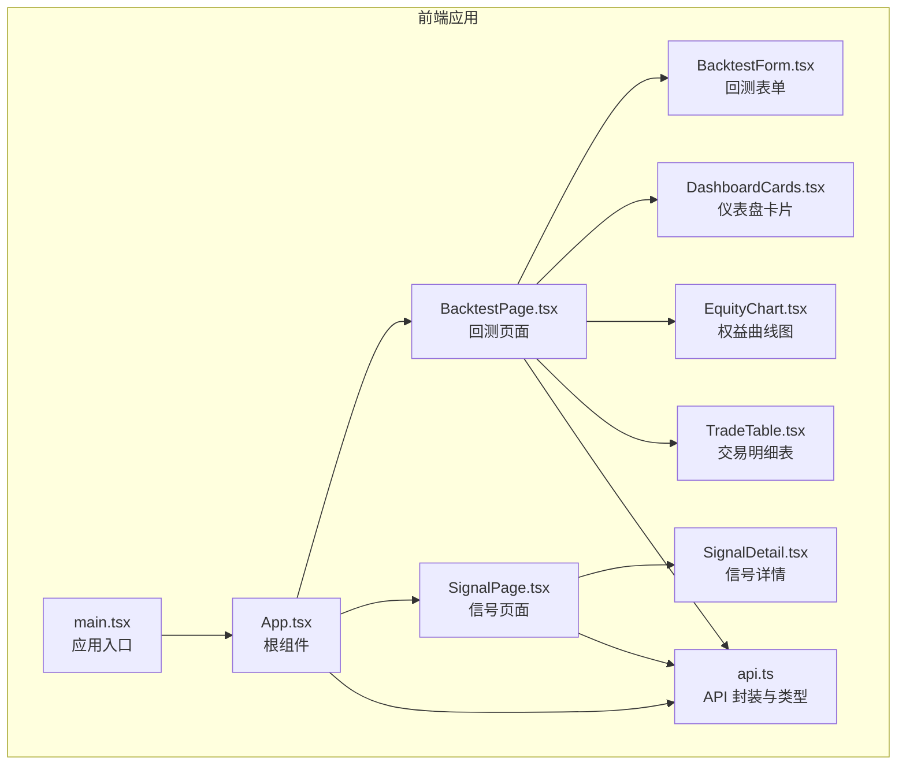
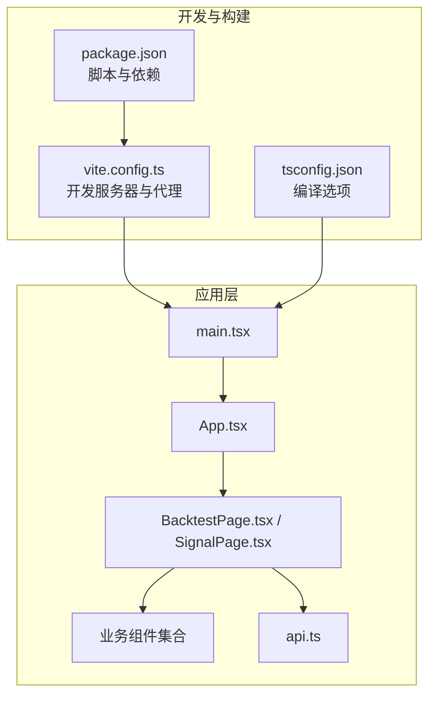
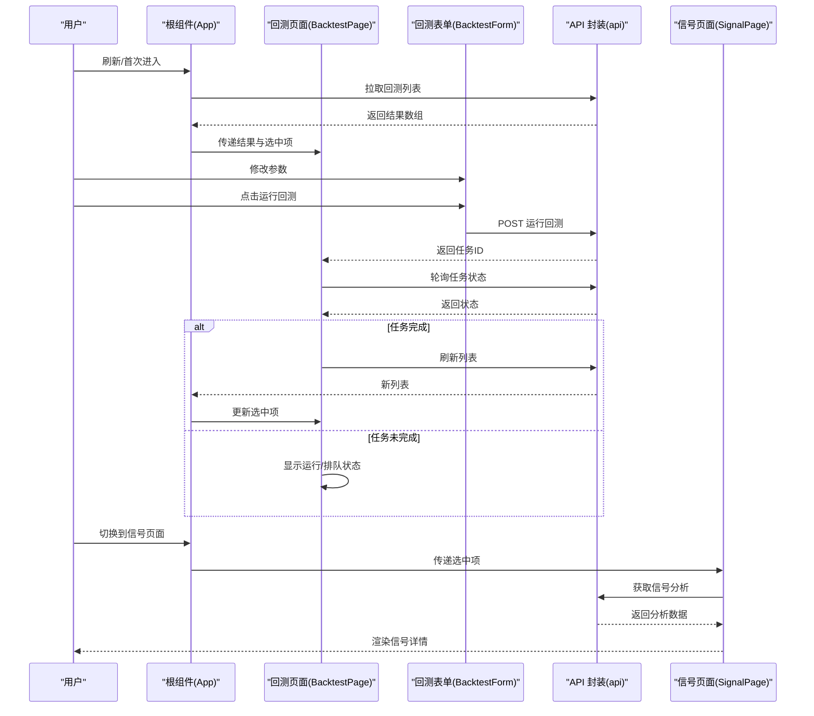
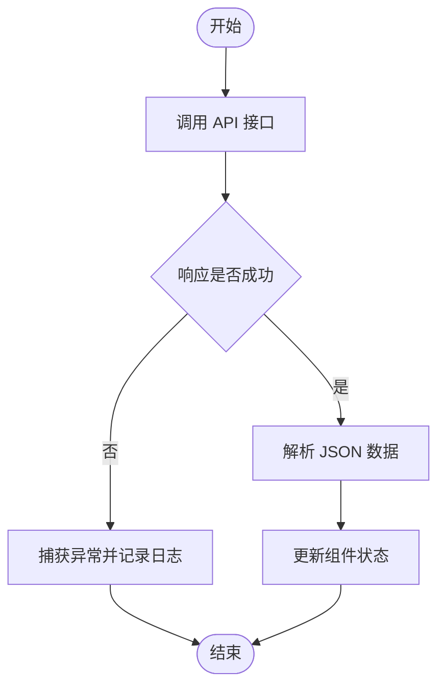
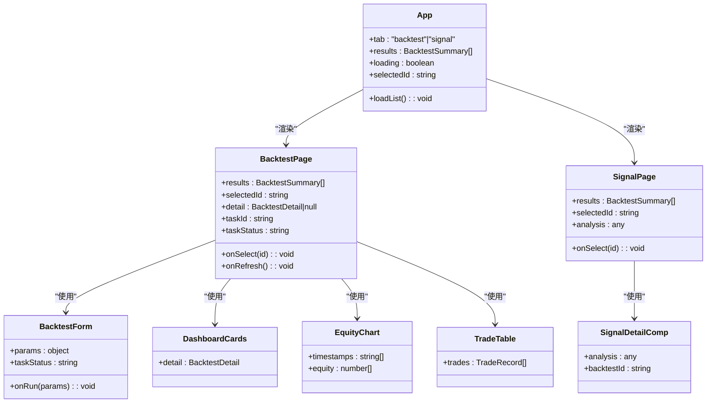
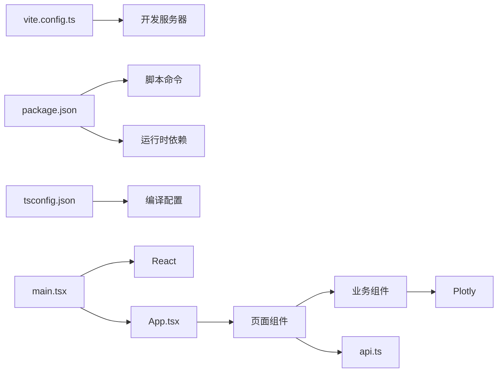

# 前端架构

<cite>
**本文引用的文件**
- [main.tsx](file://frontend/src/main.tsx)
- [App.tsx](file://frontend/src/App.tsx)
- [BacktestPage.tsx](file://frontend/src/pages/BacktestPage.tsx)
- [SignalPage.tsx](file://frontend/src/pages/SignalPage.tsx)
- [BacktestForm.tsx](file://frontend/src/components/BacktestForm.tsx)
- [DashboardCards.tsx](file://frontend/src/components/DashboardCards.tsx)
- [EquityChart.tsx](file://frontend/src/components/EquityChart.tsx)
- [SignalDetail.tsx](file://frontend/src/components/SignalDetail.tsx)
- [TradeTable.tsx](file://frontend/src/components/TradeTable.tsx)
- [api.ts](file://frontend/src/api.ts)
- [vite.config.ts](file://frontend/vite.config.ts)
- [package.json](file://frontend/package.json)
- [tsconfig.json](file://frontend/tsconfig.json)
- [plotly.d.ts](file://frontend/src/plotly.d.ts)
</cite>

## 目录
1. [引言](#引言)
2. [项目结构](#项目结构)
3. [核心组件](#核心组件)
4. [架构总览](#架构总览)
5. [详细组件分析](#详细组件分析)
6. [依赖关系分析](#依赖关系分析)
7. [性能考虑](#性能考虑)
8. [故障排除指南](#故障排除指南)
9. [结论](#结论)
10. [附录](#附录)

## 引言
本文件面向加密货币交易系统的前端架构，围绕基于 React + TypeScript 的现代化前端进行系统化梳理。重点覆盖组件层次结构、页面路由与状态管理、Vite 构建工具配置、TypeScript 类型定义与组件生命周期管理；同时解释页面组件（BacktestPage、SignalPage）的设计模式、组件复用策略与 UI 组件库使用方式，并给出前端路由配置、API 通信机制与错误处理策略。文末提供组件树结构图与数据流向示例，帮助读者快速理解与扩展。

## 项目结构
前端采用 Vite 提供的开发与构建环境，入口文件负责挂载根组件，根组件通过状态切换承载两个主要页面：回测面板与信号分析。页面内部进一步拆分为可复用的业务组件，如表单、图表、表格等。API 层统一封装请求方法与类型定义，便于跨页面共享。

**图表来源**
- [main.tsx:1-5](file://frontend/src/main.tsx#L1-L5)
- [App.tsx:1-50](file://frontend/src/App.tsx#L1-L50)
- [BacktestPage.tsx:1-94](file://frontend/src/pages/BacktestPage.tsx#L1-L94)
- [SignalPage.tsx:1-39](file://frontend/src/pages/SignalPage.tsx#L1-L39)
- [BacktestForm.tsx:1-145](file://frontend/src/components/BacktestForm.tsx#L1-L145)
- [DashboardCards.tsx:1-54](file://frontend/src/components/DashboardCards.tsx#L1-L54)
- [EquityChart.tsx:1-49](file://frontend/src/components/EquityChart.tsx#L1-L49)
- [TradeTable.tsx:1-99](file://frontend/src/components/TradeTable.tsx#L1-L99)
- [SignalDetail.tsx:1-137](file://frontend/src/components/SignalDetail.tsx#L1-L137)
- [api.ts:1-51](file://frontend/src/api.ts#L1-L51)

**章节来源**
- [main.tsx:1-5](file://frontend/src/main.tsx#L1-L5)
- [App.tsx:1-50](file://frontend/src/App.tsx#L1-L50)
- [package.json:1-22](file://frontend/package.json#L1-L22)

## 核心组件
- 应用入口与根组件
  - 入口文件负责创建根节点并渲染根组件。
  - 根组件维护当前选中的标签页、回测结果列表、选中项 ID 以及加载状态；在挂载后拉取回测列表；提供“刷新列表”按钮与顶部导航切换。
- 页面组件
  - 回测页面：负责展示回测表单、任务状态轮询、历史回测结果列表、仪表盘卡片、权益曲线图与交易明细表。
  - 信号页面：根据选中的回测 ID 获取信号分析并渲染信号详情组件。
- 业务组件
  - 回测表单：集中管理回测参数，按策略版本动态显示不同参数组，并提供日期范围限制与实时数据开关。
  - 仪表盘卡片：汇总回测关键指标，支持资金费用卡片扩展。
  - 权益曲线图：基于 Plotly 渲染权益曲线与初始资金线。
  - 交易明细表：支持按操作类型过滤、展开查看指标明细。
  - 信号详情：按策略版本组织显示盈亏分布、指标触发统计与操作类型统计。
- API 与类型
  - 统一的请求封装函数与类型定义，涵盖回测摘要、回测详情、交易记录、信号分析等接口。

**章节来源**
- [main.tsx:1-5](file://frontend/src/main.tsx#L1-L5)
- [App.tsx:1-50](file://frontend/src/App.tsx#L1-L50)
- [BacktestPage.tsx:1-94](file://frontend/src/pages/BacktestPage.tsx#L1-L94)
- [SignalPage.tsx:1-39](file://frontend/src/pages/SignalPage.tsx#L1-L39)
- [BacktestForm.tsx:1-145](file://frontend/src/components/BacktestForm.tsx#L1-L145)
- [DashboardCards.tsx:1-54](file://frontend/src/components/DashboardCards.tsx#L1-L54)
- [EquityChart.tsx:1-49](file://frontend/src/components/EquityChart.tsx#L1-L49)
- [TradeTable.tsx:1-99](file://frontend/src/components/TradeTable.tsx#L1-L99)
- [SignalDetail.tsx:1-137](file://frontend/src/components/SignalDetail.tsx#L1-L137)
- [api.ts:1-51](file://frontend/src/api.ts#L1-L51)

## 架构总览
前端采用“根组件 + 页面组件 + 业务组件”的分层结构，页面间通过状态切换实现路由式导航；API 层统一处理请求与响应，类型定义贯穿始终，确保强类型约束与可维护性。Vite 提供开发服务器与代理配置，将 /api 请求转发至后端服务。

**图表来源**
- [vite.config.ts:1-11](file://frontend/vite.config.ts#L1-L11)
- [package.json:1-22](file://frontend/package.json#L1-L22)
- [tsconfig.json:1-12](file://frontend/tsconfig.json#L1-L12)
- [main.tsx:1-5](file://frontend/src/main.tsx#L1-L5)
- [App.tsx:1-50](file://frontend/src/App.tsx#L1-L50)
- [BacktestPage.tsx:1-94](file://frontend/src/pages/BacktestPage.tsx#L1-L94)
- [SignalPage.tsx:1-39](file://frontend/src/pages/SignalPage.tsx#L1-L39)
- [api.ts:1-51](file://frontend/src/api.ts#L1-L51)

## 详细组件分析

### 组件层次与数据流
- 组件树
  - 入口 -> 根组件 -> 页面组件 -> 业务组件
  - 页面组件之间通过根组件的状态进行切换，形成“单页应用式”的路由体验。
- 数据流
  - 根组件从 API 拉取回测列表并设置默认选中项；
  - 页面组件根据选中项 ID 从 API 获取详情或分析；
  - 表单组件收集参数并通过 API 触发后台任务，页面组件轮询任务状态并在完成后刷新列表。

**图表来源**
- [App.tsx:1-50](file://frontend/src/App.tsx#L1-L50)
- [BacktestPage.tsx:1-94](file://frontend/src/pages/BacktestPage.tsx#L1-L94)
- [BacktestForm.tsx:1-145](file://frontend/src/components/BacktestForm.tsx#L1-L145)
- [SignalPage.tsx:1-39](file://frontend/src/pages/SignalPage.tsx#L1-L39)
- [api.ts:1-51](file://frontend/src/api.ts#L1-L51)

**章节来源**
- [App.tsx:1-50](file://frontend/src/App.tsx#L1-L50)
- [BacktestPage.tsx:1-94](file://frontend/src/pages/BacktestPage.tsx#L1-L94)
- [SignalPage.tsx:1-39](file://frontend/src/pages/SignalPage.tsx#L1-L39)
- [api.ts:1-51](file://frontend/src/api.ts#L1-L51)

### 设计模式与复用策略
- 单向数据流与受控组件
  - 表单参数通过受控组件更新，父组件统一收集并提交；页面组件通过 props 接收状态，避免跨层级直接修改。
- 组件职责分离
  - 表单仅负责参数收集与校验提示；页面负责生命周期与轮询；业务组件专注渲染与交互。
- 可复用性
  - 仪表盘卡片、交易明细表、权益曲线图均以 props 驱动，可在不同页面复用。
- 动态渲染
  - 根据策略版本动态显示不同参数组与统计维度，提升组件通用性。

**章节来源**
- [BacktestForm.tsx:1-145](file://frontend/src/components/BacktestForm.tsx#L1-L145)
- [DashboardCards.tsx:1-54](file://frontend/src/components/DashboardCards.tsx#L1-L54)
- [TradeTable.tsx:1-99](file://frontend/src/components/TradeTable.tsx#L1-L99)
- [EquityChart.tsx:1-49](file://frontend/src/components/EquityChart.tsx#L1-L49)
- [SignalDetail.tsx:1-137](file://frontend/src/components/SignalDetail.tsx#L1-L137)

### API 通信机制与错误处理
- 统一请求封装
  - 所有 API 请求通过统一的请求函数执行，自动拼接基础路径与错误处理；返回 JSON 数据。
- 错误处理策略
  - 页面组件在获取数据时捕获异常并打印日志；表单运行回测失败时弹出提示；任务轮询忽略异常以保证稳定性。
- 轮询与幂等
  - 任务状态轮询采用固定间隔，完成后刷新列表并更新选中项，确保 UI 与后端状态一致。

**图表来源**
- [api.ts:1-51](file://frontend/src/api.ts#L1-L51)
- [BacktestPage.tsx:1-94](file://frontend/src/pages/BacktestPage.tsx#L1-L94)

**章节来源**
- [api.ts:1-51](file://frontend/src/api.ts#L1-L51)
- [BacktestPage.tsx:1-94](file://frontend/src/pages/BacktestPage.tsx#L1-L94)

### 组件类图（代码级）

**图表来源**
- [App.tsx:1-50](file://frontend/src/App.tsx#L1-L50)
- [BacktestPage.tsx:1-94](file://frontend/src/pages/BacktestPage.tsx#L1-L94)
- [SignalPage.tsx:1-39](file://frontend/src/pages/SignalPage.tsx#L1-L39)
- [BacktestForm.tsx:1-145](file://frontend/src/components/BacktestForm.tsx#L1-L145)
- [DashboardCards.tsx:1-54](file://frontend/src/components/DashboardCards.tsx#L1-L54)
- [EquityChart.tsx:1-49](file://frontend/src/components/EquityChart.tsx#L1-L49)
- [TradeTable.tsx:1-99](file://frontend/src/components/TradeTable.tsx#L1-L99)
- [SignalDetail.tsx:1-137](file://frontend/src/components/SignalDetail.tsx#L1-L137)

## 依赖关系分析
- 构建与运行
  - Vite 提供开发服务器与代理，将 /api 请求转发至本地后端服务；脚本命令用于开发、构建与预览。
  - TypeScript 编译器选项严格，模块解析采用 bundler，JSX 使用 react-jsx。
- 运行时依赖
  - React 与 ReactDOM 提供 UI 渲染；Plotly 用于图表绘制；类型声明文件声明第三方模块。
- 组件耦合
  - 页面组件与业务组件通过 props 解耦；API 层作为单一事实来源，降低页面间耦合。

**图表来源**
- [vite.config.ts:1-11](file://frontend/vite.config.ts#L1-L11)
- [package.json:1-22](file://frontend/package.json#L1-L22)
- [tsconfig.json:1-12](file://frontend/tsconfig.json#L1-L12)
- [main.tsx:1-5](file://frontend/src/main.tsx#L1-L5)
- [App.tsx:1-50](file://frontend/src/App.tsx#L1-L50)
- [api.ts:1-51](file://frontend/src/api.ts#L1-L51)

**章节来源**
- [vite.config.ts:1-11](file://frontend/vite.config.ts#L1-L11)
- [package.json:1-22](file://frontend/package.json#L1-L22)
- [tsconfig.json:1-12](file://frontend/tsconfig.json#L1-L12)

## 性能考虑
- 图表渲染
  - 权益曲线图在数据变化时重新绘制，建议在数据量较大时考虑采样或虚拟化策略。
- 轮询策略
  - 任务状态轮询间隔固定，建议根据任务耗时调整轮询频率或引入指数退避。
- 组件重渲染
  - 使用 React.memo 或 useMemo 优化高频渲染组件；对 props 进行浅比较，避免不必要的重渲染。
- 资源加载
  - 将 Plotly 等大体积库按需加载，减少首屏体积。

## 故障排除指南
- 开发服务器无法访问 /api
  - 检查代理配置是否正确指向后端地址与端口。
- 回测任务状态不更新
  - 确认任务 ID 正确传入轮询逻辑；检查网络请求与后端任务状态接口。
- 图表不显示
  - 确保容器存在且具有尺寸；检查时间戳与数值数组长度是否大于零。
- 类型错误或模块缺失
  - 确认 TypeScript 编译选项与模块解析设置；检查第三方模块声明文件是否存在。

**章节来源**
- [vite.config.ts:1-11](file://frontend/vite.config.ts#L1-L11)
- [BacktestPage.tsx:1-94](file://frontend/src/pages/BacktestPage.tsx#L1-L94)
- [EquityChart.tsx:1-49](file://frontend/src/components/EquityChart.tsx#L1-L49)
- [plotly.d.ts:1-1](file://frontend/src/plotly.d.ts#L1-L1)

## 结论
该前端架构以 React + TypeScript 为基础，结合 Vite 的高效开发体验，实现了清晰的组件分层与可复用的业务组件体系。通过统一的 API 封装与类型定义，保障了数据一致性与可维护性；页面组件与业务组件的职责分离提升了可测试性与扩展性。未来可在图表性能优化、轮询策略改进与类型完善方面继续迭代。

## 附录
- 关键类型定义概览
  - 回测摘要、回测详情、交易记录、信号详情等接口类型在 API 文件中集中定义，便于跨页面共享与重构。
- 第三方模块声明
  - Plotly 的类型声明通过独立声明文件提供，避免运行时报错。

**章节来源**
- [api.ts:1-51](file://frontend/src/api.ts#L1-L51)
- [plotly.d.ts:1-1](file://frontend/src/plotly.d.ts#L1-L1)