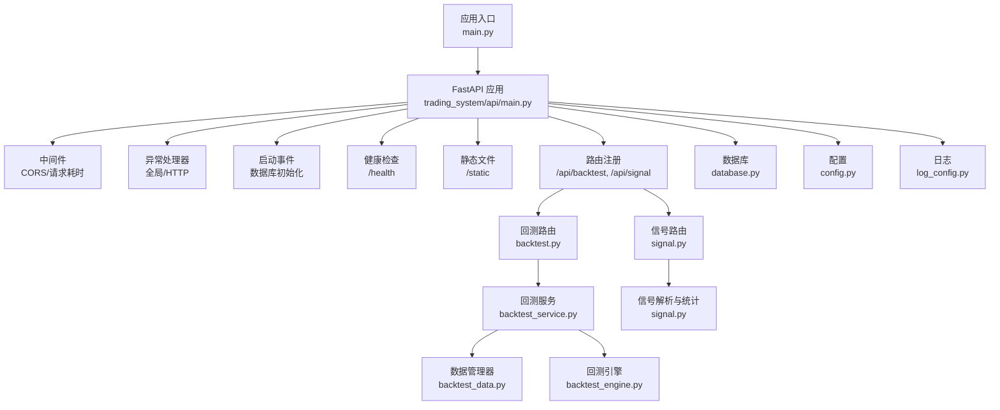
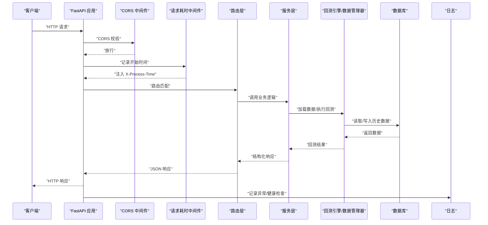
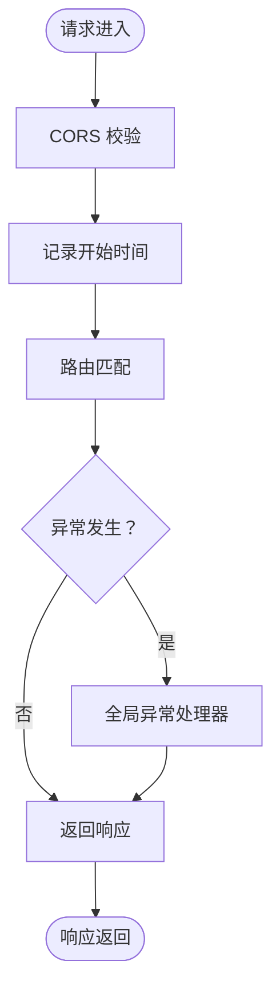
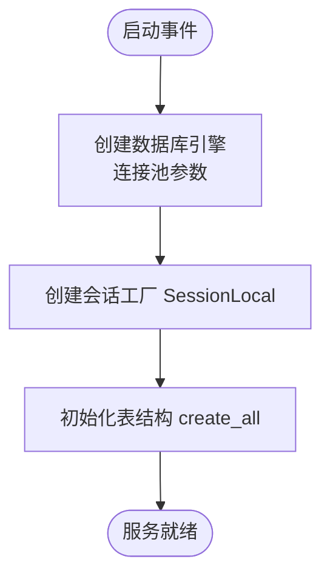
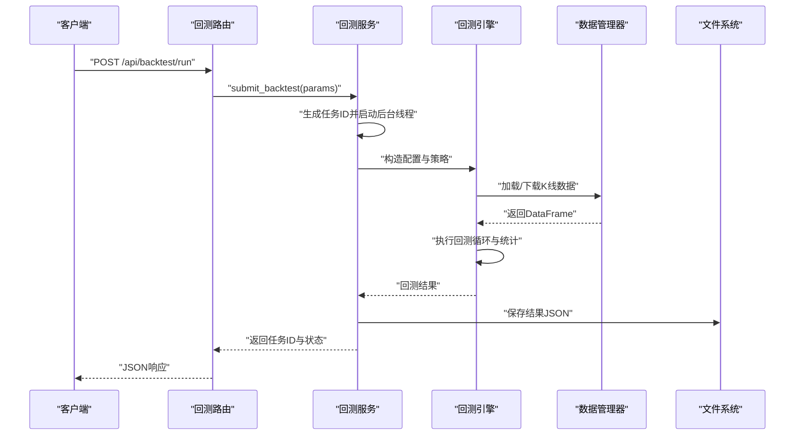
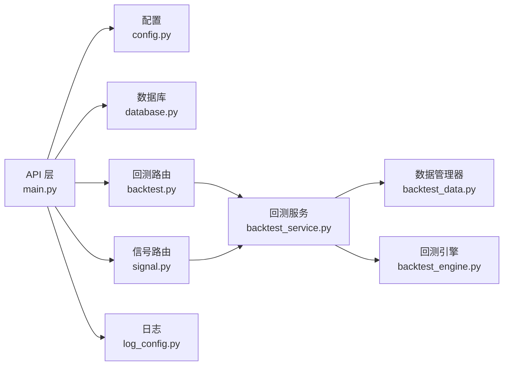

# 后端架构

<cite>
**本文引用的文件**
- [main.py](file://main.py)
- [trading_system/api/main.py](file://trading_system/api/main.py)
- [trading_system/core/database.py](file://trading_system/core/database.py)
- [trading_system/core/config.py](file://trading_system/core/config.py)
- [trading_system/api/routers/backtest.py](file://trading_system/api/routers/backtest.py)
- [trading_system/api/routers/signal.py](file://trading_system/api/routers/signal.py)
- [trading_system/api/services/backtest_service.py](file://trading_system/api/services/backtest_service.py)
- [trading_system/data/backtest_data.py](file://trading_system/data/backtest_data.py)
- [trading_system/strategies/backtest_engine.py](file://trading_system/strategies/backtest_engine.py)
- [log_config.py](file://log_config.py)
- [requirements.txt](file://requirements.txt)
- [README.md](file://README.md)
</cite>

## 目录
1. [简介](#简介)
2. [项目结构](#项目结构)
3. [核心组件](#核心组件)
4. [架构总览](#架构总览)
5. [详细组件分析](#详细组件分析)
6. [依赖关系分析](#依赖关系分析)
7. [性能考量](#性能考量)
8. [故障排查指南](#故障排查指南)
9. [结论](#结论)
10. [附录](#附录)

## 简介
本文件面向加密货币交易系统的后端架构，围绕基于 FastAPI 的 Web 服务进行系统性说明。内容涵盖路由分层设计（backtest、signal）、中间件配置（CORS、请求耗时统计）、异常处理机制、数据库连接管理与会话生命周期、健康检查与静态文件服务、以及请求处理流程与响应格式标准化。同时提供架构图与组件交互示例，帮助开发者快速理解与维护系统。

## 项目结构
后端采用分层清晰的模块化组织方式：
- 应用入口与运行：顶层 main.py 调用 trading_system/api/main.py 中的 FastAPI 应用实例，并通过 uvicorn 启动服务。
- API 层：trading_system/api/main.py 定义 FastAPI 应用、中间件、异常处理器、启动事件、健康检查、静态文件挂载与路由注册。
- 路由层：trading_system/api/routers 下按功能划分 backtest 与 signal 两个子路由，分别提供回测与信号分析相关接口。
- 服务层：trading_system/api/services 提供业务逻辑封装，如回测任务提交、状态查询、参数模板等。
- 数据与策略：trading_system/data 与 trading_system/strategies 提供数据加载、回测引擎与策略实现。
- 核心配置与数据库：trading_system/core/config.py 提供配置项；trading_system/core/database.py 提供数据库引擎、会话工厂与初始化方法。
- 日志：log_config.py 提供统一日志配置与实例。



**图表来源**
- [main.py:1-13](file://main.py#L1-L13)
- [trading_system/api/main.py:12-104](file://trading_system/api/main.py#L12-L104)
- [trading_system/api/routers/backtest.py:1-68](file://trading_system/api/routers/backtest.py#L1-L68)
- [trading_system/api/routers/signal.py:1-178](file://trading_system/api/routers/signal.py#L1-L178)
- [trading_system/api/services/backtest_service.py:1-289](file://trading_system/api/services/backtest_service.py#L1-L289)
- [trading_system/data/backtest_data.py:1-137](file://trading_system/data/backtest_data.py#L1-L137)
- [trading_system/strategies/backtest_engine.py:1-800](file://trading_system/strategies/backtest_engine.py#L1-L800)
- [trading_system/core/database.py:1-45](file://trading_system/core/database.py#L1-L45)
- [trading_system/core/config.py:1-35](file://trading_system/core/config.py#L1-L35)
- [log_config.py:1-74](file://log_config.py#L1-L74)

**章节来源**
- [main.py:1-13](file://main.py#L1-L13)
- [trading_system/api/main.py:12-104](file://trading_system/api/main.py#L12-L104)
- [README.md:1-150](file://README.md#L1-L150)

## 核心组件
- FastAPI 应用与中间件
  - CORS 中间件允许任意来源、凭据、方法与头部访问。
  - HTTP 中间件在请求进入后端处理前记录处理时间，并将耗时写入响应头。
- 异常处理
  - 全局异常处理器捕获未预期异常，统一返回 JSON 错误响应。
  - HTTP 异常处理器捕获 HTTPException，返回结构化的错误信息。
- 启动事件与健康检查
  - startup 事件中初始化数据库（创建表）。
  - /health 接口验证数据库连接可用性。
- 静态文件服务
  - 挂载 /static 路径指向静态资源目录。
- 路由分层
  - /api/backtest：回测任务提交、状态查询、结果列表与参数模板。
  - /api/signal：信号分类映射、交易明细与综合分析。

**章节来源**
- [trading_system/api/main.py:14-56](file://trading_system/api/main.py#L14-L56)
- [trading_system/api/main.py:58-88](file://trading_system/api/main.py#L58-L88)
- [trading_system/api/main.py:90-98](file://trading_system/api/main.py#L90-L98)
- [trading_system/api/routers/backtest.py:1-68](file://trading_system/api/routers/backtest.py#L1-L68)
- [trading_system/api/routers/signal.py:1-178](file://trading_system/api/routers/signal.py#L1-L178)

## 架构总览
下图展示从客户端到后端服务、再到数据与策略层的整体交互流程，以及关键中间件与异常处理的位置。



**图表来源**
- [trading_system/api/main.py:14-56](file://trading_system/api/main.py#L14-L56)
- [trading_system/api/main.py:58-88](file://trading_system/api/main.py#L58-L88)
- [trading_system/api/routers/backtest.py:1-68](file://trading_system/api/routers/backtest.py#L1-L68)
- [trading_system/api/routers/signal.py:1-178](file://trading_system/api/routers/signal.py#L1-L178)
- [trading_system/api/services/backtest_service.py:1-289](file://trading_system/api/services/backtest_service.py#L1-L289)
- [trading_system/data/backtest_data.py:1-137](file://trading_system/data/backtest_data.py#L1-L137)
- [trading_system/strategies/backtest_engine.py:1-800](file://trading_system/strategies/backtest_engine.py#L1-L800)
- [trading_system/core/database.py:1-45](file://trading_system/core/database.py#L1-L45)
- [log_config.py:1-74](file://log_config.py#L1-L74)

## 详细组件分析

### FastAPI 应用与中间件链路
- CORS 中间件配置允许通配符来源、凭据、方法与头部，便于前端跨域访问。
- HTTP 中间件在请求进入下游处理前记录开始时间，在响应返回后注入 X-Process-Time 头部，便于监控与性能分析。
- 异常处理链：
  - 全局异常处理器捕获所有未处理异常，统一返回包含错误类型、消息与细节的 JSON。
  - HTTP 异常处理器针对 HTTPException，返回包含错误类型与消息的 JSON，并保留状态码。
- 启动事件 on_startup 中调用 init_db() 创建数据库表，确保服务启动即具备可用的数据结构。
- 健康检查 /health 通过 SessionLocal 获取会话并执行简单 SQL 查询，验证数据库连通性，失败时抛出 HTTP 503 并包含错误详情。
- 静态文件挂载 /static，便于前端构建产物的直接访问。



**图表来源**
- [trading_system/api/main.py:14-56](file://trading_system/api/main.py#L14-L56)
- [trading_system/api/main.py:58-88](file://trading_system/api/main.py#L58-L88)

**章节来源**
- [trading_system/api/main.py:14-56](file://trading_system/api/main.py#L14-L56)
- [trading_system/api/main.py:58-88](file://trading_system/api/main.py#L58-L88)
- [trading_system/api/main.py:90-98](file://trading_system/api/main.py#L90-L98)

### 路由分层设计：backtest 与 signal
- backtest 路由
  - GET /api/backtest/list：列出历史回测结果。
  - GET /api/backtest/params：获取回测参数模板。
  - GET /api/backtest/{backtest_id}：获取单次回测完整结果。
  - POST /api/backtest/run：提交回测任务，返回任务 ID 与状态。
  - GET /api/backtest/task/{task_id}：查询回测任务状态。
  - GET /api/backtest/data/daterange：查询可用历史数据的日期范围。
- signal 路由
  - GET /api/signal/categories：获取信号分类映射。
  - GET /api/signal/detail/{backtest_id}：解析回测结果中的交易明细，提取指标依据与价格参考，统计指标触发频率。
  - GET /api/signal/analysis/{backtest_id}：综合信号分析，包括盈亏分布、动作统计与指标排名。

```mermaid
classDiagram
class BacktestRouter {
+GET /list
+GET /params
+GET /{backtest_id}
+POST /run
+GET /task/{task_id}
+GET /data/daterange
}
class SignalRouter {
+GET /categories
+GET /detail/{backtest_id}
+GET /analysis/{backtest_id}
}
class BacktestService {
+list_results()
+get_result(id)
+submit_backtest(params)
+get_task_status(id)
+get_available_daterange()
+get_params_template()
}
BacktestRouter --> BacktestService : "调用"
SignalRouter --> BacktestService : "读取结果"
```

**图表来源**
- [trading_system/api/routers/backtest.py:1-68](file://trading_system/api/routers/backtest.py#L1-L68)
- [trading_system/api/routers/signal.py:1-178](file://trading_system/api/routers/signal.py#L1-L178)
- [trading_system/api/services/backtest_service.py:1-289](file://trading_system/api/services/backtest_service.py#L1-L289)

**章节来源**
- [trading_system/api/routers/backtest.py:1-68](file://trading_system/api/routers/backtest.py#L1-L68)
- [trading_system/api/routers/signal.py:1-178](file://trading_system/api/routers/signal.py#L1-L178)
- [trading_system/api/services/backtest_service.py:1-289](file://trading_system/api/services/backtest_service.py#L1-L289)

### 数据库初始化与会话管理
- 配置与连接池
  - 通过 settings 读取数据库 URL、连接池大小、溢出、超时、回收与 echo 等参数。
  - 使用 SQLAlchemy 创建引擎，启用 pool_pre_ping 以自动探测失效连接。
- 会话工厂与生命周期
  - SessionLocal 绑定 engine，提供 autocommit=False、autoflush=False 的会话。
  - get_db 作为依赖注入生成器，负责创建、使用与关闭会话，并在异常时记录错误。
- 表初始化
  - init_db 调用 Base.metadata.create_all(bind=engine)，确保表结构存在。
- 启动事件
  - on_startup 中调用 init_db，保证服务启动时数据库准备就绪。



**图表来源**
- [trading_system/core/config.py:1-35](file://trading_system/core/config.py#L1-L35)
- [trading_system/core/database.py:1-45](file://trading_system/core/database.py#L1-L45)
- [trading_system/api/main.py:58-67](file://trading_system/api/main.py#L58-L67)

**章节来源**
- [trading_system/core/config.py:1-35](file://trading_system/core/config.py#L1-L35)
- [trading_system/core/database.py:1-45](file://trading_system/core/database.py#L1-L45)
- [trading_system/api/main.py:58-67](file://trading_system/api/main.py#L58-L67)

### 回测服务与数据流
- 任务提交与状态管理
  - submit_backtest 返回任务 ID，并在后台线程中执行回测，期间更新任务状态与进度。
  - get_task_status 提供任务状态查询。
- 数据加载与回测执行
  - BacktestDataManager 负责从 CSV 加载 K 线数据，支持异步下载并保存。
  - BacktestEngine 负责加载数据、执行策略、计算绩效指标、生成图表与保存结果。
- 参数模板与可用日期范围
  - get_params_template 提供前端参数控件的默认值与约束。
  - get_available_daterange 从 CSV 文件推断可用日期范围。



**图表来源**
- [trading_system/api/services/backtest_service.py:58-248](file://trading_system/api/services/backtest_service.py#L58-L248)
- [trading_system/data/backtest_data.py:47-137](file://trading_system/data/backtest_data.py#L47-L137)
- [trading_system/strategies/backtest_engine.py:445-538](file://trading_system/strategies/backtest_engine.py#L445-L538)

**章节来源**
- [trading_system/api/services/backtest_service.py:1-289](file://trading_system/api/services/backtest_service.py#L1-L289)
- [trading_system/data/backtest_data.py:1-137](file://trading_system/data/backtest_data.py#L1-L137)
- [trading_system/strategies/backtest_engine.py:1-800](file://trading_system/strategies/backtest_engine.py#L1-L800)

### 响应格式标准化
- 全局异常处理器与 HTTP 异常处理器统一返回 JSON，包含错误类型、消息与细节（或状态码）。
- 路由层返回结构化数据，如 count/results、task_id/status、signal detail/analysis 等，便于前端消费。

**章节来源**
- [trading_system/api/main.py:33-55](file://trading_system/api/main.py#L33-L55)
- [trading_system/api/routers/backtest.py:27-62](file://trading_system/api/routers/backtest.py#L27-L62)
- [trading_system/api/routers/signal.py:25-131](file://trading_system/api/routers/signal.py#L25-L131)

## 依赖关系分析
- 外部依赖
  - FastAPI、SQLAlchemy、PyMySQL、uvicorn、pandas、numpy、ccxt 等。
- 内部模块耦合
  - API 层依赖核心配置与数据库模块，路由层依赖服务层，服务层依赖数据与策略模块。
- 循环依赖规避
  - 通过延迟导入与模块拆分，避免直接循环引用。



**图表来源**
- [requirements.txt:1-64](file://requirements.txt#L1-L64)
- [trading_system/api/main.py:12-104](file://trading_system/api/main.py#L12-L104)
- [trading_system/core/config.py:1-35](file://trading_system/core/config.py#L1-L35)
- [trading_system/core/database.py:1-45](file://trading_system/core/database.py#L1-L45)
- [trading_system/api/routers/backtest.py:1-68](file://trading_system/api/routers/backtest.py#L1-L68)
- [trading_system/api/routers/signal.py:1-178](file://trading_system/api/routers/signal.py#L1-L178)
- [trading_system/api/services/backtest_service.py:1-289](file://trading_system/api/services/backtest_service.py#L1-L289)
- [trading_system/data/backtest_data.py:1-137](file://trading_system/data/backtest_data.py#L1-L137)
- [trading_system/strategies/backtest_engine.py:1-800](file://trading_system/strategies/backtest_engine.py#L1-L800)
- [log_config.py:1-74](file://log_config.py#L1-L74)

**章节来源**
- [requirements.txt:1-64](file://requirements.txt#L1-L64)
- [trading_system/api/main.py:12-104](file://trading_system/api/main.py#L12-L104)

## 性能考量
- 连接池与预检
  - 启用 pool_pre_ping 与合理的 pool_size/max_overflow，减少连接失效与阻塞。
- 异步与并发
  - 回测任务在后台线程执行，避免阻塞主线程；建议后续引入队列与异步任务框架以提升吞吐。
- 数据加载优化
  - 使用 pandas 读取 CSV 并在内存中过滤与排序，注意大文件分块与内存占用。
- 进度与可视化
  - 回测引擎内置进度条与图表生成，建议在生产环境中关闭或限制生成频率以节省资源。

[本节为通用性能建议，不直接分析具体文件]

## 故障排查指南
- 数据库连接失败
  - 检查 /health 接口返回，若返回 503，查看日志中数据库初始化与连接错误。
  - 确认 settings 中 DATABASE_URL 与实际数据库一致。
- 回测任务无响应
  - 通过 /api/backtest/task/{task_id} 查询任务状态，确认是否处于 pending/running/completed/failed。
  - 若失败，查看服务日志中的异常堆栈。
- 健康检查
  - /health 会在数据库不可达时抛出 HTTP 503，需检查数据库服务与网络连通性。

**章节来源**
- [trading_system/api/main.py:58-88](file://trading_system/api/main.py#L58-L88)
- [trading_system/api/services/backtest_service.py:240-245](file://trading_system/api/services/backtest_service.py#L240-L245)
- [log_config.py:1-74](file://log_config.py#L1-L74)

## 结论
该后端架构以 FastAPI 为核心，结合 SQLAlchemy 连接池与线程安全的会话管理，提供了清晰的路由分层与标准化的异常处理。通过中间件链路与健康检查机制，保障了服务的可观测性与稳定性。回测服务通过后台线程与数据/策略模块解耦，实现了可扩展的任务执行能力。建议后续引入异步任务队列与更完善的监控告警体系，以进一步提升性能与可靠性。

## 附录
- 快速启动
  - 安装依赖：pip install -r requirements.txt
  - 启动服务：python main.py 或 uvicorn main:app --reload
  - 访问文档：Swagger UI 与 ReDoc 地址见 README。
- 环境变量
  - 参考 README 中 .env 示例，配置数据库与第三方 API 密钥。

**章节来源**
- [README.md:75-99](file://README.md#L75-L99)
- [README.md:64-73](file://README.md#L64-L73)