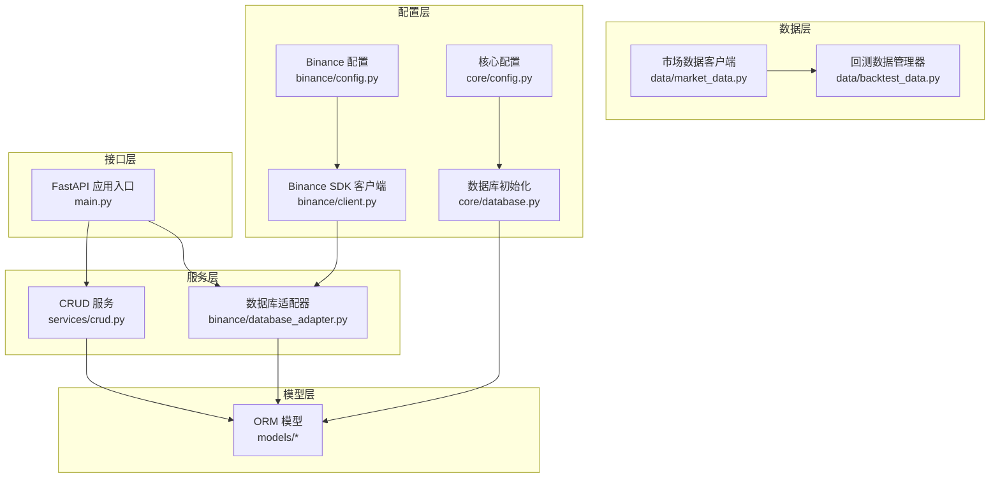
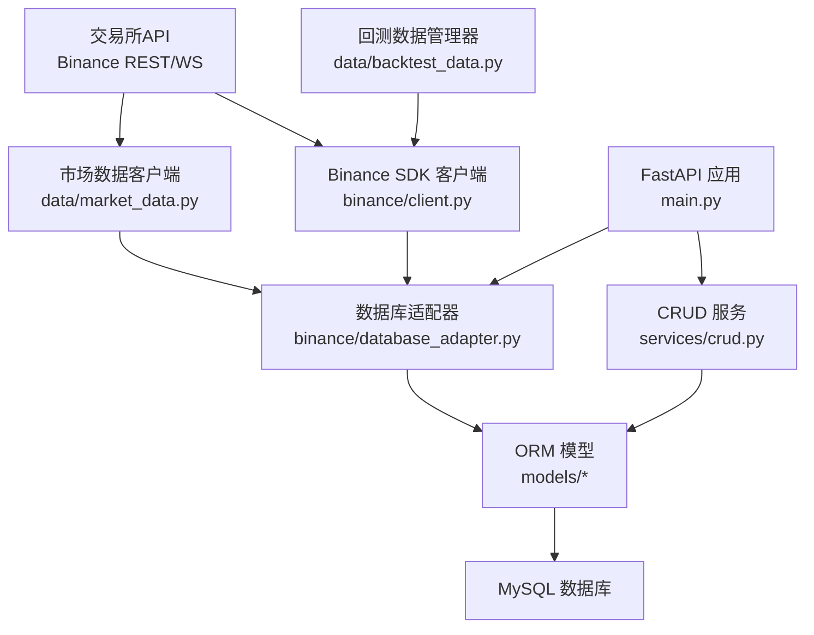
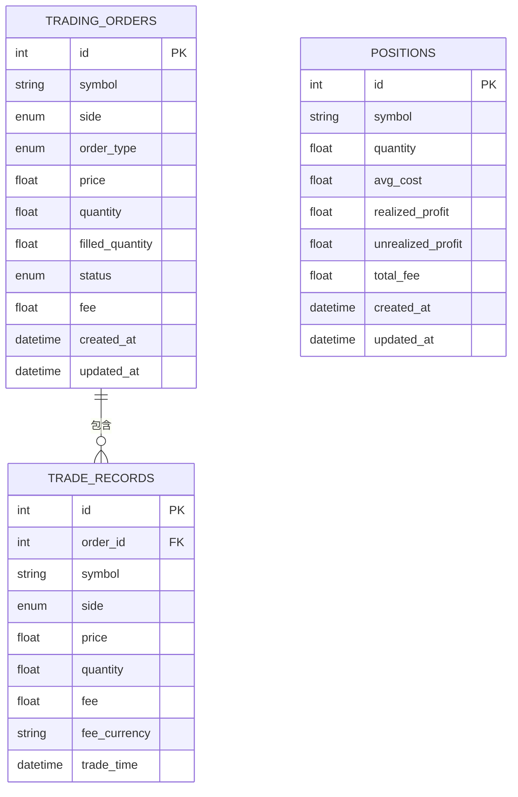
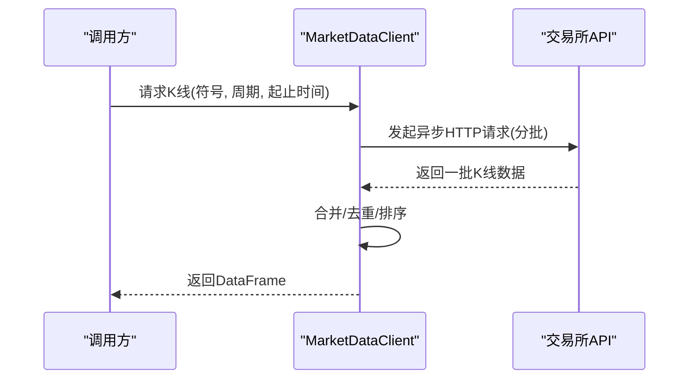
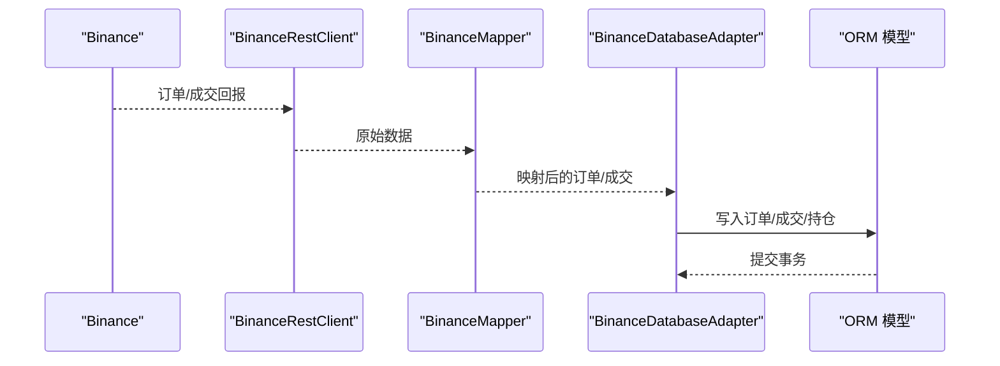
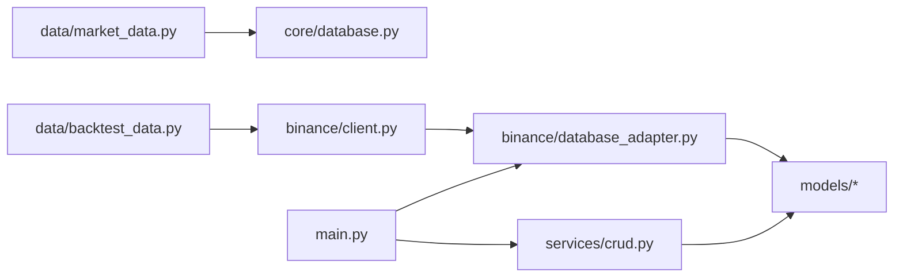
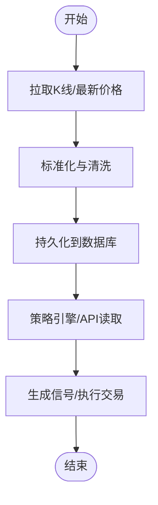

# 数据架构

<cite>
**本文引用的文件**   
- [trading_system/models/trade_record.py](file://trading_system/models/trade_record.py)
- [trading_system/models/position.py](file://trading_system/models/position.py)
- [trading_system/models/trading_order.py](file://trading_system/models/trading_order.py)
- [trading_system/core/schemas.py](file://trading_system/core/schemas.py)
- [trading_system/binance/database_adapter.py](file://trading_system/binance/database_adapter.py)
- [trading_system/binance/mapper.py](file://trading_system/binance/mapper.py)
- [trading_system/core/database.py](file://trading_system/core/database.py)
- [trading_system/data/market_data.py](file://trading_system/data/market_data.py)
- [trading_system/services/crud.py](file://trading_system/services/crud.py)
- [trading_system/binance/client.py](file://trading_system/binance/client.py)
- [trading_system/core/config.py](file://trading_system/core/config.py)
- [trading_system/binance/config.py](file://trading_system/binance/config.py)
- [trading_system/data/backtest_data.py](file://trading_system/data/backtest_data.py)
- [trading_system/models/__init__.py](file://trading_system/models/__init__.py)
- [main.py](file://main.py)
</cite>

## 目录
1. [简介](#简介)
2. [项目结构](#项目结构)
3. [核心组件](#核心组件)
4. [架构总览](#架构总览)
5. [详细组件分析](#详细组件分析)
6. [依赖分析](#依赖分析)
7. [性能考虑](#性能考虑)
8. [故障排查指南](#故障排查指南)
9. [结论](#结论)
10. [附录](#附录)

## 简介
本文件面向加密货币交易系统的数据架构，系统围绕“数据获取—存储—管理—应用”的闭环展开，覆盖市场数据采集（历史与实时）、订单与成交记录、持仓管理、数据库建模与索引策略、数据流路径、数据验证与一致性保障、缓存策略建议，以及数据迁移与备份方案。系统采用异步HTTP客户端拉取交易所OHLCV数据，通过ORM模型持久化至关系型数据库；同时提供REST API服务以供策略引擎与前端调用。

## 项目结构
系统采用按功能域划分的层次化组织方式：
- 数据层：市场数据获取（异步HTTP客户端）、历史数据下载与本地CSV存储
- 模型层：基于SQLAlchemy的ORM模型（订单、成交、持仓）
- 服务层：CRUD操作封装、数据库适配器（Binance）
- 配置层：数据库连接池与日志级别、Binance API密钥与代理配置
- 接口层：FastAPI应用入口
- 策略与回测：策略引擎与回测数据管理器

图表来源
- [main.py:1-13](file://main.py#L1-L13)
- [services/crud.py:1-137](file://trading_system/services/crud.py#L1-L137)
- [trading_system/binance/database_adapter.py:1-189](file://trading_system/binance/database_adapter.py#L1-L189)
- [trading_system/models/trading_order.py:1-43](file://trading_system/models/trading_order.py#L1-L43)
- [trading_system/models/trade_record.py:1-22](file://trading_system/models/trade_record.py#L1-L22)
- [trading_system/models/position.py:1-18](file://trading_system/models/position.py#L1-L18)
- [trading_system/data/market_data.py:1-388](file://trading_system/data/market_data.py#L1-L388)
- [trading_system/data/backtest_data.py:1-137](file://trading_system/data/backtest_data.py#L1-L137)
- [trading_system/core/config.py:1-35](file://trading_system/core/config.py#L1-L35)
- [trading_system/core/database.py:1-45](file://trading_system/core/database.py#L1-L45)
- [trading_system/binance/config.py:1-68](file://trading_system/binance/config.py#L1-L68)
- [trading_system/binance/client.py:1-342](file://trading_system/binance/client.py#L1-L342)

章节来源
- [main.py:1-13](file://main.py#L1-L13)
- [trading_system/core/config.py:1-35](file://trading_system/core/config.py#L1-L35)
- [trading_system/core/database.py:1-45](file://trading_system/core/database.py#L1-L45)

## 核心组件
- 数据模型
  - 订单模型：记录委托订单的标识、方向、类型、价格、数量、状态、费用等
  - 成交记录模型：记录每笔成交的委托关联、价格、数量、手续费、成交时间等
  - 持仓模型：记录交易对的持有数量、平均成本、已实现/未实现盈亏、总手续费等
- 数据访问与映射
  - 数据库适配器：封装订单、成交、持仓的增删改查与状态更新
  - 映射器：负责交易所字段到内部枚举与模型字段的映射
  - CRUD服务：Pydantic模型与SQLAlchemy模型之间的桥梁
- 数据获取
  - 异步市场数据客户端：支持K线分批下载、时间范围解析、最新价格获取
  - 回测数据管理器：从本地CSV加载历史K线，或通过REST客户端批量下载并保存
- 配置与连接
  - 数据库连接池配置与初始化
  - Binance API密钥、代理与模拟盘开关配置

章节来源
- [trading_system/models/trading_order.py:26-43](file://trading_system/models/trading_order.py#L26-L43)
- [trading_system/models/trade_record.py:8-22](file://trading_system/models/trade_record.py#L8-L22)
- [trading_system/models/position.py:6-18](file://trading_system/models/position.py#L6-L18)
- [trading_system/binance/database_adapter.py:14-189](file://trading_system/binance/database_adapter.py#L14-L189)
- [trading_system/binance/mapper.py:15-110](file://trading_system/binance/mapper.py#L15-L110)
- [trading_system/services/crud.py:1-137](file://trading_system/services/crud.py#L1-L137)
- [trading_system/data/market_data.py:12-388](file://trading_system/data/market_data.py#L12-L388)
- [trading_system/data/backtest_data.py:9-137](file://trading_system/data/backtest_data.py#L9-L137)
- [trading_system/core/database.py:1-45](file://trading_system/core/database.py#L1-L45)
- [trading_system/binance/config.py:27-68](file://trading_system/binance/config.py#L27-L68)

## 架构总览
系统数据流自上而下分为三层：
- 数据采集层：异步HTTP客户端从交易所拉取OHLCV与最新价格，或通过REST SDK获取K线与账户信息
- 数据存储层：ORM模型持久化，数据库适配器统一事务与错误处理
- 数据消费层：策略引擎与API服务读取历史与实时数据，驱动交易决策与展示

图表来源
- [trading_system/data/market_data.py:12-388](file://trading_system/data/market_data.py#L12-L388)
- [trading_system/data/backtest_data.py:9-137](file://trading_system/data/backtest_data.py#L9-L137)
- [trading_system/binance/client.py:10-342](file://trading_system/binance/client.py#L10-L342)
- [trading_system/binance/database_adapter.py:14-189](file://trading_system/binance/database_adapter.py#L14-L189)
- [trading_system/services/crud.py:1-137](file://trading_system/services/crud.py#L1-L137)
- [trading_system/models/trading_order.py:26-43](file://trading_system/models/trading_order.py#L26-L43)
- [trading_system/models/trade_record.py:8-22](file://trading_system/models/trade_record.py#L8-L22)
- [trading_system/models/position.py:6-18](file://trading_system/models/position.py#L6-L18)
- [main.py:1-13](file://main.py#L1-L13)

## 详细组件分析

### 数据模型与关系
- 模型定义
  - 订单模型：包含符号、方向、类型、价格、数量、已成交量、状态、费用、时间戳等
  - 成交记录模型：外键关联订单，记录成交价格、数量、手续费、成交时间等
  - 持仓模型：记录交易对的持有情况与盈亏统计
- 关系与索引
  - 订单与成交：一对多关系，成交记录通过外键关联订单
  - 索引策略：模型中对常用查询字段建立索引（如符号字段），提升查询效率
- Pydantic模型
  - 提供请求/响应的序列化与校验，确保入参与返回的一致性

图表来源
- [trading_system/models/trading_order.py:26-43](file://trading_system/models/trading_order.py#L26-L43)
- [trading_system/models/trade_record.py:8-22](file://trading_system/models/trade_record.py#L8-L22)
- [trading_system/models/position.py:6-18](file://trading_system/models/position.py#L6-L18)

章节来源
- [trading_system/models/trading_order.py:26-43](file://trading_system/models/trading_order.py#L26-L43)
- [trading_system/models/trade_record.py:8-22](file://trading_system/models/trade_record.py#L8-L22)
- [trading_system/models/position.py:6-18](file://trading_system/models/position.py#L6-L18)
- [trading_system/core/schemas.py:7-88](file://trading_system/core/schemas.py#L7-L88)

### 数据获取与历史数据处理
- 异步K线获取
  - 支持按批次分页拉取，自动处理边界条件与重复数据，输出标准化DataFrame
  - 支持多种时间周期与时间范围解析，便于回测与实时分析
- 历史数据下载与本地存储
  - 回测数据管理器可直接加载本地CSV，也可通过REST客户端批量下载并保存为CSV
  - 提供多周期数据加载能力，满足多时间框架策略需求

图表来源
- [trading_system/data/market_data.py:28-118](file://trading_system/data/market_data.py#L28-L118)

章节来源
- [trading_system/data/market_data.py:12-388](file://trading_system/data/market_data.py#L12-L388)
- [trading_system/data/backtest_data.py:9-137](file://trading_system/data/backtest_data.py#L9-L137)

### 实时数据同步机制
- 订单与成交事件
  - 通过Binance SDK客户端监听或轮询订单状态与成交回报
  - 映射器将交易所字段映射为内部枚举与模型字段
  - 数据库适配器统一写入订单、成交与持仓信息，保证事务一致性
- 持仓更新策略
  - 基于成交记录动态更新持仓数量、均价、已实现/未实现盈亏与总手续费

图表来源
- [trading_system/binance/client.py:10-342](file://trading_system/binance/client.py#L10-L342)
- [trading_system/binance/mapper.py:15-110](file://trading_system/binance/mapper.py#L15-L110)
- [trading_system/binance/database_adapter.py:14-189](file://trading_system/binance/database_adapter.py#L14-L189)

章节来源
- [trading_system/binance/client.py:10-342](file://trading_system/binance/client.py#L10-L342)
- [trading_system/binance/mapper.py:15-110](file://trading_system/binance/mapper.py#L15-L110)
- [trading_system/binance/database_adapter.py:14-189](file://trading_system/binance/database_adapter.py#L14-L189)

### 数据验证规则与一致性保障
- Pydantic模型校验
  - 对请求参数进行类型与必填项校验，确保入参规范
- 数据库约束
  - 主键、外键、枚举类型、默认值与时间戳字段，保证数据完整性
- 事务与回滚
  - 数据库适配器在异常时执行回滚，避免部分写入导致的数据不一致
- 幂等写入
  - 订单按唯一键更新，避免重复插入

章节来源
- [trading_system/core/schemas.py:7-88](file://trading_system/core/schemas.py#L7-L88)
- [trading_system/binance/database_adapter.py:31-61](file://trading_system/binance/database_adapter.py#L31-L61)
- [trading_system/binance/database_adapter.py:76-97](file://trading_system/binance/database_adapter.py#L76-L97)

### 缓存策略建议
- 热点数据缓存
  - 对高频查询的最新价格与最近K线片段进行内存缓存，减少数据库压力
- 查询结果缓存
  - 对回测所需的历史K线片段进行短期缓存，加速策略迭代
- 缓存失效策略
  - 基于时间窗口或事件触发（如新K线到达）进行失效刷新

（本节为通用建议，不直接分析具体文件）

## 依赖分析
- 组件耦合
  - 数据库适配器依赖ORM模型与映射器，提供统一的写入与更新接口
  - CRUD服务依赖Pydantic模型与SQLAlchemy会话，屏蔽ORM细节
  - 市场数据客户端与回测数据管理器分别服务于实时与历史场景
- 外部依赖
  - MySQL数据库、aiohttp异步HTTP客户端、ccxt库（可选）、Binance SDK
- 循环依赖
  - 当前结构清晰，未发现循环导入或循环依赖

图表来源
- [trading_system/data/market_data.py:12-388](file://trading_system/data/market_data.py#L12-L388)
- [trading_system/data/backtest_data.py:9-137](file://trading_system/data/backtest_data.py#L9-L137)
- [trading_system/binance/client.py:10-342](file://trading_system/binance/client.py#L10-L342)
- [trading_system/binance/database_adapter.py:14-189](file://trading_system/binance/database_adapter.py#L14-L189)
- [trading_system/services/crud.py:1-137](file://trading_system/services/crud.py#L1-L137)
- [trading_system/core/database.py:1-45](file://trading_system/core/database.py#L1-L45)
- [main.py:1-13](file://main.py#L1-L13)

章节来源
- [trading_system/core/database.py:1-45](file://trading_system/core/database.py#L1-L45)
- [trading_system/binance/database_adapter.py:14-189](file://trading_system/binance/database_adapter.py#L14-L189)
- [trading_system/services/crud.py:1-137](file://trading_system/services/crud.py#L1-L137)

## 性能考虑
- 连接池与超时
  - 设置合理的连接池大小、溢出上限、超时与回收周期，避免高并发下的连接争用
- 异步I/O
  - 使用异步HTTP客户端批量拉取K线，降低等待时间
- 写入优化
  - 批量写入与事务合并提交，减少磁盘IO次数
- 索引优化
  - 在高频查询字段（如符号、时间戳）建立索引，提升查询性能
- 数据去重与排序
  - 拉取完成后进行去重与排序，避免重复与乱序影响策略计算

章节来源
- [trading_system/core/config.py:5-35](file://trading_system/core/config.py#L5-L35)
- [trading_system/core/database.py:12-21](file://trading_system/core/database.py#L12-L21)
- [trading_system/data/market_data.py:54-118](file://trading_system/data/market_data.py#L54-L118)

## 故障排查指南
- 数据库连接问题
  - 检查数据库URL、账号密码与连接池配置是否正确
  - 查看初始化日志与异常栈，确认连接池创建与表初始化是否成功
- 事务回滚
  - 数据库适配器在异常时会回滚事务，查看错误日志定位具体失败点
- API限流与网络异常
  - 市场数据客户端与REST SDK均包含异常捕获与日志记录，检查超时与重试策略
- 回测数据缺失
  - 确认CSV文件是否存在、路径是否正确，或重新下载并保存

章节来源
- [trading_system/core/database.py:37-45](file://trading_system/core/database.py#L37-L45)
- [trading_system/binance/database_adapter.py:24-30](file://trading_system/binance/database_adapter.py#L24-L30)
- [trading_system/data/market_data.py:94-96](file://trading_system/data/market_data.py#L94-L96)
- [trading_system/data/backtest_data.py:34-45](file://trading_system/data/backtest_data.py#L34-L45)

## 结论
该数据架构以清晰的分层设计实现了从交易所API到本地存储再到策略引擎的全链路数据通路。通过ORM模型与数据库适配器统一了数据写入与更新流程，结合异步数据获取与Pydantic校验，提升了系统的可靠性与扩展性。建议在生产环境中进一步完善缓存策略、监控告警与自动化运维脚本，以支撑更高并发与更长周期的历史回测与实盘交易。

## 附录

### 数据流图（从交易所到策略引擎）

（本图为概念性流程示意，无需图表来源）

### 数据迁移与备份方案
- 数据迁移
  - 使用数据库迁移工具（如 Alembic）管理表结构变更，确保版本演进可控
  - 导出历史K线CSV，配合回测数据管理器进行迁移与校验
- 备份策略
  - 定期导出数据库快照与K线CSV，保留多版本历史数据
  - 对关键配置（API密钥、代理设置）进行安全备份与权限控制

（本节为通用建议，不直接分析具体文件）