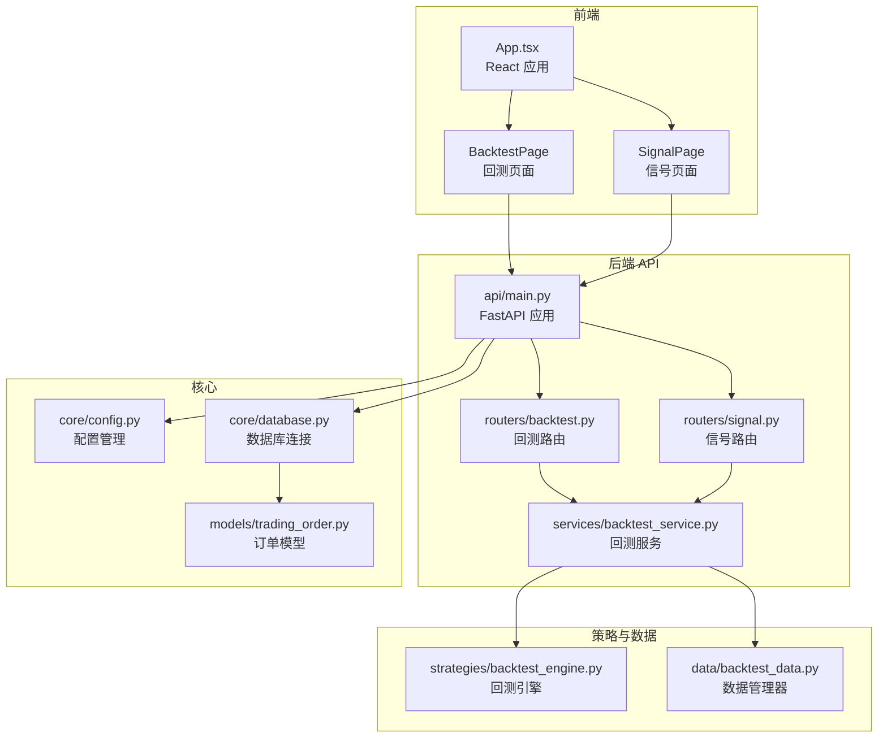
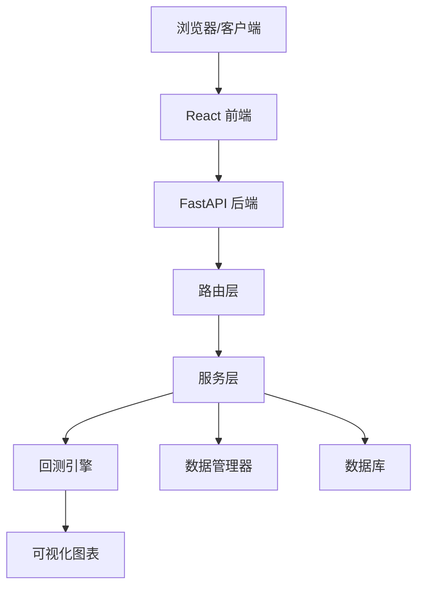
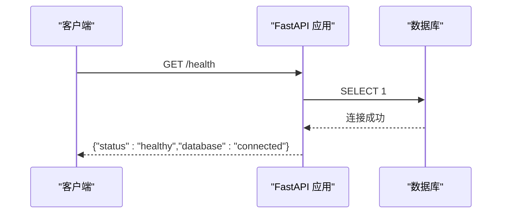
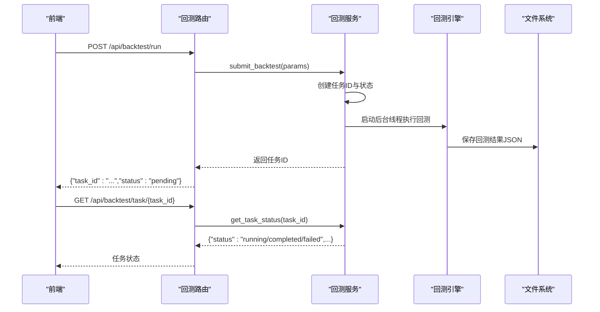
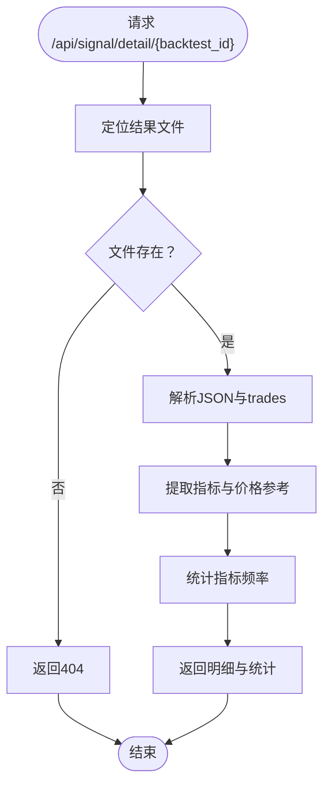
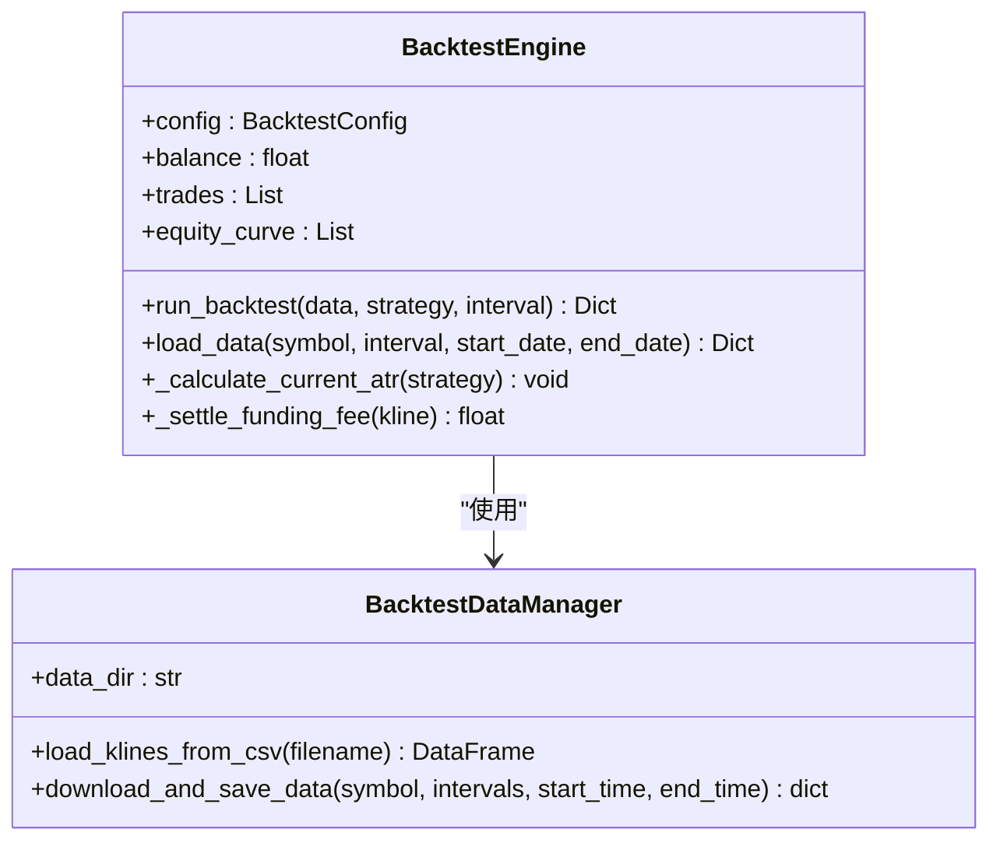
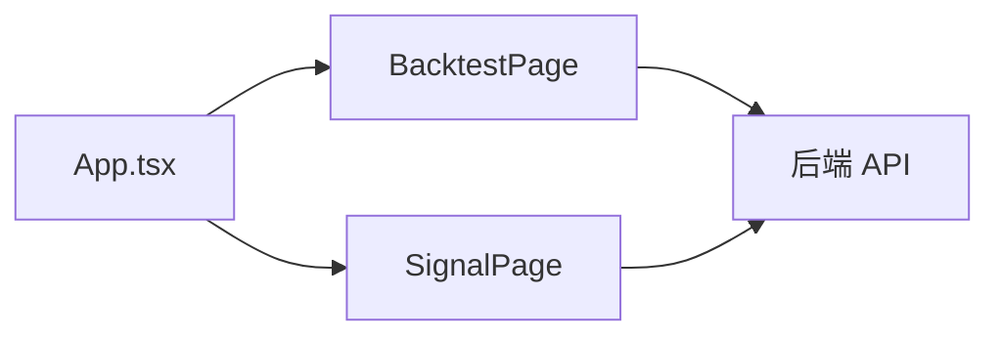
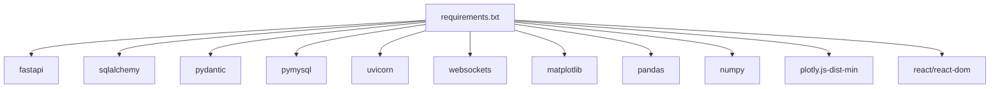
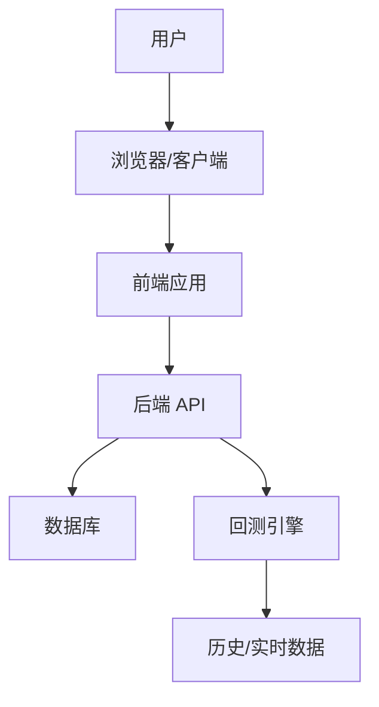

# 系统架构

<cite>
**本文档引用的文件**
- [README.md](file://README.md)
- [main.py](file://main.py)
- [requirements.txt](file://requirements.txt)
- [trading_system/api/main.py](file://trading_system/api/main.py)
- [trading_system/api/routers/backtest.py](file://trading_system/api/routers/backtest.py)
- [trading_system/api/routers/signal.py](file://trading_system/api/routers/signal.py)
- [trading_system/api/services/backtest_service.py](file://trading_system/api/services/backtest_service.py)
- [trading_system/core/config.py](file://trading_system/core/config.py)
- [trading_system/core/database.py](file://trading_system/core/database.py)
- [trading_system/models/trading_order.py](file://trading_system/models/trading_order.py)
- [trading_system/strategies/backtest_engine.py](file://trading_system/strategies/backtest_engine.py)
- [trading_system/data/backtest_data.py](file://trading_system/data/backtest_data.py)
- [frontend/src/App.tsx](file://frontend/src/App.tsx)
- [frontend/package.json](file://frontend/package.json)
- [log_config.py](file://log_config.py)
</cite>

## 目录
1. [简介](#简介)
2. [项目结构](#项目结构)
3. [核心组件](#核心组件)
4. [架构总览](#架构总览)
5. [组件详细分析](#组件详细分析)
6. [依赖关系分析](#依赖关系分析)
7. [性能考量](#性能考量)
8. [故障排查指南](#故障排查指南)
9. [结论](#结论)
10. [附录](#附录)

## 简介
本项目是一个基于 Python 的加密货币交易系统，采用前后端分离架构与事件驱动思想，结合微服务化的 API 设计与回测引擎，提供策略回测、信号分析与可视化展示能力。系统通过 FastAPI 提供 REST 接口，前端使用 React + TypeScript 构建，数据持久化采用 SQLAlchemy + MySQL，回测引擎基于 Pandas/NumPy 实现高性能策略回测与可视化。

## 项目结构
项目采用“后端 API + 前端页面 + 策略与数据工具”的分层组织方式：
- 后端 API 层：FastAPI 应用、路由、服务层、核心配置与数据库连接
- 策略与回测：回测引擎、策略基类与具体策略、数据管理器
- 前端：React 页面组件与 API 封装
- 基础设施：日志配置、依赖声明、主入口

**图表来源**
- [trading_system/api/main.py:12-104](file://trading_system/api/main.py#L12-L104)
- [trading_system/api/routers/backtest.py:1-68](file://trading_system/api/routers/backtest.py#L1-L68)
- [trading_system/api/routers/signal.py:1-178](file://trading_system/api/routers/signal.py#L1-L178)
- [trading_system/api/services/backtest_service.py:1-289](file://trading_system/api/services/backtest_service.py#L1-L289)
- [trading_system/core/config.py:1-35](file://trading_system/core/config.py#L1-L35)
- [trading_system/core/database.py:1-45](file://trading_system/core/database.py#L1-L45)
- [trading_system/models/trading_order.py:1-43](file://trading_system/models/trading_order.py#L1-L43)
- [trading_system/strategies/backtest_engine.py:1-800](file://trading_system/strategies/backtest_engine.py#L1-L800)
- [trading_system/data/backtest_data.py:1-137](file://trading_system/data/backtest_data.py#L1-L137)
- [frontend/src/App.tsx:1-50](file://frontend/src/App.tsx#L1-L50)

**章节来源**
- [README.md:1-150](file://README.md#L1-L150)
- [main.py:1-13](file://main.py#L1-L13)
- [requirements.txt:1-64](file://requirements.txt#L1-L64)

## 核心组件
- FastAPI 应用与中间件：CORS、异常处理、健康检查、静态文件挂载
- 路由与服务：回测路由（列表、参数模板、任务提交与查询）、信号路由（分类、明细、分析）
- 回测服务：任务提交、并发执行、状态管理、结果持久化
- 核心配置与数据库：配置项、连接池、会话管理、表初始化
- 回测引擎：数据加载、策略执行、资金费用结算、可视化
- 数据管理器：本地 CSV 加载、Binance 实时数据下载
- 前端应用：页面切换、API 调用、结果展示

**章节来源**
- [trading_system/api/main.py:12-104](file://trading_system/api/main.py#L12-L104)
- [trading_system/api/routers/backtest.py:1-68](file://trading_system/api/routers/backtest.py#L1-L68)
- [trading_system/api/routers/signal.py:1-178](file://trading_system/api/routers/signal.py#L1-L178)
- [trading_system/api/services/backtest_service.py:1-289](file://trading_system/api/services/backtest_service.py#L1-L289)
- [trading_system/core/config.py:1-35](file://trading_system/core/config.py#L1-L35)
- [trading_system/core/database.py:1-45](file://trading_system/core/database.py#L1-L45)
- [trading_system/strategies/backtest_engine.py:1-800](file://trading_system/strategies/backtest_engine.py#L1-L800)
- [trading_system/data/backtest_data.py:1-137](file://trading_system/data/backtest_data.py#L1-L137)
- [frontend/src/App.tsx:1-50](file://frontend/src/App.tsx#L1-L50)

## 架构总览
系统采用前后端分离与微服务化 API 的混合架构：
- 前端：React 应用，负责用户交互与可视化
- 后端：FastAPI 提供 REST API，路由层解耦业务逻辑，服务层封装任务执行
- 数据层：MySQL + SQLAlchemy，支持连接池与事务
- 策略层：回测引擎与策略集合，支持多周期数据与可视化
- 事件与异步：服务层使用线程池执行耗时任务，API 层保持响应式

**图表来源**
- [trading_system/api/main.py:12-104](file://trading_system/api/main.py#L12-L104)
- [trading_system/api/routers/backtest.py:1-68](file://trading_system/api/routers/backtest.py#L1-L68)
- [trading_system/api/routers/signal.py:1-178](file://trading_system/api/routers/signal.py#L1-L178)
- [trading_system/api/services/backtest_service.py:58-248](file://trading_system/api/services/backtest_service.py#L58-L248)
- [trading_system/strategies/backtest_engine.py:445-538](file://trading_system/strategies/backtest_engine.py#L445-L538)
- [trading_system/data/backtest_data.py:47-136](file://trading_system/data/backtest_data.py#L47-L136)
- [trading_system/core/database.py:12-45](file://trading_system/core/database.py#L12-L45)

## 组件详细分析

### API 应用与中间件
- CORS 允许任意来源访问
- 全局异常处理与 HTTP 异常处理
- 启动事件初始化数据库
- 健康检查端点验证数据库连通性
- 静态文件挂载以服务前端构建产物

**图表来源**
- [trading_system/api/main.py:58-87](file://trading_system/api/main.py#L58-L87)

**章节来源**
- [trading_system/api/main.py:12-104](file://trading_system/api/main.py#L12-L104)

### 回测路由与服务
- 回测路由提供：历史结果列表、参数模板、单次结果查询、任务提交、任务状态查询、可用日期范围
- 服务层提交任务后在后台线程执行，维护任务状态字典，支持模糊匹配结果文件名

**图表来源**
- [trading_system/api/routers/backtest.py:27-62](file://trading_system/api/routers/backtest.py#L27-L62)
- [trading_system/api/services/backtest_service.py:58-248](file://trading_system/api/services/backtest_service.py#L58-L248)

**章节来源**
- [trading_system/api/routers/backtest.py:1-68](file://trading_system/api/routers/backtest.py#L1-L68)
- [trading_system/api/services/backtest_service.py:1-289](file://trading_system/api/services/backtest_service.py#L1-L289)

### 信号路由与分析
- 信号路由提供：信号分类映射、按回测ID获取信号明细、综合分析
- 明细解析 reason 字段提取指标类别与价格参考，统计指标触发频率，汇总交易摘要

**图表来源**
- [trading_system/api/routers/signal.py:31-131](file://trading_system/api/routers/signal.py#L31-L131)

**章节来源**
- [trading_system/api/routers/signal.py:1-178](file://trading_system/api/routers/signal.py#L1-L178)

### 回测引擎与数据管理
- 回测引擎支持多周期数据注入、ATR 动态止损、资金费用结算、可视化图表生成
- 数据管理器支持本地 CSV 加载与 Binance 实时数据下载

**图表来源**
- [trading_system/strategies/backtest_engine.py:228-538](file://trading_system/strategies/backtest_engine.py#L228-L538)
- [trading_system/data/backtest_data.py:9-136](file://trading_system/data/backtest_data.py#L9-L136)

**章节来源**
- [trading_system/strategies/backtest_engine.py:1-800](file://trading_system/strategies/backtest_engine.py#L1-L800)
- [trading_system/data/backtest_data.py:1-137](file://trading_system/data/backtest_data.py#L1-L137)

### 前端应用与页面
- App 组件负责标签页切换与数据加载
- 通过 api 封装调用后端接口，BacktestPage 与 SignalPage 分别渲染回测与信号分析界面

**图表来源**
- [frontend/src/App.tsx:1-50](file://frontend/src/App.tsx#L1-L50)
- [frontend/package.json:1-22](file://frontend/package.json#L1-L22)

**章节来源**
- [frontend/src/App.tsx:1-50](file://frontend/src/App.tsx#L1-L50)
- [frontend/package.json:1-22](file://frontend/package.json#L1-L22)

## 依赖关系分析
- 后端依赖：FastAPI、SQLAlchemy、Pydantic、PyMySQL、Uvicorn、WebSockets、Matplotlib、Pandas、NumPy
- 前端依赖：React、React DOM、Plotly.js、TypeScript、Vite
- 配置与日志：pydantic-settings、python-dotenv、日志统一配置

**图表来源**
- [requirements.txt:1-64](file://requirements.txt#L1-L64)

**章节来源**
- [requirements.txt:1-64](file://requirements.txt#L1-L64)

## 性能考量
- 数据加载与处理
  - 使用 Pandas/NumPy 进行向量化计算，减少 Python 循环开销
  - 多周期数据按需加载与增量更新，避免全量重载
- 并发与任务调度
  - 回测任务在后台线程执行，避免阻塞 API 响应
  - 使用连接池与预检 ping 降低数据库连接延迟
- 可视化与内存
  - 定期垃圾回收，避免长时间回测导致内存膨胀
  - 可选关闭图表生成以节省资源

[本节为通用性能建议，不直接分析特定文件]

## 故障排查指南
- 数据库连接失败
  - 检查数据库 URL 与连接池配置，确认服务启动时初始化成功
- 回测任务失败
  - 查看服务层日志与任务状态错误信息，确认数据文件是否存在与格式正确
- 健康检查失败
  - 使用 /health 端点诊断数据库连通性，关注异常堆栈
- 前端无法加载
  - 确认静态文件挂载与端口开放，检查网络代理与跨域配置

**章节来源**
- [trading_system/core/database.py:37-45](file://trading_system/core/database.py#L37-L45)
- [trading_system/api/main.py:58-87](file://trading_system/api/main.py#L58-L87)
- [trading_system/api/services/backtest_service.py:240-244](file://trading_system/api/services/backtest_service.py#L240-L244)
- [log_config.py:11-56](file://log_config.py#L11-L56)

## 结论
该系统通过清晰的分层与模块化设计，实现了从前端可视化到后端 API、回测引擎与数据管理的完整闭环。FastAPI 提供了高可用的接口层，回测引擎具备多周期与可视化能力，前后端分离提升了开发与部署的灵活性。后续可在容器化、消息队列与可观测性方面进一步增强。

## 附录
- 系统上下文图（概念性）

[本图为概念性示意，不对应具体源码文件]