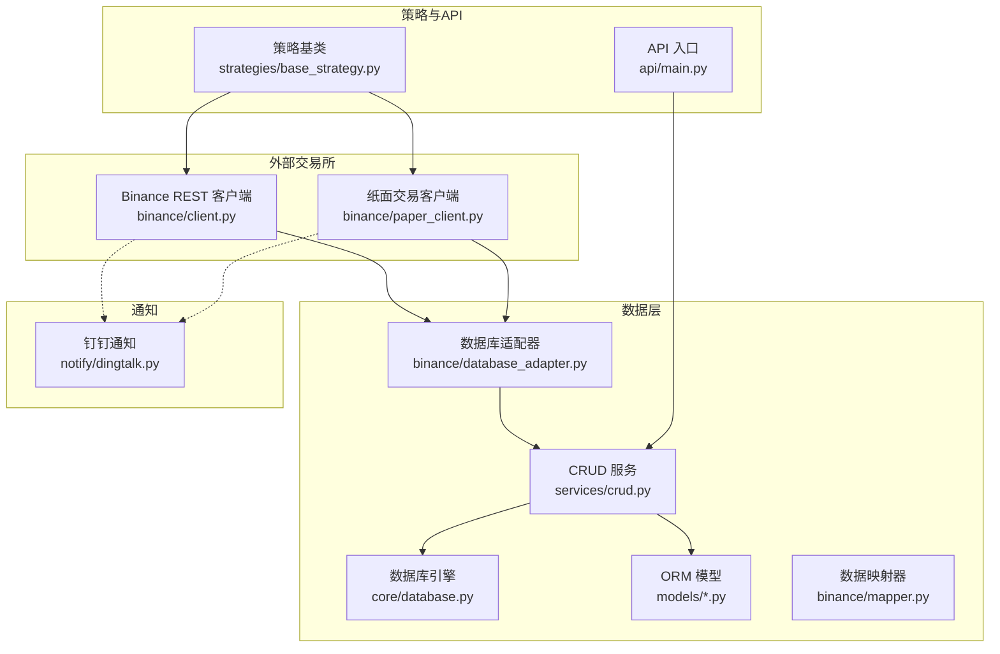
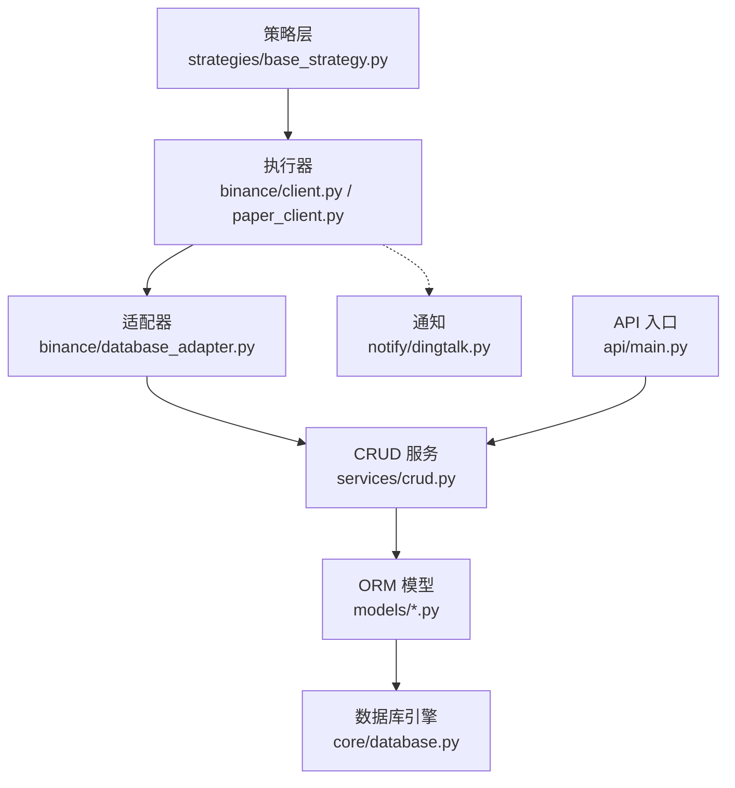
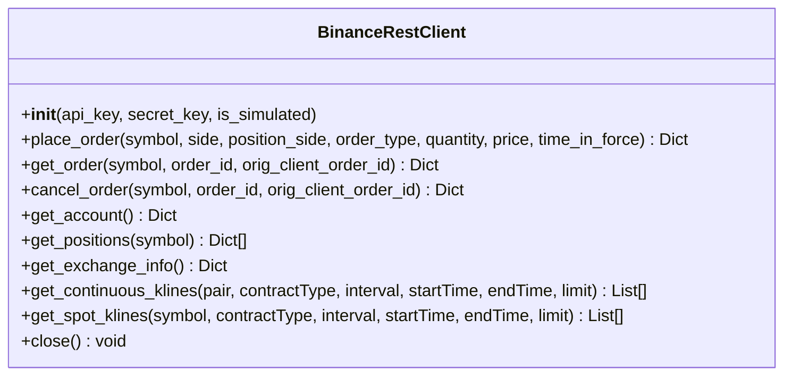
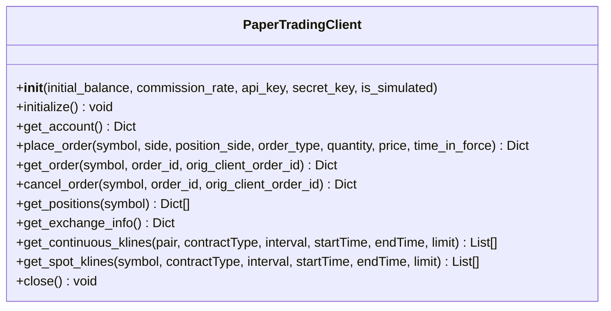
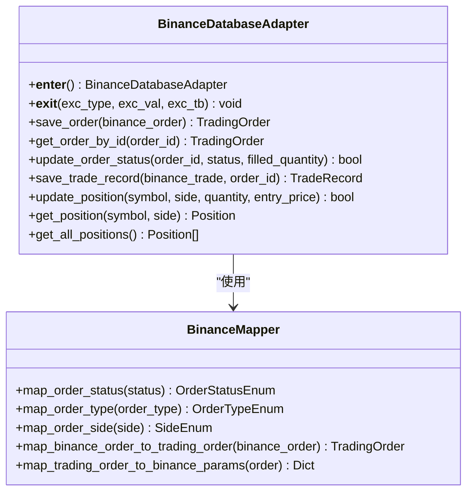
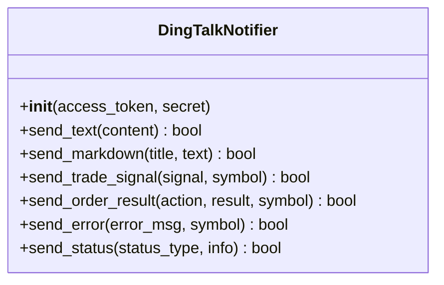
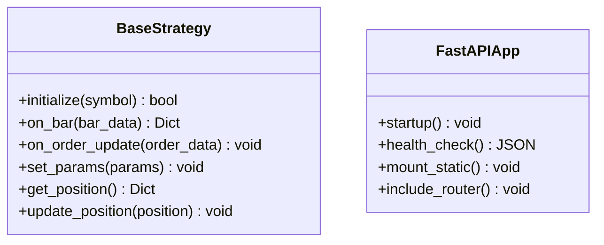
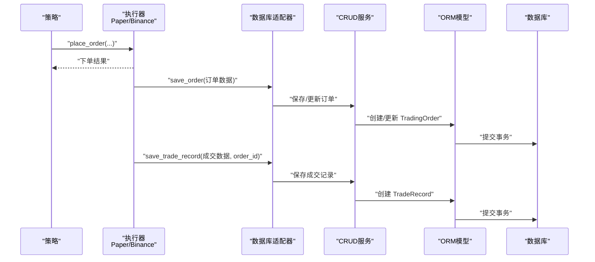
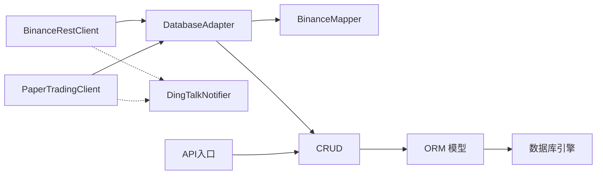

# 集成架构

<cite>
**本文引用的文件**
- [trading_system/binance/client.py](file://trading_system/binance/client.py)
- [trading_system/binance/paper_client.py](file://trading_system/binance/paper_client.py)
- [trading_system/binance/database_adapter.py](file://trading_system/binance/database_adapter.py)
- [trading_system/binance/mapper.py](file://trading_system/binance/mapper.py)
- [trading_system/binance/enums.py](file://trading_system/binance/enums.py)
- [trading_system/binance/config.py](file://trading_system/binance/config.py)
- [trading_system/notify/dingtalk.py](file://trading_system/notify/dingtalk.py)
- [trading_system/core/database.py](file://trading_system/core/database.py)
- [trading_system/models/trading_order.py](file://trading_system/models/trading_order.py)
- [trading_system/models/position.py](file://trading_system/models/position.py)
- [trading_system/models/trade_record.py](file://trading_system/models/trade_record.py)
- [trading_system/services/crud.py](file://trading_system/services/crud.py)
- [trading_system/api/main.py](file://trading_system/api/main.py)
- [trading_system/strategies/base_strategy.py](file://trading_system/strategies/base_strategy.py)
</cite>

## 目录
1. [简介](#简介)
2. [项目结构](#项目结构)
3. [核心组件](#核心组件)
4. [架构总览](#架构总览)
5. [详细组件分析](#详细组件分析)
6. [依赖分析](#依赖分析)
7. [性能考虑](#性能考虑)
8. [故障排查指南](#故障排查指南)
9. [结论](#结论)
10. [附录](#附录)

## 简介
本文件面向加密货币交易系统的集成架构，聚焦于与外部交易所（Binance、OKX）及第三方服务（钉钉通知）的对接设计。系统采用“API客户端封装 + 数据适配器模式 + 消息通知系统”的分层架构，支持PaperClient纸面交易模拟与ExchangeClient真实交易执行双模运行，并通过DatabaseAdapter实现数据转换与持久化。文档详细说明集成接口设计、错误重试策略与限流控制、安全认证机制、数据同步策略与故障恢复方案，并提供集成流程图与接口调用示例。

## 项目结构
系统按功能域划分模块，核心路径如下：
- 外部交易所接入：binance（Binance REST客户端、纸面交易客户端、数据库适配器、数据映射器、配置）
- 第三方通知：notify（钉钉机器人通知）
- 数据层：core（数据库引擎）、models（ORM模型）、services（CRUD服务）
- 策略层：strategies（策略基类）
- API网关：api（FastAPI入口）

图表来源
- [trading_system/binance/client.py:10-342](file://trading_system/binance/client.py#L10-L342)
- [trading_system/binance/paper_client.py:20-328](file://trading_system/binance/paper_client.py#L20-L328)
- [trading_system/binance/database_adapter.py:14-189](file://trading_system/binance/database_adapter.py#L14-L189)
- [trading_system/binance/mapper.py:15-110](file://trading_system/binance/mapper.py#L15-L110)
- [trading_system/core/database.py:12-45](file://trading_system/core/database.py#L12-L45)
- [trading_system/models/trading_order.py:26-43](file://trading_system/models/trading_order.py#L26-L43)
- [trading_system/models/position.py:6-18](file://trading_system/models/position.py#L6-L18)
- [trading_system/models/trade_record.py:8-22](file://trading_system/models/trade_record.py#L8-L22)
- [trading_system/services/crud.py:9-137](file://trading_system/services/crud.py#L9-L137)
- [trading_system/notify/dingtalk.py:14-185](file://trading_system/notify/dingtalk.py#L14-L185)
- [trading_system/api/main.py:12-104](file://trading_system/api/main.py#L12-L104)
- [trading_system/strategies/base_strategy.py:8-168](file://trading_system/strategies/base_strategy.py#L8-L168)

章节来源
- [trading_system/api/main.py:12-104](file://trading_system/api/main.py#L12-L104)

## 核心组件
- BinanceRestClient：基于官方SDK封装REST API，提供下单、撤单、查询、账户、K线等能力，支持模拟盘与实盘切换。
- PaperTradingClient：本地纸面交易模拟，接口与BinanceRestClient保持一致，用于回测与策略验证。
- BinanceDatabaseAdapter：数据库适配器，负责将交易所返回的数据映射为ORM模型并持久化，提供订单、成交、持仓的读写。
- BinanceMapper：数据映射器，统一映射订单状态、类型、方向等枚举，以及下单参数构造。
- DingTalkNotifier：钉钉机器人通知，支持文本与Markdown消息、签名认证、限流控制。
- 数据库与模型：基于SQLAlchemy，提供交易订单、成交记录、持仓等表结构与CRUD服务。
- API入口：FastAPI提供健康检查、静态资源挂载与路由注册，数据库在启动时初始化。

章节来源
- [trading_system/binance/client.py:10-342](file://trading_system/binance/client.py#L10-L342)
- [trading_system/binance/paper_client.py:20-328](file://trading_system/binance/paper_client.py#L20-L328)
- [trading_system/binance/database_adapter.py:14-189](file://trading_system/binance/database_adapter.py#L14-L189)
- [trading_system/binance/mapper.py:15-110](file://trading_system/binance/mapper.py#L15-L110)
- [trading_system/notify/dingtalk.py:14-185](file://trading_system/notify/dingtalk.py#L14-L185)
- [trading_system/core/database.py:12-45](file://trading_system/core/database.py#L12-L45)
- [trading_system/models/trading_order.py:26-43](file://trading_system/models/trading_order.py#L26-L43)
- [trading_system/models/position.py:6-18](file://trading_system/models/position.py#L6-L18)
- [trading_system/models/trade_record.py:8-22](file://trading_system/models/trade_record.py#L8-L22)
- [trading_system/services/crud.py:9-137](file://trading_system/services/crud.py#L9-L137)
- [trading_system/api/main.py:58-88](file://trading_system/api/main.py#L58-L88)

## 架构总览
系统采用“策略驱动 + 外部交易所适配 + 数据持久化 + 通知告警”的分层设计。策略层通过统一接口与外部交易所交互，PaperClient用于离线回测，BinanceRestClient用于实盘交易。数据通过适配器映射到ORM模型并持久化，通知模块负责风控与业务事件提醒。

图表来源
- [trading_system/strategies/base_strategy.py:8-168](file://trading_system/strategies/base_strategy.py#L8-L168)
- [trading_system/binance/client.py:10-342](file://trading_system/binance/client.py#L10-L342)
- [trading_system/binance/paper_client.py:20-328](file://trading_system/binance/paper_client.py#L20-L328)
- [trading_system/binance/database_adapter.py:14-189](file://trading_system/binance/database_adapter.py#L14-L189)
- [trading_system/services/crud.py:9-137](file://trading_system/services/crud.py#L9-L137)
- [trading_system/models/trading_order.py:26-43](file://trading_system/models/trading_order.py#L26-L43)
- [trading_system/models/position.py:6-18](file://trading_system/models/position.py#L6-L18)
- [trading_system/models/trade_record.py:8-22](file://trading_system/models/trade_record.py#L8-L22)
- [trading_system/core/database.py:12-45](file://trading_system/core/database.py#L12-L45)
- [trading_system/notify/dingtalk.py:14-185](file://trading_system/notify/dingtalk.py#L14-L185)
- [trading_system/api/main.py:58-88](file://trading_system/api/main.py#L58-L88)

## 详细组件分析

### 组件A：BinanceRestClient（真实交易执行）
- 角色定位：封装Binance REST API，提供下单、撤单、查询、账户、K线等能力，支持模拟盘与实盘切换。
- 关键接口与职责
  - 下单：构造参数并调用SDK下单，记录请求与响应日志，异常时返回错误结构。
  - 查询/撤单：支持按订单ID或客户端订单ID查询与撤单。
  - 账户与持仓：获取账户资金、持仓风险等信息。
  - K线：支持永续与现货K线，支持时间范围与数量限制。
- 错误处理：捕获异常并记录错误日志，返回标准化错误结构，避免中断流程。
- 限流与并发：通过异步执行与线程池包装SDK调用，避免阻塞事件循环。

图表来源
- [trading_system/binance/client.py:10-342](file://trading_system/binance/client.py#L10-L342)

章节来源
- [trading_system/binance/client.py:10-342](file://trading_system/binance/client.py#L10-L342)

### 组件B：PaperTradingClient（纸面交易模拟）
- 角色定位：与BinanceRestClient保持一致的公开接口，用于策略回测与验证，不向交易所发送真实订单。
- 关键机制
  - 账户模拟：维护可用余额、未实现盈亏、总权益等。
  - 订单模拟：即时成交、手续费计算、开平仓逻辑、成交记录追加。
  - 持仓模拟：按开仓均价与数量更新，支持多仓叠加与平仓。
  - K线获取：委托BinanceRestClient获取K线并缓存最新价格。
- 报告输出：回测结束打印最终报告，包含初始资金、总盈亏、手续费、胜率、平均盈亏等。

图表来源
- [trading_system/binance/paper_client.py:20-328](file://trading_system/binance/paper_client.py#L20-L328)

章节来源
- [trading_system/binance/paper_client.py:20-328](file://trading_system/binance/paper_client.py#L20-L328)

### 组件C：BinanceDatabaseAdapter（数据适配器）
- 角色定位：将外部交易所返回的数据映射为ORM模型并持久化，提供订单、成交、持仓的读写接口。
- 关键职责
  - 订单保存与更新：去重、状态同步、时间戳更新。
  - 成交记录保存：绑定订单ID，记录价格、数量、手续费与时间。
  - 持仓更新：按交易对与方向更新数量与均价，支持新增与覆盖。
  - 事务管理：with上下文自动开启/关闭/回滚，异常时保证一致性。
- 与Mapper协作：通过BinanceMapper完成状态、类型、方向的标准化映射。

图表来源
- [trading_system/binance/database_adapter.py:14-189](file://trading_system/binance/database_adapter.py#L14-L189)
- [trading_system/binance/mapper.py:15-110](file://trading_system/binance/mapper.py#L15-L110)

章节来源
- [trading_system/binance/database_adapter.py:14-189](file://trading_system/binance/database_adapter.py#L14-L189)
- [trading_system/binance/mapper.py:15-110](file://trading_system/binance/mapper.py#L15-L110)

### 组件D：DingTalkNotifier（消息通知）
- 角色定位：通过钉钉机器人发送文本与Markdown消息，支持签名认证与限流控制。
- 关键机制
  - 签名认证：生成timestamp与sign，拼接到URL。
  - 限流控制：1分钟最多18条消息，超过则丢弃。
  - 消息类型：交易信号、订单结果、异常、策略启停、风控告警等。
- 异常处理：网络异常、接口返回非成功码时记录错误日志。

图表来源
- [trading_system/notify/dingtalk.py:14-185](file://trading_system/notify/dingtalk.py#L14-L185)

章节来源
- [trading_system/notify/dingtalk.py:14-185](file://trading_system/notify/dingtalk.py#L14-L185)

### 组件E：策略基类与API入口
- 策略基类：定义initialize、on_bar、on_order_update等抽象方法，提供参数设置与持仓查询能力，确保策略实现的一致性。
- API入口：FastAPI应用，注册CORS、全局异常处理器、健康检查、静态文件挂载与路由，启动时初始化数据库。

图表来源
- [trading_system/strategies/base_strategy.py:8-168](file://trading_system/strategies/base_strategy.py#L8-L168)
- [trading_system/api/main.py:58-98](file://trading_system/api/main.py#L58-L98)

章节来源
- [trading_system/strategies/base_strategy.py:8-168](file://trading_system/strategies/base_strategy.py#L8-L168)
- [trading_system/api/main.py:58-98](file://trading_system/api/main.py#L58-L98)

### API/服务组件：下单流程序列图
以下展示策略触发下单后，经过PaperClient/BinanceRestClient、DatabaseAdapter、CRUD与模型的完整流程。

图表来源
- [trading_system/binance/paper_client.py:83-188](file://trading_system/binance/paper_client.py#L83-L188)
- [trading_system/binance/client.py:38-73](file://trading_system/binance/client.py#L38-L73)
- [trading_system/binance/database_adapter.py:31-61](file://trading_system/binance/database_adapter.py#L31-L61)
- [trading_system/services/crud.py:9-55](file://trading_system/services/crud.py#L9-L55)
- [trading_system/models/trading_order.py:26-43](file://trading_system/models/trading_order.py#L26-L43)
- [trading_system/models/trade_record.py:8-22](file://trading_system/models/trade_record.py#L8-L22)

## 依赖分析
- 组件耦合与内聚
  - BinanceRestClient/PaperTradingClient与DatabaseAdapter通过统一的订单/成交数据结构解耦，便于替换执行器。
  - DatabaseAdapter依赖Mapper进行数据标准化，降低外部接口差异带来的影响。
  - API入口仅依赖CRUD与模型，不直接依赖外部交易所SDK，便于扩展与测试。
- 外部依赖
  - Binance SDK（UM Futures）、SQLAlchemy、FastAPI、钉钉Webhook。
- 循环依赖
  - 未发现循环依赖，模块边界清晰。

图表来源
- [trading_system/binance/client.py:10-342](file://trading_system/binance/client.py#L10-L342)
- [trading_system/binance/paper_client.py:20-328](file://trading_system/binance/paper_client.py#L20-L328)
- [trading_system/binance/database_adapter.py:14-189](file://trading_system/binance/database_adapter.py#L14-L189)
- [trading_system/binance/mapper.py:15-110](file://trading_system/binance/mapper.py#L15-L110)
- [trading_system/services/crud.py:9-137](file://trading_system/services/crud.py#L9-L137)
- [trading_system/models/trading_order.py:26-43](file://trading_system/models/trading_order.py#L26-L43)
- [trading_system/models/position.py:6-18](file://trading_system/models/position.py#L6-L18)
- [trading_system/models/trade_record.py:8-22](file://trading_system/models/trade_record.py#L8-L22)
- [trading_system/core/database.py:12-45](file://trading_system/core/database.py#L12-L45)
- [trading_system/notify/dingtalk.py:14-185](file://trading_system/notify/dingtalk.py#L14-L185)
- [trading_system/api/main.py:58-98](file://trading_system/api/main.py#L58-L98)

章节来源
- [trading_system/binance/client.py:10-342](file://trading_system/binance/client.py#L10-L342)
- [trading_system/binance/paper_client.py:20-328](file://trading_system/binance/paper_client.py#L20-L328)
- [trading_system/binance/database_adapter.py:14-189](file://trading_system/binance/database_adapter.py#L14-L189)
- [trading_system/binance/mapper.py:15-110](file://trading_system/binance/mapper.py#L15-L110)
- [trading_system/services/crud.py:9-137](file://trading_system/services/crud.py#L9-L137)
- [trading_system/models/trading_order.py:26-43](file://trading_system/models/trading_order.py#L26-L43)
- [trading_system/models/position.py:6-18](file://trading_system/models/position.py#L6-L18)
- [trading_system/models/trade_record.py:8-22](file://trading_system/models/trade_record.py#L8-L22)
- [trading_system/core/database.py:12-45](file://trading_system/core/database.py#L12-L45)
- [trading_system/notify/dingtalk.py:14-185](file://trading_system/notify/dingtalk.py#L14-L185)
- [trading_system/api/main.py:58-98](file://trading_system/api/main.py#L58-L98)

## 性能考虑
- 异步与并发
  - BinanceRestClient通过事件循环与线程池包装SDK调用，避免阻塞。
  - PaperTradingClient为纯内存操作，适合高并发回测场景。
- 数据库连接池
  - 通过SQLAlchemy连接池参数（pool_size、max_overflow、pool_recycle、pool_pre_ping）提升并发与稳定性。
- 限流与降级
  - 钉钉通知限流（1分钟18条），防止触发频率限制。
  - 外部API异常时返回错误结构，避免级联故障。
- 缓存与批处理
  - PaperClient缓存K线最新价格，减少重复查询。
  - 建议在批量下单/查询时采用分批与退避重试策略（见“错误重试策略”）。

## 故障排查指南
- 外部API错误
  - 现象：下单/查询/撤单返回错误结构。
  - 排查：查看日志中的请求参数与异常堆栈，确认参数合法性与网络连通性。
  - 参考路径：[下单错误处理:66-72](file://trading_system/binance/client.py#L66-L72)、[查询错误处理:94-99](file://trading_system/binance/client.py#L94-L99)、[撤单错误处理:121-127](file://trading_system/binance/client.py#L121-L127)
- 数据库事务异常
  - 现象：保存订单/成交失败，日志显示回滚。
  - 排查：检查数据库连接、权限与表结构，确认唯一约束与字段类型。
  - 参考路径：[适配器事务处理:24-30](file://trading_system/binance/database_adapter.py#L24-L30)、[订单保存异常:58-61](file://trading_system/binance/database_adapter.py#L58-L61)
- 通知失败
  - 现象：钉钉消息发送失败或被限流。
  - 排查：确认access_token与secret配置正确，检查签名生成与URL拼接，关注限流日志。
  - 参考路径：[签名与限流:32-52](file://trading_system/notify/dingtalk.py#L32-L52)、[发送异常:69-71](file://trading_system/notify/dingtalk.py#L69-L71)
- API健康检查失败
  - 现象：健康检查返回未连接。
  - 排查：检查数据库URL、连接池参数与目标数据库可达性。
  - 参考路径：[健康检查:75-87](file://trading_system/api/main.py#L75-L87)、[数据库引擎:12-21](file://trading_system/core/database.py#L12-L21)

章节来源
- [trading_system/binance/client.py:66-127](file://trading_system/binance/client.py#L66-L127)
- [trading_system/binance/database_adapter.py:24-61](file://trading_system/binance/database_adapter.py#L24-L61)
- [trading_system/notify/dingtalk.py:32-71](file://trading_system/notify/dingtalk.py#L32-L71)
- [trading_system/api/main.py:75-87](file://trading_system/api/main.py#L75-L87)
- [trading_system/core/database.py:12-21](file://trading_system/core/database.py#L12-L21)

## 结论
本集成架构以“策略驱动 + 外部交易所适配 + 数据持久化 + 通知告警”为核心，通过PaperClient与BinanceRestClient实现双模运行，DatabaseAdapter与Mapper保障数据一致性与可扩展性，DingTalkNotifier提供风控与运营级告警。系统具备良好的模块内聚、低耦合与可测试性，适合在加密货币交易场景下进行策略迭代与生产部署。

## 附录

### 集成接口设计要点
- 统一接口：PaperTradingClient与BinanceRestClient对外暴露一致的方法签名，便于策略无感切换。
- 参数映射：BinanceMapper负责状态、类型、方向的标准化，减少外部差异。
- 事务语义：DatabaseAdapter以with块管理事务，异常自动回滚，保证数据一致性。
- 通知契约：DingTalkNotifier提供多种消息模板，统一告警格式。

章节来源
- [trading_system/binance/paper_client.py:83-188](file://trading_system/binance/paper_client.py#L83-L188)
- [trading_system/binance/client.py:38-73](file://trading_system/binance/client.py#L38-L73)
- [trading_system/binance/mapper.py:63-110](file://trading_system/binance/mapper.py#L63-L110)
- [trading_system/binance/database_adapter.py:20-30](file://trading_system/binance/database_adapter.py#L20-L30)
- [trading_system/notify/dingtalk.py:87-147](file://trading_system/notify/dingtalk.py#L87-L147)

### 错误重试策略与限流控制
- 外部API重试
  - 建议：对临时性错误（网络抖动、超时）采用指数退避重试，最大重试次数与超时阈值需结合业务SLA配置。
  - 参考：下单/查询/撤单的异常捕获与日志记录。
- 通知限流
  - 1分钟最多18条消息，超出则丢弃并记录警告。
  - 参考：[限流检查:45-52](file://trading_system/notify/dingtalk.py#L45-L52)

章节来源
- [trading_system/binance/client.py:66-127](file://trading_system/binance/client.py#L66-L127)
- [trading_system/notify/dingtalk.py:45-52](file://trading_system/notify/dingtalk.py#L45-L52)

### 安全认证机制
- 钉钉签名认证
  - 生成timestamp与sign，拼接到URL，确保消息来源可信。
  - 参考：[签名生成:32-43](file://trading_system/notify/dingtalk.py#L32-L43)
- 外部API密钥
  - Binance REST客户端通过配置类注入API Key/Secret，支持模拟盘与实盘切换。
  - 参考：[配置类:27-67](file://trading_system/binance/config.py#L27-L67)、[客户端初始化:13-30](file://trading_system/binance/client.py#L13-L30)

章节来源
- [trading_system/notify/dingtalk.py:32-43](file://trading_system/notify/dingtalk.py#L32-L43)
- [trading_system/binance/config.py:27-67](file://trading_system/binance/config.py#L27-L67)
- [trading_system/binance/client.py:13-30](file://trading_system/binance/client.py#L13-L30)

### 数据同步策略与故障恢复
- 数据同步
  - 订单状态：通过DatabaseAdapter更新状态与已成交数量，确保与外部一致。
  - 成交记录：按订单ID关联，保证审计与复盘数据完整性。
  - 持仓：按交易对与方向聚合，支持开仓均价与数量的动态更新。
- 故障恢复
  - 事务回滚：异常时自动回滚，避免脏数据。
  - 重试与降级：建议在上游API失败时采用重试与熔断，必要时降级为只读模式。
  - 参考：[适配器事务:24-30](file://trading_system/binance/database_adapter.py#L24-L30)、[CRUD更新:37-45](file://trading_system/services/crud.py#L37-L45)

章节来源
- [trading_system/binance/database_adapter.py:36-97](file://trading_system/binance/database_adapter.py#L36-L97)
- [trading_system/services/crud.py:37-45](file://trading_system/services/crud.py#L37-L45)

### 集成流程图与接口调用示例
- 策略下单流程（参考上文序列图）
- 接口调用示例（以路径代替代码片段）
  - 下单：[下单接口:38-73](file://trading_system/binance/client.py#L38-L73)
  - 查询订单：[查询接口:74-99](file://trading_system/binance/client.py#L74-L99)
  - 取消订单：[撤单接口:101-127](file://trading_system/binance/client.py#L101-L127)
  - 获取账户：[账户接口:129-138](file://trading_system/binance/client.py#L129-L138)
  - 获取K线：[K线接口:172-236](file://trading_system/binance/client.py#L172-L236)
  - 纸面下单：[纸面下单:83-188](file://trading_system/binance/paper_client.py#L83-L188)
  - 保存订单：[保存订单:31-61](file://trading_system/binance/database_adapter.py#L31-L61)
  - 保存成交：[保存成交:99-126](file://trading_system/binance/database_adapter.py#L99-L126)
  - 更新持仓：[更新持仓:128-161](file://trading_system/binance/database_adapter.py#L128-L161)
  - 发送通知：[发送Markdown:80-85](file://trading_system/notify/dingtalk.py#L80-L85)