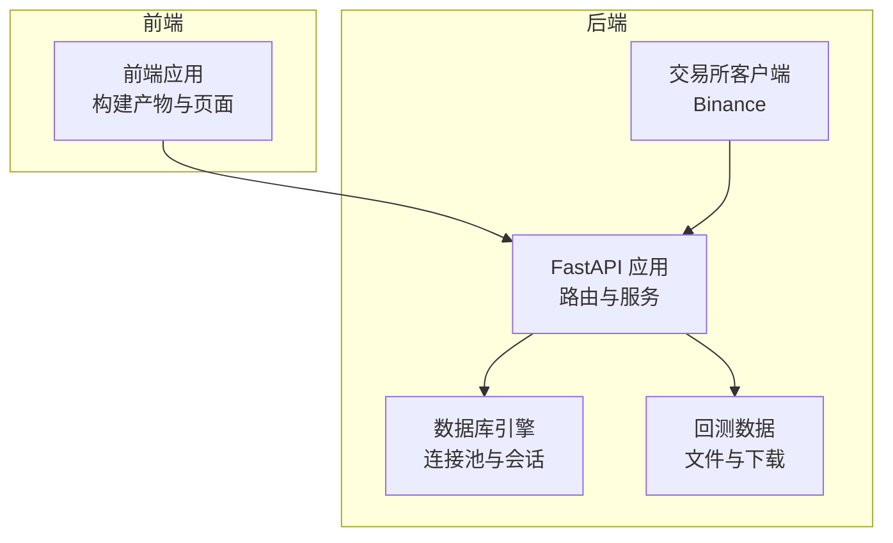
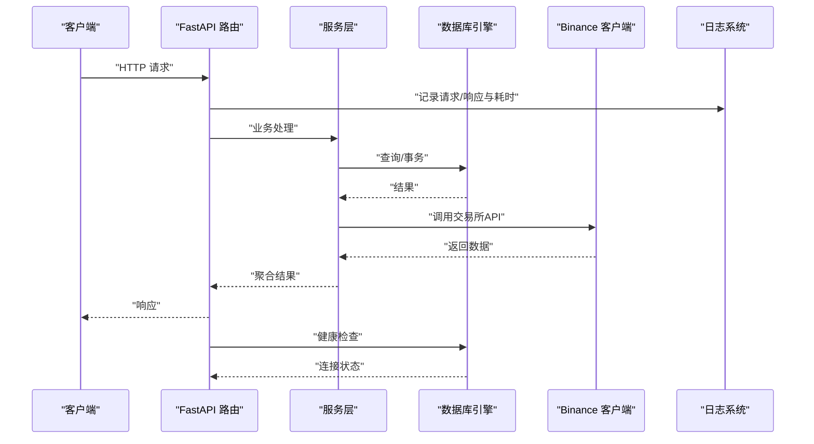
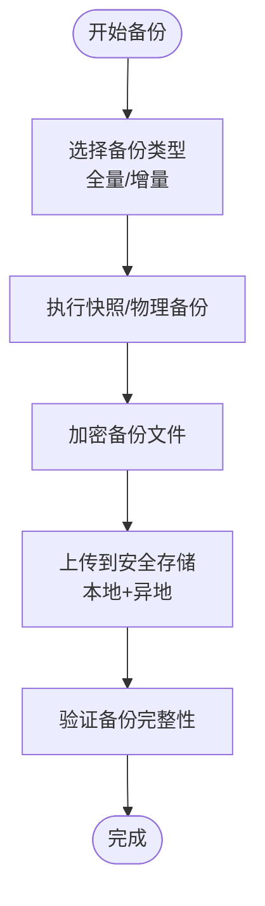
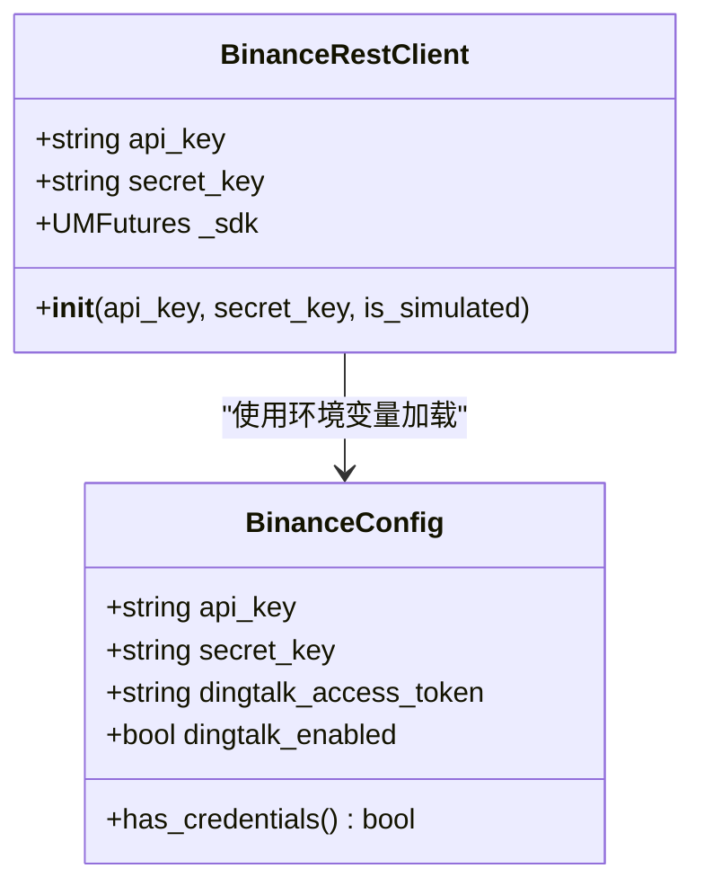
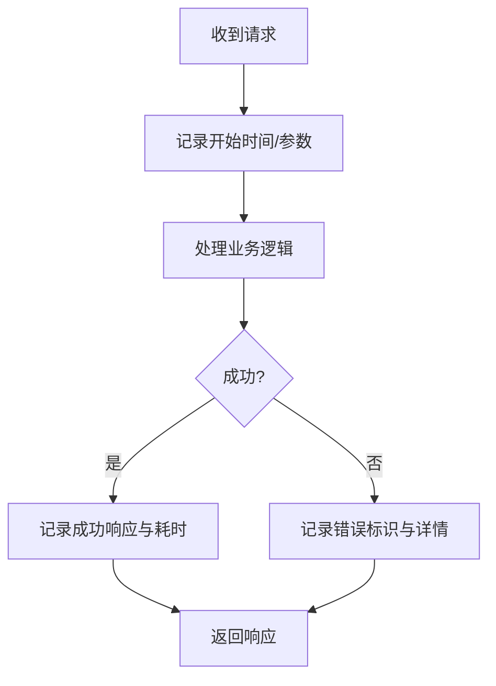
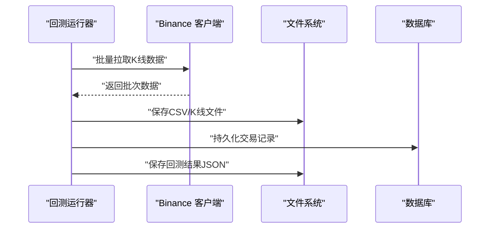
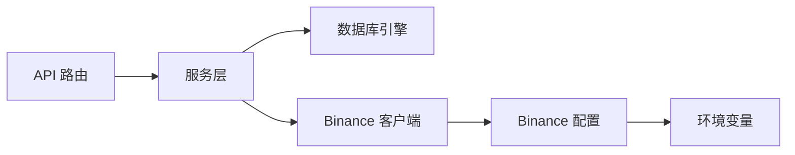

# 安全备份

<cite>
**本文引用的文件**
- [trading_system/core/database.py](file://trading_system/core/database.py)
- [trading_system/binance/config.py](file://trading_system/binance/config.py)
- [trading_system/binance/client.py](file://trading_system/binance/client.py)
- [trading_system/api/routers/signal.py](file://trading_system/api/routers/signal.py)
- [trading_system/data/backtest_data.py](file://trading_system/data/backtest_data.py)
- [.trae/documents/binance_rest_api_plan.md](file://.trae/documents/binance_rest_api_plan.md)
- [.trae/specs/优化数据库连接和代码/checklist.md](file://.trae/specs/优化数据库连接和代码/checklist.md)
- [.trae/specs/api_logging/spec.md](file://.trae/specs/api_logging/spec.md)
- [.trae/specs/api_logging/checklist.md](file://.trae/specs/api_logging/checklist.md)
- [.trae/specs/remove_redundant_code_plan.md](file://.trae/specs/remove_redundant_code_plan.md)
- [.trae/specs/config_refactor/tasks.md](file://.trae/specs/config_refactor/tasks.md)
- [.trae/specs/replace_signer_ed25519/spec.md](file://.trae/specs/replace_signer_ed25519/spec.md)
</cite>

## 目录
1. [引言](#引言)
2. [项目结构](#项目结构)
3. [核心组件](#核心组件)
4. [架构概览](#架构概览)
5. [详细组件分析](#详细组件分析)
6. [依赖分析](#依赖分析)
7. [性能考虑](#性能考虑)
8. [故障排查指南](#故障排查指南)
9. [结论](#结论)
10. [附录](#附录)

## 引言
本指南聚焦于交易系统的安全配置与数据备份，围绕以下主题展开：API密钥管理、敏感信息保护、访问控制；数据库备份策略、数据加密与恢复；防火墙与网络隔离、DDoS防护；监控告警、入侵检测与安全审计；灾难恢复与业务连续性；以及合规性与定期安全检查、漏洞扫描最佳实践。文档以仓库中现有实现为依据，结合可落地的改进建议，帮助团队建立稳健的安全与备份体系。

## 项目结构
交易系统采用前后端分离与模块化设计，核心安全相关能力分布在以下区域：
- 后端服务与API：FastAPI应用、路由与服务层
- 数据访问层：SQLAlchemy引擎与会话管理
- 交易所对接：Binance客户端与配置加载
- 回测与数据：回测结果持久化与下载
- 文档与规格：安全与配置相关的规划与验收标准

**图表来源**
- [trading_system/core/database.py:1-44](file://trading_system/core/database.py#L1-L44)
- [trading_system/binance/client.py:12-27](file://trading_system/binance/client.py#L12-L27)
- [trading_system/data/backtest_data.py:47-82](file://trading_system/data/backtest_data.py#L47-L82)

**章节来源**
- [trading_system/core/database.py:1-44](file://trading_system/core/database.py#L1-L44)
- [trading_system/binance/client.py:12-27](file://trading_system/binance/client.py#L12-L27)
- [trading_system/data/backtest_data.py:47-82](file://trading_system/data/backtest_data.py#L47-L82)

## 核心组件
- 数据库连接与会话管理：集中配置连接池参数，提供会话生命周期管理与异常处理。
- Binance API配置与客户端：从环境变量加载API密钥，支持模拟交易与真实交易。
- 回测数据与结果：异步下载历史K线数据，保存回测结果文件。
- 日志与健康检查：按日生成API日志文件，提供健康检查端点与数据库连接状态检查。
- 配置重构与密钥管理：将API配置迁移至环境变量文件，移除硬编码配置。

**章节来源**
- [trading_system/core/database.py:12-34](file://trading_system/core/database.py#L12-L34)
- [trading_system/binance/config.py:30-43](file://trading_system/binance/config.py#L30-L43)
- [trading_system/binance/client.py:12-27](file://trading_system/binance/client.py#L12-L27)
- [trading_system/data/backtest_data.py:47-82](file://trading_system/data/backtest_data.py#L47-L82)
- [.trae/specs/api_logging/spec.md:37-83](file://.trae/specs/api_logging/spec.md#L37-L83)
- [.trae/specs/优化数据库连接和代码/checklist.md:1-12](file://.trae/specs/优化数据库连接和代码/checklist.md#L1-L12)

## 架构概览
系统安全与备份涉及的关键交互如下：

**图表来源**
- [trading_system/api/routers/signal.py:36-67](file://trading_system/api/routers/signal.py#L36-L67)
- [trading_system/core/database.py:24-34](file://trading_system/core/database.py#L24-L34)
- [.trae/specs/api_logging/spec.md:48-77](file://.trae/specs/api_logging/spec.md#L48-L77)

## 详细组件分析

### 数据库安全与备份
- 连接池与会话管理
  - 使用SQLAlchemy创建带连接池的引擎，配置池大小、溢出、超时与回收周期，并启用预检校验，确保连接稳定性与资源回收。
  - 会话创建与关闭在上下文中管理，异常时记录错误并抛出，避免静默失败。
- 备份策略
  - 建议采用定时快照（如每日增量+每周全量）与在线热备（如MySQL物理备份）相结合的方式，保留至少7天的恢复点目标（RPO/RTO）。
  - 备份数据应加密存储（传输与静态加密），并定期进行恢复演练。
- 恢复流程
  - 定义标准化恢复步骤：停止写入、校验备份完整性、在隔离环境验证、切换到备用实例、回放增量、验证业务数据一致性。

**图表来源**
- [trading_system/core/database.py:12-21](file://trading_system/core/database.py#L12-L21)
- [trading_system/core/database.py:24-34](file://trading_system/core/database.py#L24-L34)

**章节来源**
- [trading_system/core/database.py:12-34](file://trading_system/core/database.py#L12-L34)
- [.trae/specs/优化数据库连接和代码/checklist.md:3-11](file://.trae/specs/优化数据库连接和代码/checklist.md#L3-L11)

### API密钥管理与敏感信息保护
- 密钥加载
  - Binance配置类从环境变量加载API密钥与密钥串，支持钉钉通知令牌与开关。
  - 命令行参数允许覆盖默认密钥，便于测试与调试。
- 敏感信息保护
  - 建议将密钥存储在受控的密钥管理服务（如硬件安全模块HSM或云密管），禁用硬编码与明文配置文件。
  - 对日志输出进行敏感字段脱敏（如签名参数、密钥），仅记录必要上下文。
- 访问控制
  - 为API端点设置最小权限原则的访问控制（IP白名单、速率限制、API网关鉴权）。
  - 对关键操作（下单、撤单、查询）实施二次确认与审计日志。

**图表来源**
- [trading_system/binance/config.py:30-43](file://trading_system/binance/config.py#L30-L43)
- [trading_system/binance/client.py:12-27](file://trading_system/binance/client.py#L12-L27)

**章节来源**
- [trading_system/binance/config.py:30-43](file://trading_system/binance/config.py#L30-L43)
- [trading_system/binance/client.py:12-27](file://trading_system/binance/client.py#L12-L27)
- [.trae/specs/replace_signer_ed25519/spec.md:16-45](file://.trae/specs/replace_signer_ed25519/spec.md#L16-L45)

### 日志与审计
- 日志规范
  - 按日生成日志文件，记录请求开始时间、结束时间、处理耗时、参数与响应。
  - 错误日志包含特殊标识与详细错误信息，便于快速定位问题。
- 审计要点
  - 对所有关键操作（登录、下单、配置变更）进行审计日志记录。
  - 日志保留策略与归档流程需满足合规要求（如7天内可检索）。

**图表来源**
- [.trae/specs/api_logging/spec.md:48-77](file://.trae/specs/api_logging/spec.md#L48-L77)

**章节来源**
- [.trae/specs/api_logging/spec.md:37-83](file://.trae/specs/api_logging/spec.md#L37-L83)
- [.trae/specs/api_logging/checklist.md:1-13](file://.trae/specs/api_logging/checklist.md#L1-L13)

### 回测数据与结果备份
- 数据下载
  - 异步下载K线数据，支持批量分页拉取，保存到本地CSV文件。
- 结果保存
  - 回测完成后保存为JSON文件，包含交易明细与统计指标。
- 备份建议
  - 将历史数据与回测结果纳入统一备份策略，区分热数据（近30天）与冷数据（长期归档）。
  - 对结果文件进行哈希校验，确保完整性与可恢复性。

**图表来源**
- [trading_system/data/backtest_data.py:47-82](file://trading_system/data/backtest_data.py#L47-L82)
- [trading_system/api/routers/signal.py:36-67](file://trading_system/api/routers/signal.py#L36-L67)

**章节来源**
- [trading_system/data/backtest_data.py:47-82](file://trading_system/data/backtest_data.py#L47-L82)
- [trading_system/api/routers/signal.py:36-67](file://trading_system/api/routers/signal.py#L36-L67)

### 健康检查与可用性
- 健康检查端点
  - 提供/health端点，检查数据库连接状态，返回服务健康信息。
- 性能与稳定性
  - 连接池参数优化与预检校验减少连接抖动，降低偶发失败概率。
  - 日志记录不影响接口性能（额外开销小于阈值）。

**章节来源**
- [.trae/specs/优化数据库连接和代码/checklist.md:3-11](file://.trae/specs/优化数据库连接和代码/checklist.md#L3-L11)

### 配置重构与密钥治理
- 环境变量与配置文件
  - 将API密钥从代码中移除，迁移到环境变量文件，避免硬编码。
  - 数据库连接配置从环境变量迁移到代码中，确保默认值合理且可追踪。
- 验收标准
  - 配置加载正常，API路由与数据库连接均不受影响。

**章节来源**
- [.trae/specs/remove_redundant_code_plan.md:30-56](file://.trae/specs/remove_redundant_code_plan.md#L30-L56)
- [.trae/specs/config_refactor/tasks.md:15-37](file://.trae/specs/config_refactor/tasks.md#L15-L37)

## 依赖分析
- 组件耦合
  - API路由依赖服务层，服务层依赖数据库引擎与交易所客户端。
  - Binance客户端依赖配置类，配置类依赖环境变量。
- 外部依赖
  - SQLAlchemy、PyMySQL、aiohttp、cryptography等库承担ORM、数据库驱动与加密职责。
- 安全风险点
  - 环境变量泄露、日志未脱敏、密钥硬编码、无访问控制与DDoS防护。

**图表来源**
- [trading_system/core/database.py:12-21](file://trading_system/core/database.py#L12-L21)
- [trading_system/binance/client.py:12-27](file://trading_system/binance/client.py#L12-L27)
- [trading_system/binance/config.py:30-43](file://trading_system/binance/config.py#L30-L43)

**章节来源**
- [trading_system/core/database.py:12-21](file://trading_system/core/database.py#L12-L21)
- [trading_system/binance/client.py:12-27](file://trading_system/binance/client.py#L12-L27)
- [trading_system/binance/config.py:30-43](file://trading_system/binance/config.py#L30-L43)
- [.trae/documents/binance_rest_api_plan.md:160-176](file://.trae/documents/binance_rest_api_plan.md#L160-L176)

## 性能考虑
- 连接池优化：合理设置池大小与超时，避免高并发下的连接争用。
- 日志开销：按日轮转与结构化日志，避免频繁IO与过大文件。
- 异步下载：批量分页拉取数据，减少单次请求压力。
- 健康检查：轻量级检查，避免对生产流量造成影响。

## 故障排查指南
- 数据库连接问题
  - 检查连接池参数与回收周期，确认预检校验生效。
  - 查看会话创建/关闭日志，定位异常抛出位置。
- API密钥问题
  - 核对环境变量是否正确加载，命令行参数是否覆盖默认值。
  - 检查日志中敏感字段是否脱敏，避免泄露。
- 日志与审计
  - 确认日志文件按日生成，错误日志包含详细信息。
  - 审计日志是否覆盖关键操作，保留策略是否满足合规。
- 回测数据
  - 检查K线文件保存与回测结果JSON完整性，进行哈希校验。

**章节来源**
- [trading_system/core/database.py:24-34](file://trading_system/core/database.py#L24-L34)
- [trading_system/binance/config.py:30-43](file://trading_system/binance/config.py#L30-L43)
- [.trae/specs/api_logging/checklist.md:1-13](file://.trae/specs/api_logging/checklist.md#L1-L13)
- [trading_system/data/backtest_data.py:47-82](file://trading_system/data/backtest_data.py#L47-L82)

## 结论
通过将API密钥与数据库配置迁移到受控环境、强化日志与审计、完善备份与恢复流程，并结合健康检查与访问控制，交易系统可在保证业务连续性的同时提升整体安全性。建议尽快落实密钥治理、DDoS防护与入侵检测方案，并定期开展漏洞扫描与渗透测试，持续改进安全基线。

## 附录
- 合规性要求
  - 数据最小化、可追溯、可恢复；日志与备份保留期限满足监管要求。
- 灾难恢复计划
  - 明确RTO/RPO目标、恢复步骤、角色分工与演练频次。
- 定期安全检查
  - 漏洞扫描、配置基线核查、权限审查与应急演练常态化。