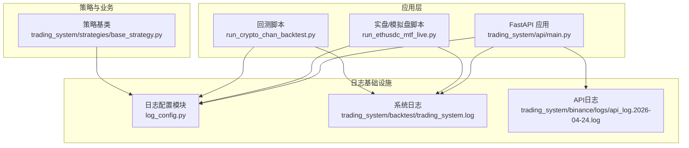
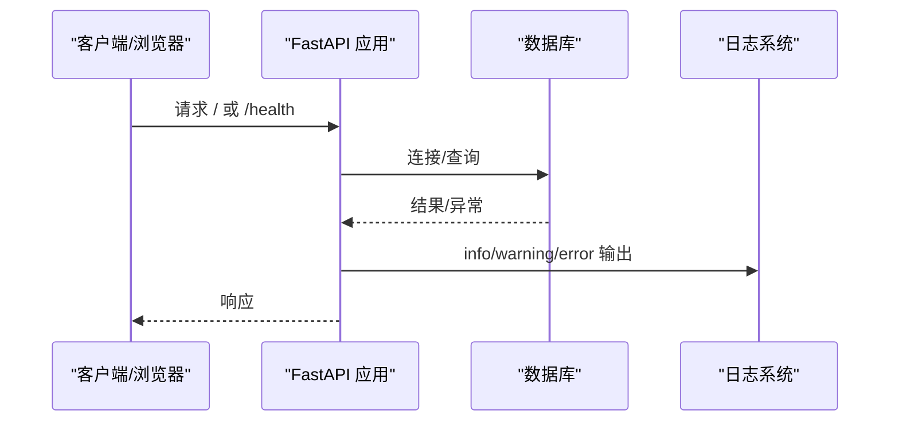
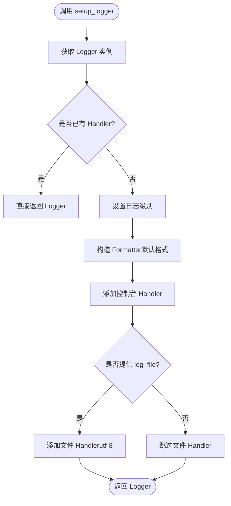
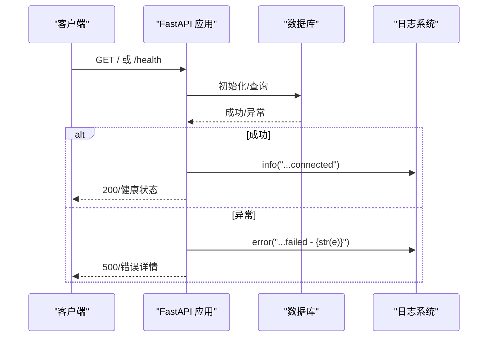
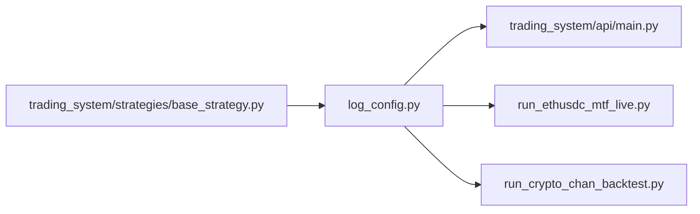

# 日志监控

<cite>
**本文引用的文件**
- [log_config.py](file://log_config.py)
- [trading_system/api/main.py](file://trading_system/api/main.py)
- [run_ethusdc_mtf_live.py](file://run_ethusdc_mtf_live.py)
- [run_crypto_chan_backtest.py](file://run_crypto_chan_backtest.py)
- [trading_system/strategies/base_strategy.py](file://trading_system/strategies/base_strategy.py)
- [trading_system/backtest/trading_system.log](file://trading_system/backtest/trading_system.log)
- [trading_system/binance/logs/api_log.2026-04-24.log](file://trading_system/binance/logs/api_log.2026-04-24.log)
</cite>

## 目录
1. [简介](#简介)
2. [项目结构](#项目结构)
3. [核心组件](#核心组件)
4. [架构总览](#架构总览)
5. [详细组件分析](#详细组件分析)
6. [依赖分析](#依赖分析)
7. [性能考虑](#性能考虑)
8. [故障排查指南](#故障排查指南)
9. [结论](#结论)
10. [附录](#附录)

## 简介
本文件面向“日志监控与管理系统”，结合代码库现状，系统性阐述日志配置模块的使用方法、日志级别与输出格式定制、系统日志/回测日志/交易日志的分类管理、日志轮转与清理策略建议、基于日志的故障排查与性能分析方法，以及日志采集、聚合与可视化的落地思路与外部监控系统集成要点。文档既关注工程实践细节，也兼顾非技术读者的理解需求。

## 项目结构
围绕日志体系的关键位置如下：
- 统一日志配置模块：log_config.py
- FastAPI 应用入口与全局异常日志：trading_system/api/main.py
- 实盘/模拟盘交易脚本：run_ethusdc_mtf_live.py
- 回测脚本：run_crypto_chan_backtest.py
- 策略基类中的日志使用：trading_system/strategies/base_strategy.py
- 各类日志文件示例：trading_system/backtest/trading_system.log、trading_system/binance/logs/api_log.2026-04-24.log

图示来源
- [log_config.py:11-64](file://log_config.py#L11-L64)
- [trading_system/api/main.py:1-104](file://trading_system/api/main.py#L1-L104)
- [run_ethusdc_mtf_live.py:34-42](file://run_ethusdc_mtf_live.py#L34-L42)
- [run_crypto_chan_backtest.py:35-39](file://run_crypto_chan_backtest.py#L35-L39)
- [trading_system/strategies/base_strategy.py:1-168](file://trading_system/strategies/base_strategy.py#L1-L168)

章节来源
- [log_config.py:11-64](file://log_config.py#L11-L64)
- [trading_system/api/main.py:1-104](file://trading_system/api/main.py#L1-L104)
- [run_ethusdc_mtf_live.py:34-42](file://run_ethusdc_mtf_live.py#L34-L42)
- [run_crypto_chan_backtest.py:35-39](file://run_crypto_chan_backtest.py#L35-L39)
- [trading_system/strategies/base_strategy.py:1-168](file://trading_system/strategies/base_strategy.py#L1-L168)

## 核心组件
- 统一日志配置模块：提供可复用的 Logger 创建函数，支持控制台与文件输出、避免重复 Handler、可自定义格式与级别。
- FastAPI 全局异常与健康检查日志：集中捕获异常与数据库连接状态，统一输出到日志。
- 实盘/模拟盘脚本：使用 logging.basicConfig 配置控制台与文件输出，便于实盘运行时观测。
- 回测脚本：使用 logging.basicConfig 配置控制台输出，便于批处理与结果导出。
- 策略基类：在策略参数更新等关键节点输出日志，便于追踪策略状态变化。

章节来源
- [log_config.py:11-64](file://log_config.py#L11-L64)
- [trading_system/api/main.py:33-87](file://trading_system/api/main.py#L33-L87)
- [run_ethusdc_mtf_live.py:34-42](file://run_ethusdc_mtf_live.py#L34-L42)
- [run_crypto_chan_backtest.py:35-39](file://run_crypto_chan_backtest.py#L35-L39)
- [trading_system/strategies/base_strategy.py:124-139](file://trading_system/strategies/base_strategy.py#L124-L139)

## 架构总览
下图展示日志在系统中的流向与落盘位置：

图示来源
- [trading_system/api/main.py:69-87](file://trading_system/api/main.py#L69-L87)

章节来源
- [trading_system/api/main.py:69-87](file://trading_system/api/main.py#L69-L87)

## 详细组件分析

### 组件A：统一日志配置模块（log_config.py）
- 功能概述
  - 提供 setup_logger(name, level, log_file, format_string) 方法，返回配置好的 Logger 实例。
  - 自动避免重复添加 Handler，保证多处导入不重复注册。
  - 默认输出格式包含时间、Logger 名称、级别与消息体；可选文件输出。
- 关键点
  - 控制台 Handler 使用 sys.stdout，级别与 Logger 一致。
  - 文件 Handler 可选，编码为 utf-8。
  - 默认 Logger 名称为 "trading_system"，默认日志文件为 "trading_system.log"。
- 使用建议
  - 在应用入口与各模块按需调用 setup_logger，或直接使用模块内默认 logger。
  - 对于 API 层，建议在中间件与异常处理器中统一使用该 logger。

图示来源
- [log_config.py:11-64](file://log_config.py#L11-L64)

章节来源
- [log_config.py:11-64](file://log_config.py#L11-L64)

### 组件B：FastAPI 应用日志（trading_system/api/main.py）
- 全局异常日志：捕获 Exception 与 HTTPException，记录错误详情并返回标准 JSON 响应。
- 启动阶段日志：数据库初始化成功/失败均输出 info/error。
- 健康检查日志：数据库连通性检查成功/失败分别输出 info/error。
- 性能指标：通过中间件记录 X-Process-Time 并写入响应头，便于日志关联分析。

图示来源
- [trading_system/api/main.py:33-87](file://trading_system/api/main.py#L33-L87)

章节来源
- [trading_system/api/main.py:24-55](file://trading_system/api/main.py#L24-L55)
- [trading_system/api/main.py:58-66](file://trading_system/api/main.py#L58-L66)
- [trading_system/api/main.py:75-87](file://trading_system/api/main.py#L75-L87)

### 组件C：实盘/模拟盘脚本日志（run_ethusdc_mtf_live.py）
- 使用 logging.basicConfig 配置控制台与文件输出，格式包含时间、级别与消息。
- 日志文件命名为 mtf_live_trading.log，便于区分运行模式（实盘/模拟盘/DRY-RUN）。
- 适合长时间运行与守护进程模式，便于远程观察与排障。

章节来源
- [run_ethusdc_mtf_live.py:34-42](file://run_ethusdc_mtf_live.py#L34-L42)

### 组件D：回测脚本日志（run_crypto_chan_backtest.py）
- 使用 logging.basicConfig 配置控制台输出，便于批处理与结果导出。
- 日志中包含数据加载、策略处理、图表保存与结果文件写入等关键步骤。

章节来源
- [run_crypto_chan_backtest.py:35-39](file://run_crypto_chan_backtest.py#L35-L39)
- [run_crypto_chan_backtest.py:174-200](file://run_crypto_chan_backtest.py#L174-L200)

### 组件E：策略基类日志（trading_system/strategies/base_strategy.py）
- 在 set_params 等关键流程输出 info 日志，便于追踪策略参数变更与状态。
- 有助于审计策略行为与定位参数注入问题。

章节来源
- [trading_system/strategies/base_strategy.py:124-139](file://trading_system/strategies/base_strategy.py#L124-L139)

## 依赖分析
- 模块耦合
  - trading_system/api/main.py 依赖 log_config.py 的 logger 实例。
  - 各脚本与策略模块直接使用 Python 标准库 logging，未引入第三方日志库，降低耦合度。
- 外部依赖
  - FastAPI 与 Uvicorn（运行时）与日志无直接耦合，但 API 中间件与异常处理器会输出日志。
- 潜在风险
  - 多模块各自配置 logging.basicConfig 可能导致 Handler 重复注册，建议统一由 log_config.py 管理。

图示来源
- [log_config.py:11-64](file://log_config.py#L11-L64)
- [trading_system/api/main.py:1-104](file://trading_system/api/main.py#L1-L104)
- [run_ethusdc_mtf_live.py:34-42](file://run_ethusdc_mtf_live.py#L34-L42)
- [run_crypto_chan_backtest.py:35-39](file://run_crypto_chan_backtest.py#L35-L39)
- [trading_system/strategies/base_strategy.py:1-168](file://trading_system/strategies/base_strategy.py#L1-L168)

章节来源
- [log_config.py:11-64](file://log_config.py#L11-L64)
- [trading_system/api/main.py:1-104](file://trading_system/api/main.py#L1-L104)
- [run_ethusdc_mtf_live.py:34-42](file://run_ethusdc_mtf_live.py#L34-L42)
- [run_crypto_chan_backtest.py:35-39](file://run_crypto_chan_backtest.py#L35-L39)
- [trading_system/strategies/base_strategy.py:1-168](file://trading_system/strategies/base_strategy.py#L1-L168)

## 性能考虑
- 日志级别选择
  - 生产环境建议使用 INFO 或更高，减少 DEBUG 信息带来的 IO 压力。
- 输出目标
  - 控制台输出适用于开发与调试；生产环境优先文件输出，便于持久化与轮转。
- 格式化成本
  - 自定义格式字符串会增加轻微 CPU 开销，建议在生产环境保持简洁。
- 异步与缓冲
  - Python logging 默认同步写入，高并发场景可考虑第三方异步日志库或集中式日志代理（见“附录”）。

## 故障排查指南
- 快速定位
  - 查看 trading_system/backtest/trading_system.log 与 trading_system/binance/logs/api_log.2026-04-24.log 中的 ERROR/WARNING 级别日志。
  - 在 FastAPI 异常处理器中，错误会被记录到日志并返回统一错误响应。
- 常见问题
  - 数据库连接失败：查看 /health 接口日志与数据库初始化日志。
  - 回测数据缺失：查看回测脚本日志中关于数据文件加载的警告。
  - 策略参数未生效：查看策略基类 set_params 的日志输出。
- 性能分析
  - 结合 API 中间件记录的处理时间（X-Process-Time），定位慢请求。
- 行为审计
  - 通过策略参数更新日志与交易脚本日志，核对策略行为与交易决策链路。

章节来源
- [trading_system/api/main.py:33-87](file://trading_system/api/main.py#L33-L87)
- [trading_system/backtest/trading_system.log:1-200](file://trading_system/backtest/trading_system.log#L1-L200)
- [trading_system/binance/logs/api_log.2026-04-24.log:1-6](file://trading_system/binance/logs/api_log.2026-04-24.log#L1-L6)
- [trading_system/strategies/base_strategy.py:124-139](file://trading_system/strategies/base_strategy.py#L124-L139)

## 结论
当前系统采用“统一配置 + 多源输出”的日志策略：统一配置模块负责 Logger 初始化与格式化，API 层集中处理异常与健康检查，脚本与策略模块按需输出。建议后续引入日志轮转与集中采集能力，以满足生产级监控与合规审计需求。

## 附录

### 日志级别与输出格式定制
- 日志级别
  - DEBUG：开发调试
  - INFO：常规运行信息
  - WARNING：潜在问题
  - ERROR：错误事件
- 输出格式
  - 控制台：默认格式包含时间、Logger 名称、级别与消息。
  - 文件：默认格式与控制台一致，编码为 utf-8。
- 建议
  - 生产环境统一使用 INFO 级别，必要时临时提升至 DEBUG。
  - 自定义格式时避免过多字段，减少序列化开销。

章节来源
- [log_config.py:11-64](file://log_config.py#L11-L64)

### 日志分类管理（系统/回测/交易）
- 系统日志
  - API 启动、健康检查、异常处理日志，落盘于 trading_system/backtest/trading_system.log。
- 回测日志
  - 回测脚本输出的数据加载、处理与结果保存日志。
- 交易日志
  - 实盘/模拟盘脚本输出的交易流程日志，落盘于 mtf_live_trading.log。

章节来源
- [trading_system/api/main.py:58-87](file://trading_system/api/main.py#L58-L87)
- [run_crypto_chan_backtest.py:35-39](file://run_crypto_chan_backtest.py#L35-L39)
- [run_ethusdc_mtf_live.py:34-42](file://run_ethusdc_mtf_live.py#L34-L42)

### 日志轮转、压缩与清理策略（建议）
- 轮转
  - 使用 RotatingFileHandler 或 TimedRotatingFileHandler，按大小或时间轮转。
- 压缩
  - 轮转后压缩旧日志，节省磁盘空间。
- 清理
  - 设置保留天数或最大文件数，定期清理过期日志。
- 注意
  - 轮转策略需与日志采集/聚合系统兼容，避免文件句柄占用问题。

### 日志采集、聚合与可视化（建议）
- 采集
  - 使用 Filebeat/Fluent Bit 采集日志文件，或在应用侧集成 Structured Logging（JSON）。
- 聚合
  - 使用 ELK/EFK 或 Loki/Grafana 进行日志聚合与检索。
- 可视化
  - 基于日志字段构建仪表板，如错误率、响应时间分布、策略触发频次等。
- 集成
  - 将日志与告警系统（如 Alertmanager/PagerDuty）联动，实现异常自动通知。

### 与外部监控系统的集成（建议）
- Prometheus + Grafana
  - 将关键指标（如处理时间、错误数）暴露为指标，配合 Grafana 可视化。
- APM（如 New Relic/DataDog）
  - 通过 SDK 上报事务与错误，结合日志实现端到端追踪。
- SIEM（如 Splunk/SentinelOne）
  - 导入结构化日志，进行安全事件检测与合规审计。