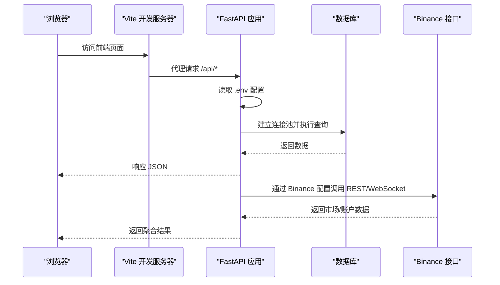
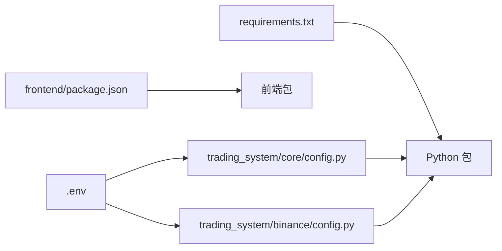

# 环境配置

<cite>
**本文引用的文件**
- [README.md](file://README.md)
- [requirements.txt](file://requirements.txt)
- [trading_system/core/config.py](file://trading_system/core/config.py)
- [trading_system/binance/config.py](file://trading_system/binance/config.py)
- [main.py](file://main.py)
- [log_config.py](file://log_config.py)
- [trading_system/api/main.py](file://trading_system/api/main.py)
- [frontend/package.json](file://frontend/package.json)
- [.env.example](file://.env.example)
- [frontend/vite.config.ts](file://frontend/vite.config.ts)
- [run_ethusdc_mtf_live.py](file://run_ethusdc_mtf_live.py)
</cite>

## 目录
1. [简介](#简介)
2. [项目结构](#项目结构)
3. [核心组件](#核心组件)
4. [架构总览](#架构总览)
5. [详细组件分析](#详细组件分析)
6. [依赖关系分析](#依赖关系分析)
7. [性能考虑](#性能考虑)
8. [故障排查指南](#故障排查指南)
9. [结论](#结论)
10. [附录](#附录)

## 简介
本指南面向首次部署与日常维护本交易系统的用户，提供从 Python 虚拟环境到依赖安装、系统环境变量、数据库与 API 密钥配置，以及前后端联调的完整步骤。同时覆盖 Windows、Linux、macOS 三大平台的差异点，并解释开发与生产环境的配置差异。

## 项目结构
项目采用“后端 FastAPI + 前端 Vite React”的双端分离架构，后端通过 .env 管理敏感配置，requirements.txt 统一声明依赖，前端通过 Vite 开发服务器代理后端 API。

```mermaid
graph TB
subgraph "后端"
API["FastAPI 应用<br/>trading_system/api/main.py"]
CFG["配置管理<br/>trading_system/core/config.py"]
LOG["日志配置<br/>log_config.py"]
BINCFG["Binance 配置<br/>trading_system/binance/config.py"]
MAIN["入口脚本<br/>main.py"]
end
subgraph "前端"
VITE["Vite 开发服务器<br/>frontend/vite.config.ts"]
PKG["依赖声明<br/>frontend/package.json"]
end
ENV[".env 环境变量<br/>.env.example"]
VITE --> |"代理 /api →"| API
API --> CFG
API --> LOG
API --> BINCFG
CFG <-- ENV
BINCFG <-- ENV
MAIN --> API
PKG --> VITE
```

图表来源
- [trading_system/api/main.py:1-104](file://trading_system/api/main.py#L1-L104)
- [trading_system/core/config.py:1-35](file://trading_system/core/config.py#L1-L35)
- [trading_system/binance/config.py:1-68](file://trading_system/binance/config.py#L1-L68)
- [main.py:1-13](file://main.py#L1-L13)
- [log_config.py:1-74](file://log_config.py#L1-L74)
- [frontend/vite.config.ts:1-11](file://frontend/vite.config.ts#L1-L11)
- [frontend/package.json:1-22](file://frontend/package.json#L1-L22)

章节来源
- [README.md:1-150](file://README.md#L1-L150)
- [frontend/package.json:1-22](file://frontend/package.json#L1-L22)

## 核心组件
- 配置管理：后端使用 pydantic-settings 从 .env 加载数据库与日志等配置；Binance 配置从 .env 加载 API Key、代理与钉钉通知开关。
- 日志系统：统一初始化日志器，支持控制台与文件输出。
- 前端代理：Vite 将 /api 请求转发至后端 8000 端口，便于本地联调。
- 入口与运行：main.py 作为 Uvicorn 启动入口，trading_system/api/main.py 提供健康检查与路由注册。

章节来源
- [trading_system/core/config.py:1-35](file://trading_system/core/config.py#L1-L35)
- [trading_system/binance/config.py:1-68](file://trading_system/binance/config.py#L1-L68)
- [log_config.py:1-74](file://log_config.py#L1-L74)
- [frontend/vite.config.ts:1-11](file://frontend/vite.config.ts#L1-L11)
- [main.py:1-13](file://main.py#L1-L13)
- [trading_system/api/main.py:1-104](file://trading_system/api/main.py#L1-L104)

## 架构总览
下图展示从浏览器到后端 API、数据库与外部交易所 API 的交互路径，以及 .env 配置如何贯穿其中。



图表来源
- [frontend/vite.config.ts:1-11](file://frontend/vite.config.ts#L1-L11)
- [trading_system/api/main.py:1-104](file://trading_system/api/main.py#L1-L104)
- [trading_system/core/config.py:1-35](file://trading_system/core/config.py#L1-L35)
- [trading_system/binance/config.py:1-68](file://trading_system/binance/config.py#L1-L68)

## 详细组件分析

### Python 版本与虚拟环境
- Python 版本要求：技术栈说明中明确 Python 3.7+。
- 虚拟环境建议：使用 venv 或 conda 创建隔离环境，避免全局污染。
- 激活方式（示例）：
  - Windows: python -m venv .venv && .venv\Scripts\activate
  - Linux/macOS: python3 -m venv .venv && source .venv/bin/activate

章节来源
- [README.md:137-142](file://README.md#L137-L142)

### 依赖安装
- 安装命令：pip install -r requirements.txt
- 依赖来源：requirements.txt 统一声明后端所需包（FastAPI、SQLAlchemy、PyMySQL、Pydantic、Uvicorn 等）。
- 前端依赖：前端独立使用 npm/yarn/pnpm 安装（package.json），与后端 Python 环境解耦。

章节来源
- [README.md:75-79](file://README.md#L75-L79)
- [requirements.txt:1-64](file://requirements.txt#L1-L64)
- [frontend/package.json:1-22](file://frontend/package.json#L1-L22)

### 系统环境变量与配置文件
- .env 示例文件：复制 .env.example 为 .env 并按需填写。
- 后端配置项（来自 .env）：
  - 数据库连接：DATABASE_URL（例如 mysql+pymysql://...）
  - 日志级别：LOG_LEVEL（DEBUG/INFO/WARNING/ERROR/CRITICAL）
- Binance 配置项（来自 .env）：
  - BINANCE_API_KEY、BINANCE_SECRET_KEY
  - BINANCE_IS_SIMULATED（true/false）
  - BINANCE_PROXY_HOST、BINANCE_PROXY_PORT、BINANCE_PROXY_PROTOCOL
  - DINGTALK_WEBHOOK_ACCESS_TOKEN、DINGTALK_WEBHOOK_SECRET

章节来源
- [README.md:59-73](file://README.md#L59-L73)
- [trading_system/core/config.py:5-31](file://trading_system/core/config.py#L5-L31)
- [trading_system/binance/config.py:30-44](file://trading_system/binance/config.py#L30-L44)

### 数据库连接设置
- 连接池参数：pool_size、max_overflow、pool_timeout、pool_recycle、echo。
- 默认数据库 URL：可在 .env 中覆盖，或在代码中调整。
- 启动时初始化：FastAPI startup 事件中调用 init_db，失败会记录错误并抛出异常。

章节来源
- [trading_system/core/config.py:5-12](file://trading_system/core/config.py#L5-L12)
- [trading_system/api/main.py:58-66](file://trading_system/api/main.py#L58-L66)

### API 密钥与外部服务配置
- Binance API：从 .env 读取密钥与模拟/实盘标识，自动选择 REST 基础地址。
- 代理支持：可选配置代理主机、端口与协议，用于网络受限环境。
- 钉钉通知：当 access_token 与 secret 均存在时启用，用于运行脚本的关键事件通知。

章节来源
- [trading_system/binance/config.py:30-58](file://trading_system/binance/config.py#L30-L58)
- [run_ethusdc_mtf_live.py:256-257](file://run_ethusdc_mtf_live.py#L256-L257)

### 前后端联调与代理
- 前端代理：Vite 将 /api 前缀请求转发到后端 8000 端口。
- 健康检查：后端提供 /health 接口，用于验证数据库连通性。
- 文档访问：Swagger UI 与 ReDoc 地址见 README。

章节来源
- [frontend/vite.config.ts:1-11](file://frontend/vite.config.ts#L1-L11)
- [trading_system/api/main.py:75-87](file://trading_system/api/main.py#L75-L87)
- [README.md:95-98](file://README.md#L95-L98)

### 不同操作系统安装步骤

- Windows
  - 步骤要点：
    - 安装 Python 3.7+，确保加入 PATH。
    - 创建并激活虚拟环境：python -m venv .venv && .venv\Scripts\activate
    - 安装依赖：pip install -r requirements.txt
    - 复制并编辑 .env，填写数据库与 API 密钥
    - 启动后端：python main.py 或 uvicorn main:app --reload
    - 启动前端：进入 frontend 目录，安装依赖后运行开发服务器
  - 注意事项：
    - 若出现编译问题，优先安装 Microsoft C++ Build Tools
    - 网络受限时，按需配置 Binance 代理

- Linux/macOS
  - 步骤要点：
    - 使用系统包管理器安装 Python 3.7+ 与 pip
    - 创建虚拟环境：python3 -m venv .venv && source .venv/bin/activate
    - 安装依赖：pip install -r requirements.txt
    - 复制并编辑 .env，填写数据库与 API 密钥
    - 启动后端：python main.py 或 uvicorn main:app --reload
    - 启动前端：进入 frontend 目录，安装依赖后运行开发服务器
  - 注意事项：
    - 若系统缺少编译工具链，先安装 build-essential（Linux）或 Xcode Command Line Tools（macOS）

章节来源
- [README.md:75-98](file://README.md#L75-L98)
- [requirements.txt:1-64](file://requirements.txt#L1-L64)
- [trading_system/binance/config.py:35-44](file://trading_system/binance/config.py#L35-L44)

### 开发环境与生产环境配置差异
- 开发环境
  - 日志级别：建议 INFO 或 DEBUG
  - 数据库：本地 MySQL，可使用 sqlite（需调整连接串）
  - CORS：允许任意来源（开发阶段）
  - 代理：前端 Vite 代理 /api → 后端 8000
- 生产环境
  - 日志级别：INFO 或 WARNING，避免泄露敏感信息
  - CORS：限制为可信域名
  - 数据库：使用高可用 MySQL，配置只读副本与连接池参数
  - HTTPS：反向代理启用 TLS
  - 进程管理：使用 systemd/Gunicorn/Uvicorn workers 管理进程

章节来源
- [trading_system/core/config.py:14-26](file://trading_system/core/config.py#L14-L26)
- [trading_system/api/main.py:14-21](file://trading_system/api/main.py#L14-L21)
- [frontend/vite.config.ts:5-10](file://frontend/vite.config.ts#L5-L10)

## 依赖关系分析
后端依赖通过 requirements.txt 统一管理，前端依赖通过 package.json 管理。.env 作为外部注入源，被核心配置模块与 Binance 配置模块读取。



图表来源
- [requirements.txt:1-64](file://requirements.txt#L1-L64)
- [frontend/package.json:1-22](file://frontend/package.json#L1-L22)
- [trading_system/core/config.py:28-31](file://trading_system/core/config.py#L28-L31)
- [trading_system/binance/config.py:3,30-44:3-44](file://trading_system/binance/config.py#L3-L44)

章节来源
- [requirements.txt:1-64](file://requirements.txt#L1-L64)
- [frontend/package.json:1-22](file://frontend/package.json#L1-L22)
- [trading_system/core/config.py:28-31](file://trading_system/core/config.py#L28-L31)
- [trading_system/binance/config.py:3,30-44:3-44](file://trading_system/binance/config.py#L3-L44)

## 性能考虑
- 数据库连接池：根据并发量调整 pool_size 与 max_overflow，避免连接耗尽。
- 日志级别：生产环境避免 DEBUG，减少 IO 压力。
- 前端代理：开发阶段使用 Vite 代理，生产阶段由 Nginx/反向代理处理静态资源与跨域。
- 进程与端口：后端默认 8000 端口，生产环境建议固定端口并配合防火墙策略。

## 故障排查指南
- 启动后端报错
  - 检查 .env 是否存在且键名正确
  - 核对 DATABASE_URL 是否可达
  - 查看日志输出定位异常
- 健康检查失败
  - /health 返回数据库断开，检查连接串与数据库服务状态
- 前端无法访问后端接口
  - 确认 Vite 代理配置 /api → http://localhost:8000
  - 确认后端已监听 0.0.0.0:8000
- Binance API 无法访问
  - 检查 BINANCE_API_KEY/SECRET 是否正确
  - 如需代理，确认代理主机、端口与协议
  - 模拟盘/实盘地址切换是否匹配

章节来源
- [trading_system/api/main.py:58-87](file://trading_system/api/main.py#L58-L87)
- [frontend/vite.config.ts:5-10](file://frontend/vite.config.ts#L5-L10)
- [trading_system/binance/config.py:30-58](file://trading_system/binance/config.py#L30-L58)

## 结论
通过规范的虚拟环境、统一的依赖管理与 .env 配置，本项目可在多平台上快速搭建开发与生产环境。建议在生产环境中严格控制 CORS、日志级别与数据库连接池参数，并通过反向代理统一对外暴露服务。

## 附录

### 配置文件结构与参数说明
- .env
  - DATABASE_URL：数据库连接串
  - LOG_LEVEL：日志级别
  - BINANCE_API_KEY、BINANCE_SECRET_KEY：Binance API 凭据
  - BINANCE_IS_SIMULATED：是否使用模拟盘
  - BINANCE_PROXY_HOST、BINANCE_PROXY_PORT、BINANCE_PROXY_PROTOCOL：代理配置
  - DINGTALK_WEBHOOK_ACCESS_TOKEN、DINGTALK_WEBHOOK_SECRET：钉钉通知开关

章节来源
- [README.md:59-73](file://README.md#L59-L73)
- [trading_system/core/config.py:5-12](file://trading_system/core/config.py#L5-L12)
- [trading_system/binance/config.py:30-44](file://trading_system/binance/config.py#L30-L44)