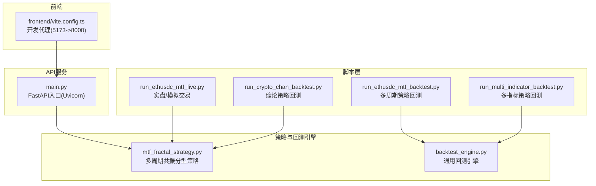
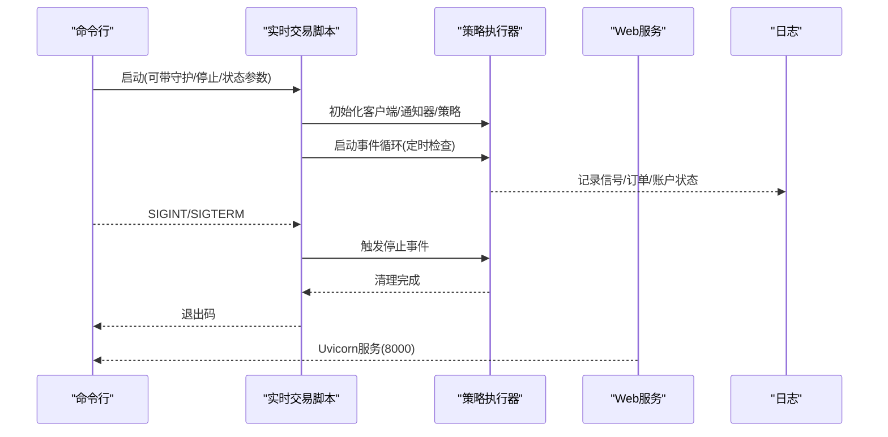
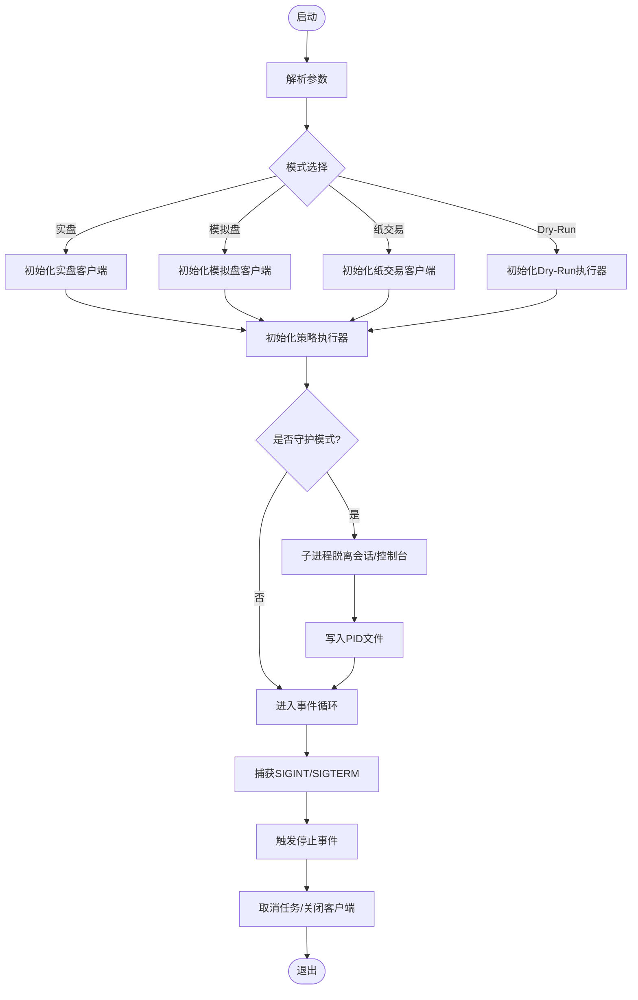
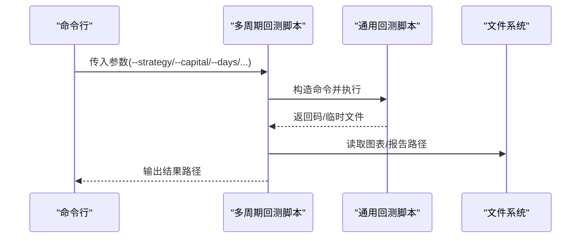
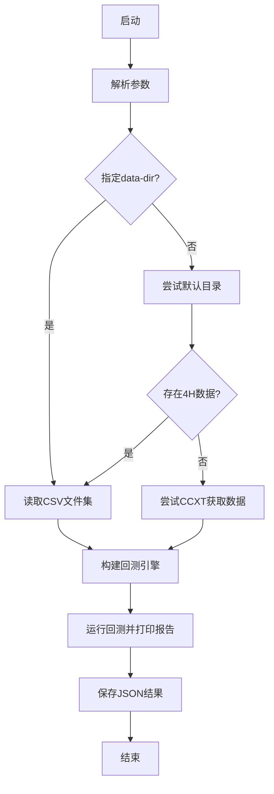
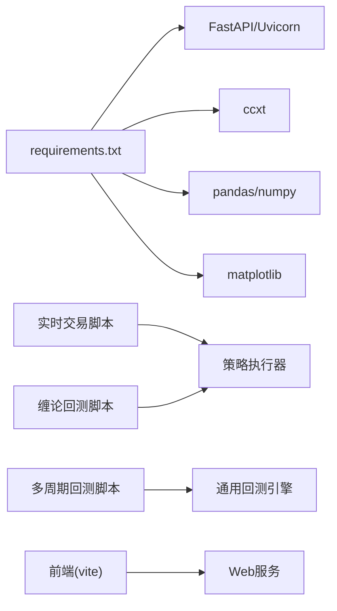

# 进程管理

<cite>
**本文引用的文件**
- [main.py](file://main.py)
- [run_ethusdc_mtf_live.py](file://run_ethusdc_mtf_live.py)
- [run_crypto_chan_backtest.py](file://run_crypto_chan_backtest.py)
- [run_ethusdc_mtf_backtest.py](file://run_ethusdc_mtf_backtest.py)
- [run_multi_indicator_backtest.py](file://run_multi_indicator_backtest.py)
- [log_config.py](file://log_config.py)
- [requirements.txt](file://requirements.txt)
- [vite.config.ts](file://frontend/vite.config.ts)
- [mtf_fractal_strategy.py](file://trading_system/strategies/mtf_fractal_strategy.py)
</cite>

## 目录
1. [简介](#简介)
2. [项目结构](#项目结构)
3. [核心组件](#核心组件)
4. [架构总览](#架构总览)
5. [详细组件分析](#详细组件分析)
6. [依赖分析](#依赖分析)
7. [性能考虑](#性能考虑)
8. [故障排查指南](#故障排查指南)
9. [结论](#结论)
10. [附录](#附录)

## 简介
本指南聚焦于该交易系统的进程管理与任务调度，涵盖以下主题：
- 各类运行脚本的功能差异、启动方式与参数配置
- 后台进程启动、进程守护与自动重启机制
- 进程监控、资源使用跟踪与异常处理策略
- 多策略并行运行、任务队列管理与负载均衡
- Docker容器化部署与Kubernetes编排的基础配置建议

## 项目结构
该项目采用“脚本驱动 + 策略引擎 + API服务”的分层组织方式：
- 脚本层：多个独立的Python脚本负责回测与实盘/模拟交易
- 策略层：策略引擎与回测引擎位于trading_system/strategies与trading_system/backtest
- API层：基于FastAPI的Web服务入口
- 前端层：Vite + React可视化界面，代理转发至API服务

**图表来源**
- [main.py:1-13](file://main.py#L1-L13)
- [run_ethusdc_mtf_live.py:1-332](file://run_ethusdc_mtf_live.py#L1-L332)
- [run_crypto_chan_backtest.py:1-334](file://run_crypto_chan_backtest.py#L1-L334)
- [run_ethusdc_mtf_backtest.py:1-396](file://run_ethusdc_mtf_backtest.py#L1-L396)
- [run_multi_indicator_backtest.py:1-117](file://run_multi_indicator_backtest.py#L1-L117)
- [vite.config.ts:1-11](file://frontend/vite.config.ts#L1-L11)

**章节来源**
- [main.py:1-13](file://main.py#L1-L13)
- [requirements.txt:1-64](file://requirements.txt#L1-L64)

## 核心组件
- Web服务入口与进程模型
  - 主入口通过Uvicorn托管FastAPI应用，监听0.0.0.0:8000，reload关闭，适合生产环境部署
- 实时交易脚本
  - 支持实盘/模拟盘/纸交易模式，具备守护进程模式、状态查询与停止能力
- 回测脚本族
  - 多周期共振分型策略回测、缠论策略回测、多指标趋势跟踪回测；部分脚本通过子进程调用通用回测引擎
- 日志系统
  - 统一日志配置，支持控制台与文件输出，便于进程监控与问题定位

**章节来源**
- [main.py:5-12](file://main.py#L5-L12)
- [run_ethusdc_mtf_live.py:34-42](file://run_ethusdc_mtf_live.py#L34-L42)
- [log_config.py:11-56](file://log_config.py#L11-L56)

## 架构总览
系统采用“脚本即任务”的轻量级进程模型：
- 实时交易脚本以异步事件循环运行，通过信号处理优雅停机
- 回测脚本以同步方式运行，部分脚本通过subprocess并发调用通用回测引擎
- Web服务作为API入口，策略与回测脚本可独立运行，互不阻塞

**图表来源**
- [run_ethusdc_mtf_live.py:186-314](file://run_ethusdc_mtf_live.py#L186-L314)
- [main.py:5-12](file://main.py#L5-L12)

## 详细组件分析

### 实时交易脚本：多周期共振分型策略
- 功能与模式
  - 支持实盘/模拟盘/纸交易三种模式，Dry-Run仅生成信号不下单
  - 关键参数：支撑/阻力位、杠杆、止盈盈亏比、每日/单笔风控阈值等
- 守护进程机制
  - 跨平台守护：Windows使用DETACHED_PROCESS+NEW_PROCESS_GROUP，Linux使用start_new_session
  - PID文件管理：启动写入PID，停止发送SIGTERM或SIGBREAK，状态检查通过os.kill(pid,0)
- 异常处理与优雅停机
  - 通过信号处理器设置停止事件，等待任务完成后取消任务并关闭客户端
- 日志与通知
  - 控制台+文件双输出；可选钉钉通知

**图表来源**
- [run_ethusdc_mtf_live.py:63-143](file://run_ethusdc_mtf_live.py#L63-L143)
- [run_ethusdc_mtf_live.py:155-183](file://run_ethusdc_mtf_live.py#L155-L183)
- [run_ethusdc_mtf_live.py:292-314](file://run_ethusdc_mtf_live.py#L292-L314)

**章节来源**
- [run_ethusdc_mtf_live.py:1-332](file://run_ethusdc_mtf_live.py#L1-L332)

### 回测脚本：多周期共振分型策略
- 功能与参数
  - 通过子进程调用通用回测脚本，传入策略版本、资金、杠杆、日期范围等参数
  - 支持提前入场、多周期确认、支撑/阻力位等策略细节
- 子进程管理
  - 使用subprocess.run执行回测，检查返回码并输出结果路径

**图表来源**
- [run_ethusdc_mtf_backtest.py:64-158](file://run_ethusdc_mtf_backtest.py#L64-L158)

**章节来源**
- [run_ethusdc_mtf_backtest.py:1-396](file://run_ethusdc_mtf_backtest.py#L1-L396)

### 回测脚本：缠论策略
- 功能与参数
  - 直接在本进程中构建策略配置与数据加载，支持本地CSV与CCXT数据源
  - 输出回测报告与JSON结果
- 数据加载策略
  - 优先本地CSV，否则尝试CCXT；失败时提示安装依赖或指定数据目录

**图表来源**
- [run_crypto_chan_backtest.py:216-330](file://run_crypto_chan_backtest.py#L216-L330)

**章节来源**
- [run_crypto_chan_backtest.py:1-334](file://run_crypto_chan_backtest.py#L1-L334)

### 回测脚本：多指标趋势跟踪
- 功能与参数
  - 通过子进程调用通用回测脚本，传入指标参数与数据范围
  - 支持使用实时数据下载

**章节来源**
- [run_multi_indicator_backtest.py:1-117](file://run_multi_indicator_backtest.py#L1-L117)

### Web服务入口与前端代理
- Web服务
  - Uvicorn托管FastAPI应用，监听0.0.0.0:8000，reload关闭
- 前端代理
  - Vite开发服务器端口5173，代理/api到后端8000端口

**章节来源**
- [main.py:5-12](file://main.py#L5-L12)
- [vite.config.ts:5-10](file://frontend/vite.config.ts#L5-L10)

## 依赖分析
- 运行时依赖
  - FastAPI/Uvicorn提供Web服务；ccxt用于数据获取；pandas/numpy用于回测数据处理
- 脚本间耦合
  - 回测脚本通过子进程调用通用回测脚本，降低模块耦合度
  - 实时交易脚本与策略执行器解耦，便于独立扩展

**图表来源**
- [requirements.txt:1-64](file://requirements.txt#L1-L64)
- [run_ethusdc_mtf_backtest.py:22-22](file://run_ethusdc_mtf_backtest.py#L22-L22)

**章节来源**
- [requirements.txt:1-64](file://requirements.txt#L1-L64)

## 性能考虑
- 异步事件循环
  - 实时交易脚本使用asyncio事件循环，减少I/O阻塞，提高并发响应能力
- 子进程并行
  - 回测脚本通过subprocess并行运行多个回测任务，充分利用多核CPU
- 日志与资源
  - 统一日志配置，避免重复handler；文件日志按需开启，减少磁盘IO压力
- 策略执行
  - 策略执行器按固定间隔检查信号，避免高频轮询造成CPU占用

**章节来源**
- [run_ethusdc_mtf_live.py:186-314](file://run_ethusdc_mtf_live.py#L186-L314)
- [run_ethusdc_mtf_backtest.py:128-158](file://run_ethusdc_mtf_backtest.py#L128-L158)

## 故障排查指南
- 守护进程问题
  - 无PID文件：检查守护进程是否成功启动或被系统回收
  - PID文件无效：删除无效文件后重新启动
  - 进程不存在：停止时若目标进程不存在，会清理PID文件
- 信号处理
  - 收到SIGINT/SIGTERM后，执行器会等待当前任务完成并清理资源
- 日志定位
  - 控制台+文件双输出，结合策略执行器中的异常记录快速定位问题
- 依赖缺失
  - CCXT未安装导致缠论回测失败，需安装ccxt或提供本地数据目录

**章节来源**
- [run_ethusdc_mtf_live.py:98-143](file://run_ethusdc_mtf_live.py#L98-L143)
- [run_ethusdc_mtf_live.py:292-314](file://run_ethusdc_mtf_live.py#L292-L314)
- [run_crypto_chan_backtest.py:280-290](file://run_crypto_chan_backtest.py#L280-L290)

## 结论
该系统通过脚本化任务与策略引擎分离的设计，实现了灵活的进程管理与任务调度：
- 实时交易脚本提供守护进程与优雅停机能力
- 回测脚本通过子进程并行提升效率
- Web服务与前端代理形成清晰的前后端分离架构
- 统一日志与异常处理机制便于运维与问题定位

## 附录

### 后台进程启动、守护与自动重启
- 启动
  - 实时交易脚本支持--daemon/-d参数以守护进程方式启动
- 停止
  - 使用--stop参数，脚本会读取PID文件并向目标进程发送终止信号
- 状态
  - 使用--status参数检查守护进程运行状态
- 自动重启
  - 当前脚本未内置自动重启逻辑，可在系统层面（如Supervisor/Cron）实现

**章节来源**
- [run_ethusdc_mtf_live.py:63-143](file://run_ethusdc_mtf_live.py#L63-L143)

### 进程监控与资源使用
- 日志
  - 控制台+文件输出，便于进程监控与审计
- 策略执行器
  - 记录信号、订单与账户状态，便于追踪资源变化
- Web服务
  - Uvicorn提供基础健康检查能力，可结合外部监控系统

**章节来源**
- [log_config.py:11-56](file://log_config.py#L11-L56)
- [mtf_fractal_strategy.py:2900-2941](file://trading_system/strategies/mtf_fractal_strategy.py#L2900-L2941)

### 多策略并行、任务队列与负载均衡
- 并行运行
  - 回测脚本通过subprocess并行运行多个回测任务
- 任务队列
  - 当前未实现专用任务队列，可通过外部消息队列（如Celery/RQ）扩展
- 负载均衡
  - 通过多实例部署与反向代理实现

**章节来源**
- [run_ethusdc_mtf_backtest.py:128-158](file://run_ethusdc_mtf_backtest.py#L128-L158)
- [run_multi_indicator_backtest.py:100-113](file://run_multi_indicator_backtest.py#L100-L113)

### Docker容器化与Kubernetes编排
- 容器化建议
  - 基于Python官方镜像，COPY项目代码，安装依赖，暴露端口8000
  - 前端开发环境使用Vite镜像，配置代理
- Kubernetes编排
  - Web服务部署为Deployment + Service
  - 回测与实时交易脚本可部署为Job/CronJob，按需运行
  - 挂载持久卷存储日志与回测结果

[本节为概念性指导，不涉及具体文件分析]