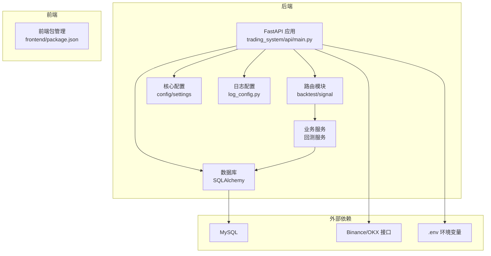
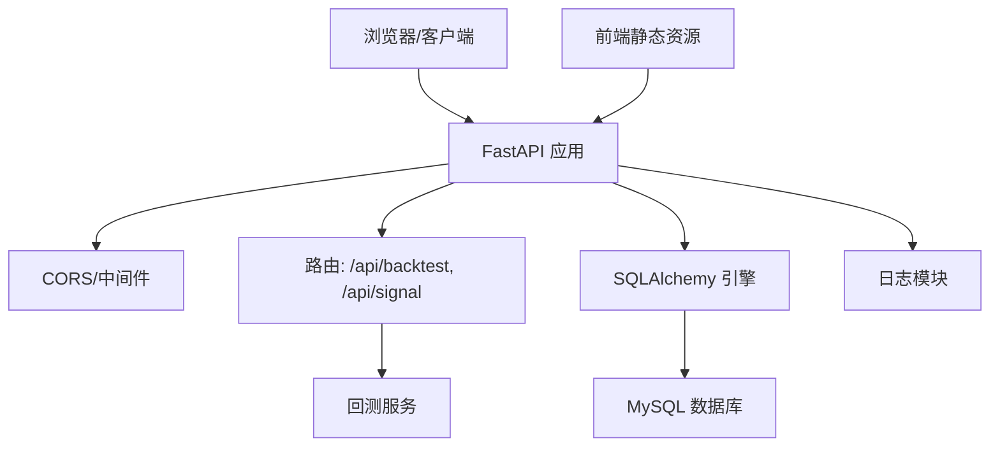
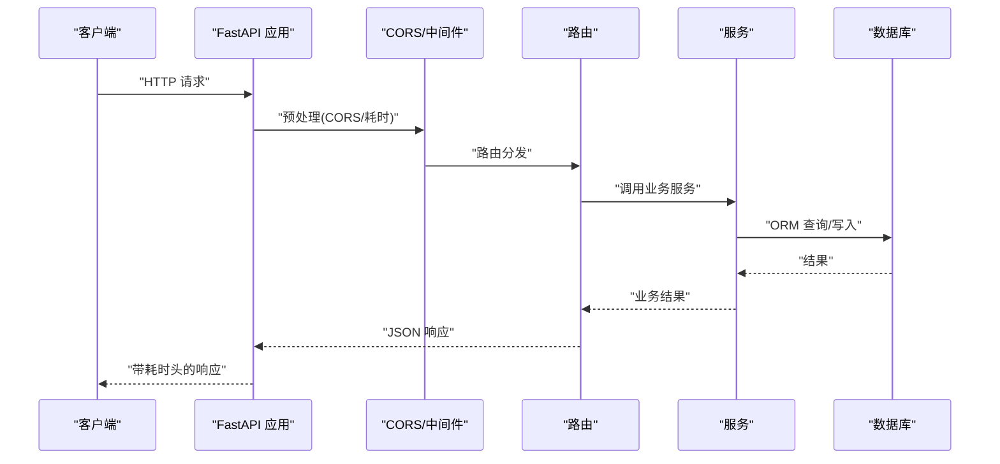
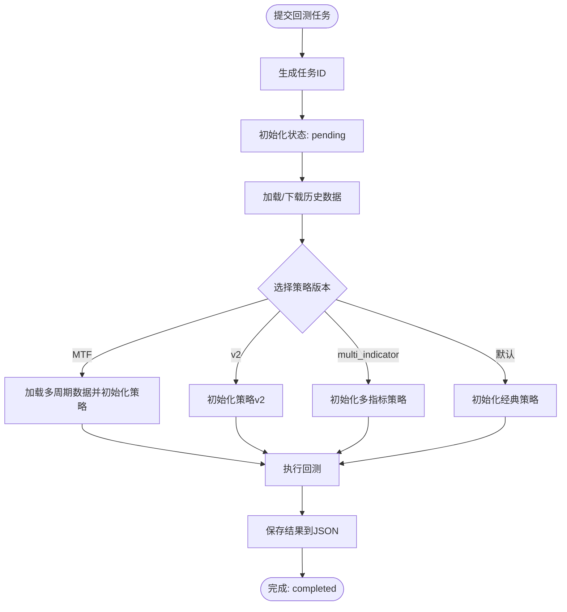
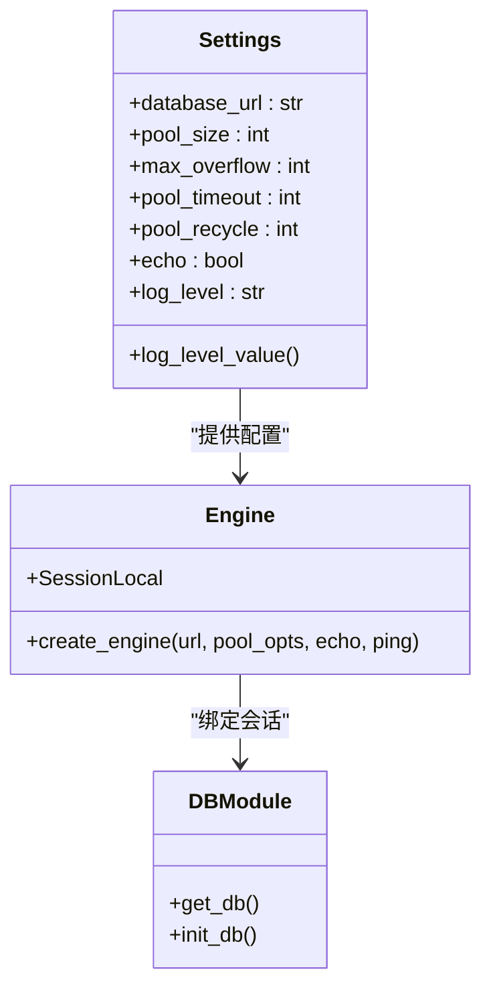
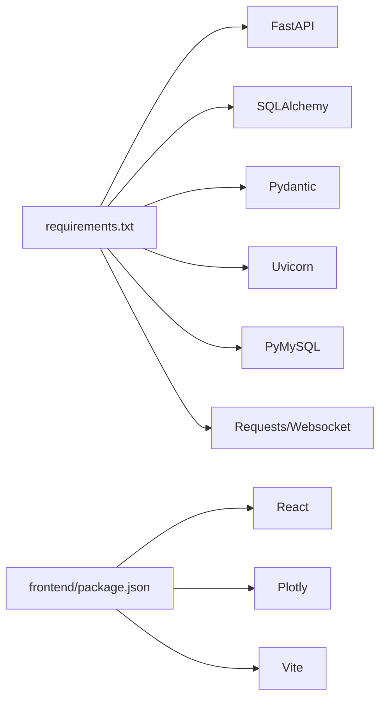

# 部署运维

<cite>
**本文引用的文件**
- [README.md](file://README.md)
- [requirements.txt](file://requirements.txt)
- [log_config.py](file://log_config.py)
- [main.py](file://main.py)
- [trading_system/api/main.py](file://trading_system/api/main.py)
- [trading_system/core/config.py](file://trading_system/core/config.py)
- [trading_system/core/database.py](file://trading_system/core/database.py)
- [trading_system/binance/config.py](file://trading_system/binance/config.py)
- [trading_system/binance/client.py](file://trading_system/binance/client.py)
- [trading_system/api/routers/backtest.py](file://trading_system/api/routers/backtest.py)
- [trading_system/api/routers/signal.py](file://trading_system/api/routers/signal.py)
- [trading_system/api/services/backtest_service.py](file://trading_system/api/services/backtest_service.py)
- [frontend/package.json](file://frontend/package.json)
</cite>

## 目录
1. [简介](#简介)
2. [项目结构](#项目结构)
3. [核心组件](#核心组件)
4. [架构总览](#架构总览)
5. [详细组件分析](#详细组件分析)
6. [依赖关系分析](#依赖关系分析)
7. [性能考量](#性能考量)
8. [故障排查指南](#故障排查指南)
9. [结论](#结论)
10. [附录](#附录)

## 简介
本指南面向生产环境部署与运维，覆盖环境配置、依赖安装、服务器设置、日志与监控、性能优化、错误追踪、容器化与自动化部署、CI/CD、安全加固、备份与灾备、高可用与扩展性等主题。项目采用 Python/TypeScript 技术栈，后端基于 FastAPI，前端基于 React/Vite，数据库为 MySQL，支持回测引擎与多交易所对接（Binance/OKX）。本文档以仓库现有代码为依据，结合最佳实践给出可落地的运维建议。

## 项目结构
项目采用前后端分离与模块化组织：后端 trading_system 包含 API 层、核心配置、数据库、模型、服务、策略与工具；前端位于 frontend；根目录提供运行入口与日志配置；requirements.txt 管理后端依赖；README 提供安装与运行指引。

图表来源
- [trading_system/api/main.py:1-104](file://trading_system/api/main.py#L1-L104)
- [trading_system/api/routers/backtest.py:1-68](file://trading_system/api/routers/backtest.py#L1-L68)
- [trading_system/api/routers/signal.py:1-178](file://trading_system/api/routers/signal.py#L1-L178)
- [trading_system/api/services/backtest_service.py:1-289](file://trading_system/api/services/backtest_service.py#L1-L289)
- [trading_system/core/config.py:1-35](file://trading_system/core/config.py#L1-L35)
- [trading_system/core/database.py:1-45](file://trading_system/core/database.py#L1-L45)
- [log_config.py:1-74](file://log_config.py#L1-L74)
- [frontend/package.json:1-22](file://frontend/package.json#L1-L22)

章节来源
- [README.md:1-150](file://README.md#L1-L150)
- [requirements.txt:1-64](file://requirements.txt#L1-L64)

## 核心组件
- 应用入口与启动
  - 后端通过 uvicorn 启动 FastAPI 应用，监听 0.0.0.0:8000。
  - 前端通过 Vite 开发服务器提供静态资源，生产构建产物由后端静态文件挂载提供。
- 配置与环境
  - 使用 pydantic-settings 读取 .env，集中管理数据库连接池、日志级别等。
  - Binance/OKX 等外部接口通过环境变量注入密钥与代理配置。
- 数据库
  - SQLAlchemy 引擎按配置建立连接池，启动时自动建表。
- 日志
  - 统一日志配置，支持控制台与文件输出，便于生产审计与问题定位。
- 回测与信号
  - 提供回测任务提交、状态查询、结果读取与信号明细分析接口。
- 依赖
  - 后端依赖通过 requirements.txt 管控，前端依赖通过 package.json 管控。

章节来源
- [main.py:1-13](file://main.py#L1-L13)
- [trading_system/api/main.py:1-104](file://trading_system/api/main.py#L1-L104)
- [trading_system/core/config.py:1-35](file://trading_system/core/config.py#L1-L35)
- [trading_system/core/database.py:1-45](file://trading_system/core/database.py#L1-L45)
- [log_config.py:1-74](file://log_config.py#L1-L74)
- [trading_system/api/routers/backtest.py:1-68](file://trading_system/api/routers/backtest.py#L1-L68)
- [trading_system/api/routers/signal.py:1-178](file://trading_system/api/routers/signal.py#L1-L178)
- [trading_system/api/services/backtest_service.py:1-289](file://trading_system/api/services/backtest_service.py#L1-L289)
- [frontend/package.json:1-22](file://frontend/package.json#L1-L22)

## 架构总览
后端采用 FastAPI + SQLAlchemy + MySQL 的标准 Web 架构，路由层负责请求处理与异常捕获，服务层封装业务逻辑（回测调度），核心模块负责配置与数据库连接，日志模块贯穿全链路。前端通过 Vite 构建，静态资源由后端挂载提供。

图表来源
- [trading_system/api/main.py:1-104](file://trading_system/api/main.py#L1-L104)
- [trading_system/api/routers/backtest.py:1-68](file://trading_system/api/routers/backtest.py#L1-L68)
- [trading_system/api/routers/signal.py:1-178](file://trading_system/api/routers/signal.py#L1-L178)
- [trading_system/api/services/backtest_service.py:1-289](file://trading_system/api/services/backtest_service.py#L1-L289)
- [trading_system/core/database.py:1-45](file://trading_system/core/database.py#L1-L45)
- [log_config.py:1-74](file://log_config.py#L1-L74)

## 详细组件分析

### FastAPI 应用与中间件
- CORS 允许跨域访问，便于前端直连后端。
- 请求处理耗时通过自定义中间件写入响应头，辅助性能观测。
- 全局异常处理器统一返回错误结构，避免泄露内部细节。
- 启动事件初始化数据库，健康检查验证数据库连通性。
- 静态文件挂载，提供前端构建产物访问。

图表来源
- [trading_system/api/main.py:1-104](file://trading_system/api/main.py#L1-L104)
- [trading_system/api/routers/backtest.py:1-68](file://trading_system/api/routers/backtest.py#L1-L68)
- [trading_system/api/services/backtest_service.py:1-289](file://trading_system/api/services/backtest_service.py#L1-L289)
- [trading_system/core/database.py:1-45](file://trading_system/core/database.py#L1-L45)

章节来源
- [trading_system/api/main.py:1-104](file://trading_system/api/main.py#L1-L104)

### 回测服务与任务调度
- 任务提交：生成唯一任务 ID，异步执行回测，进度与状态存储于内存字典。
- 策略选择：根据策略版本加载不同策略，准备多周期或多指标数据。
- 结果持久化：回测完成后写入 JSON 文件，便于前端查询与展示。
- 参数模板：提供可配置的回测参数集合，便于前端渲染与用户选择。

图表来源
- [trading_system/api/services/backtest_service.py:1-289](file://trading_system/api/services/backtest_service.py#L1-L289)
- [trading_system/api/routers/backtest.py:1-68](file://trading_system/api/routers/backtest.py#L1-L68)

章节来源
- [trading_system/api/services/backtest_service.py:1-289](file://trading_system/api/services/backtest_service.py#L1-L289)
- [trading_system/api/routers/backtest.py:1-68](file://trading_system/api/routers/backtest.py#L1-L68)

### 数据库连接与配置
- 通过配置类读取 .env，设置连接池大小、超时、回收与 echo。
- 启动时自动建表，确保生产环境表结构一致。
- 会话管理封装了异常处理与关闭逻辑，避免连接泄漏。

图表来源
- [trading_system/core/config.py:1-35](file://trading_system/core/config.py#L1-L35)
- [trading_system/core/database.py:1-45](file://trading_system/core/database.py#L1-L45)

章节来源
- [trading_system/core/config.py:1-35](file://trading_system/core/config.py#L1-L35)
- [trading_system/core/database.py:1-45](file://trading_system/core/database.py#L1-L45)

### 日志配置与错误追踪
- 统一日志工厂支持控制台与文件输出，避免重复 handler。
- 后端全局异常处理器记录错误并返回标准化错误体。
- 建议生产开启文件日志与结构化日志，配合集中式日志收集。

章节来源
- [log_config.py:1-74](file://log_config.py#L1-L74)
- [trading_system/api/main.py:33-55](file://trading_system/api/main.py#L33-L55)

### 前端构建与静态资源
- 前端使用 Vite 构建，开发/生产脚本明确；静态资源由后端挂载提供。
- 生产部署建议将前端构建产物复制至后端静态目录，或通过 Nginx 提供。

章节来源
- [frontend/package.json:1-22](file://frontend/package.json#L1-L22)
- [trading_system/api/main.py:90-94](file://trading_system/api/main.py#L90-L94)

## 依赖关系分析
- 后端依赖通过 requirements.txt 管理，包含 FastAPI、SQLAlchemy、Pydantic、Uvicorn、PyMySQL、Requests 等。
- 前端依赖通过 package.json 管理，包含 React、React-DOM、Plotly、Vite 等。
- 外部接口依赖：Binance/OKX SDK 与 WebSocket 客户端。

图表来源
- [requirements.txt:1-64](file://requirements.txt#L1-L64)
- [frontend/package.json:1-22](file://frontend/package.json#L1-L22)

章节来源
- [requirements.txt:1-64](file://requirements.txt#L1-L64)
- [frontend/package.json:1-22](file://frontend/package.json#L1-L22)

## 性能考量
- 连接池与超时
  - 合理设置连接池大小与回收时间，避免高峰期连接耗尽。
  - 数据库 echo 仅在调试阶段启用，生产关闭以减少开销。
- 回测任务并发
  - 当前回测服务使用线程池串行执行，建议引入队列（如 Celery/RQ）与工作进程隔离 CPU 密集型任务。
- 前端静态资源
  - 生产环境启用压缩与缓存，减少网络延迟。
- 中间件与异常
  - 保持中间件数量最小化，异常处理器避免昂贵的序列化操作。

章节来源
- [trading_system/core/config.py:7-12](file://trading_system/core/config.py#L7-L12)
- [trading_system/core/database.py:12-20](file://trading_system/core/database.py#L12-L20)
- [trading_system/api/main.py:24-30](file://trading_system/api/main.py#L24-L30)
- [trading_system/api/services/backtest_service.py:64-248](file://trading_system/api/services/backtest_service.py#L64-L248)

## 故障排查指南
- 健康检查
  - 通过 /health 接口快速判断数据库连通性，失败时返回 503 并记录错误。
- 异常处理
  - 全局异常处理器统一记录错误并返回结构化错误体，便于前端与监控系统识别。
- 日志定位
  - 启用文件日志，结合错误堆栈与请求头 X-Process-Time 定位慢请求。
- 回测任务
  - 通过任务状态接口查询进度与错误，必要时重试或调整参数。
- 数据库
  - 启动时自动建表，若失败检查 .env 中数据库 URL 与权限。

章节来源
- [trading_system/api/main.py:75-88](file://trading_system/api/main.py#L75-L88)
- [trading_system/api/main.py:33-55](file://trading_system/api/main.py#L33-L55)
- [log_config.py:1-74](file://log_config.py#L1-L74)
- [trading_system/api/services/backtest_service.py:240-244](file://trading_system/api/services/backtest_service.py#L240-L244)
- [trading_system/core/database.py:37-45](file://trading_system/core/database.py#L37-L45)

## 结论
本项目具备清晰的模块边界与可扩展的架构设计。生产部署建议围绕“配置即代码”“基础设施即代码”“可观测性优先”的原则推进：完善 CI/CD、容器化与自动化部署；强化安全与备份；实施高可用与弹性扩缩容；持续优化性能与成本。以上建议均以仓库现有代码为基础，结合通用工程实践提出。

## 附录

### A. 环境配置与依赖安装
- 环境变量
  - 复制示例文件并按需填写数据库与交易所密钥。
- 依赖安装
  - 后端：pip install -r requirements.txt
  - 前端：npm install（或对应包管理器）
- 运行方式
  - 后端：python main.py 或 uvicorn main:app --reload
  - 前端：npm run dev

章节来源
- [README.md:57-99](file://README.md#L57-L99)
- [requirements.txt:1-64](file://requirements.txt#L1-L64)
- [frontend/package.json:1-22](file://frontend/package.json#L1-L22)

### B. 监控与日志
- 日志
  - 控制台与文件双输出，生产建议落盘并接入集中式日志平台。
- 健康检查
  - /health 接口返回数据库连通性，可用于探活与编排。
- 性能指标
  - 利用中间件 X-Process-Time 与数据库连接池指标进行性能观测。

章节来源
- [log_config.py:1-74](file://log_config.py#L1-L74)
- [trading_system/api/main.py:75-88](file://trading_system/api/main.py#L75-L88)
- [trading_system/api/main.py:24-30](file://trading_system/api/main.py#L24-L30)
- [trading_system/core/database.py:12-20](file://trading_system/core/database.py#L12-L20)

### C. 容器化与自动化部署
- 建议
  - Dockerfile：Python 基础镜像 + pip 安装依赖 + uvicorn 启动 + 前端静态资源挂载。
  - docker-compose：后端 + MySQL + Nginx（可选）。
  - CI/CD：流水线包含依赖安装、单元测试、打包镜像、推送 Registry、编排部署。
- 注意
  - 将 .env 与敏感密钥通过环境注入或密钥管理服务提供。
  - 前端构建产物在 CI 中生成并复制到后端镜像的静态目录。

[本节为概念性建议，不直接分析具体源码文件]

### D. 安全配置
- 密钥管理
  - 使用环境变量或密钥管理服务，禁止硬编码。
- 网络与访问
  - 限制数据库与交易所 API 的访问白名单，启用 TLS。
- API 安全
  - 在网关层启用速率限制、WAF 与鉴权（如需）。
- 传输安全
  - 交易所 WebSocket/TLS 配置正确，代理与证书校验按要求设置。

章节来源
- [trading_system/binance/config.py:30-58](file://trading_system/binance/config.py#L30-L58)
- [trading_system/binance/client.py:23-28](file://trading_system/binance/client.py#L23-L28)

### E. 备份与灾备
- 数据库
  - 定期快照与增量备份，验证恢复流程。
- 配置与代码
  - .env 与配置纳入版本管理（敏感信息脱敏），定期备份。
- 灾难恢复
  - 多可用区部署，自动故障转移与回滚机制。

[本节为通用实践建议，未直接分析具体源码文件]

### F. 负载均衡、高可用与扩展性
- 负载均衡
  - 多副本部署，结合健康检查与会话亲和策略（如需）。
- 扩展性
  - 读写分离、缓存层、消息队列解耦回测任务。
  - 前端静态资源 CDN 加速。
- 监控告警
  - 指标采集（CPU/内存/连接数/错误率/延迟）与可视化看板。

[本节为通用实践建议，未直接分析具体源码文件]