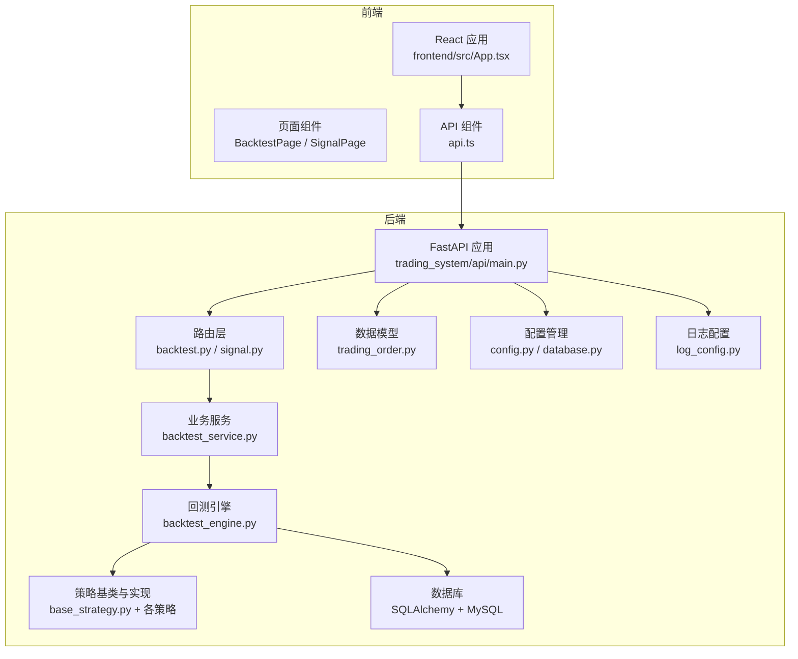
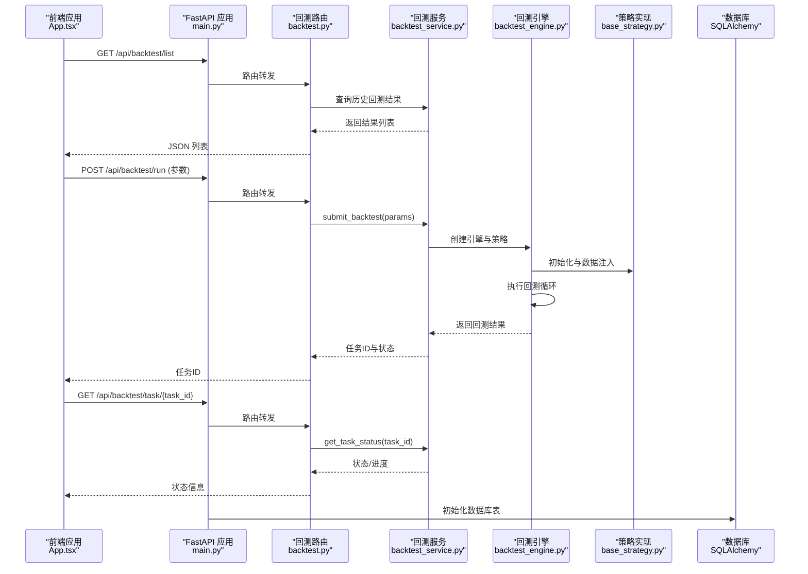
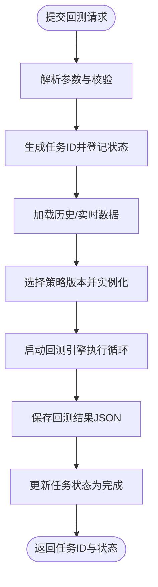
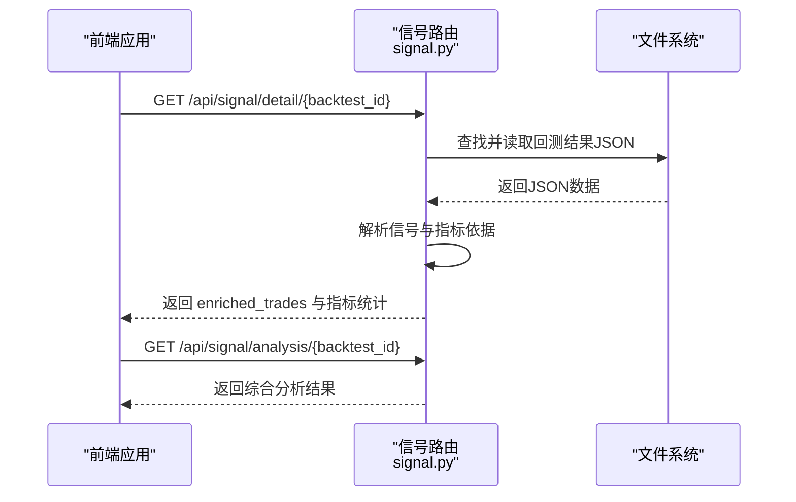
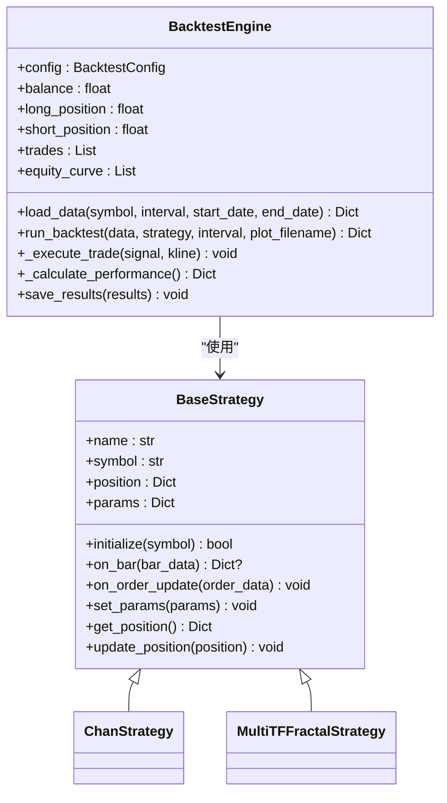
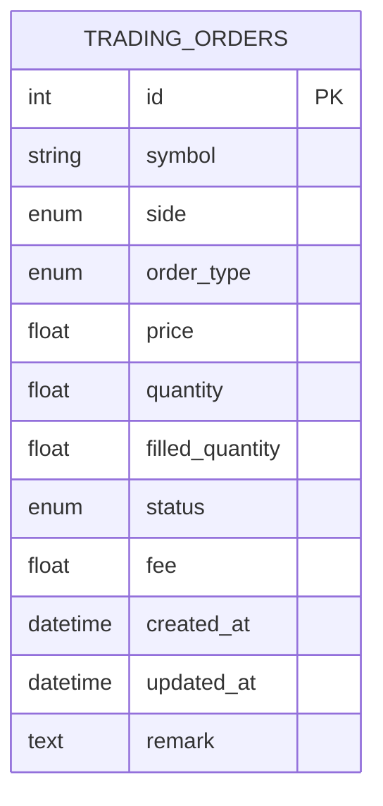
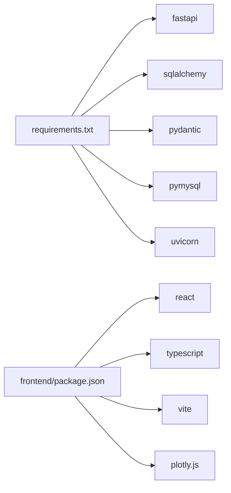

# 项目概述

<cite>
**本文档引用的文件**
- [README.md](file://README.md)
- [main.py](file://main.py)
- [requirements.txt](file://requirements.txt)
- [trading_system/api/main.py](file://trading_system/api/main.py)
- [trading_system/api/routers/backtest.py](file://trading_system/api/routers/backtest.py)
- [trading_system/api/routers/signal.py](file://trading_system/api/routers/signal.py)
- [trading_system/api/services/backtest_service.py](file://trading_system/api/services/backtest_service.py)
- [trading_system/core/config.py](file://trading_system/core/config.py)
- [trading_system/core/database.py](file://trading_system/core/database.py)
- [trading_system/models/trading_order.py](file://trading_system/models/trading_order.py)
- [trading_system/strategies/base_strategy.py](file://trading_system/strategies/base_strategy.py)
- [trading_system/strategies/backtest_engine.py](file://trading_system/strategies/backtest_engine.py)
- [frontend/src/App.tsx](file://frontend/src/App.tsx)
- [log_config.py](file://log_config.py)
</cite>

## 目录
1. [简介](#简介)
2. [项目结构](#项目结构)
3. [核心组件](#核心组件)
4. [架构总览](#架构总览)
5. [详细组件分析](#详细组件分析)
6. [依赖分析](#依赖分析)
7. [性能考虑](#性能考虑)
8. [故障排除指南](#故障排除指南)
9. [结论](#结论)
10. [附录](#附录)

## 简介
本项目是一个面向加密货币市场的交易系统，围绕“回测系统、实时交易、数据分析”三大核心模块设计，旨在为用户提供从策略验证到实盘执行与可视化分析的一体化能力。系统采用前后端分离架构：后端基于 FastAPI 提供 REST API，前端使用 React + TypeScript 构建可视化界面；核心交易逻辑由策略引擎与回测引擎驱动，数据持久化通过 SQLAlchemy + MySQL 实现。

项目目标：
- 提供可配置的回测平台，支持多周期、多策略组合验证；
- 提供信号分析与可视化，帮助用户理解策略触发依据；
- 提供可扩展的策略基类与回测引擎，便于快速迭代新策略；
- 提供统一的日志与异常处理，保障生产级稳定性。

## 项目结构
项目采用按功能域划分的层次化组织方式：
- trading_system：后端核心业务包，包含 API 层、核心配置、数据库模型、策略与回测引擎、工具与数据访问层；
- frontend：React 前端工程，提供回测面板与信号分析页面；
- 根目录脚本：主入口、依赖安装、数据下载与运行脚本；
- 文档与配置：README、日志配置、环境变量示例等。

**图表来源**
- [trading_system/api/main.py:1-104](file://trading_system/api/main.py#L1-L104)
- [trading_system/api/routers/backtest.py:1-68](file://trading_system/api/routers/backtest.py#L1-L68)
- [trading_system/api/routers/signal.py:1-178](file://trading_system/api/routers/signal.py#L1-L178)
- [trading_system/api/services/backtest_service.py:1-289](file://trading_system/api/services/backtest_service.py#L1-L289)
- [trading_system/strategies/backtest_engine.py:1-800](file://trading_system/strategies/backtest_engine.py#L1-L800)
- [trading_system/models/trading_order.py:1-43](file://trading_system/models/trading_order.py#L1-L43)
- [trading_system/core/config.py:1-35](file://trading_system/core/config.py#L1-L35)
- [trading_system/core/database.py:1-45](file://trading_system/core/database.py#L1-L45)
- [frontend/src/App.tsx:1-50](file://frontend/src/App.tsx#L1-L50)
- [log_config.py:1-74](file://log_config.py#L1-L74)

**章节来源**
- [README.md:1-150](file://README.md#L1-L150)
- [main.py:1-13](file://main.py#L1-L13)
- [requirements.txt:1-64](file://requirements.txt#L1-L64)

## 核心组件
- FastAPI 应用与中间件：提供跨域、异常处理、健康检查、静态资源挂载与路由注册；
- 路由器：回测路由负责任务提交、状态查询与结果列表；信号路由负责信号详情与综合分析；
- 业务服务：回测服务负责任务调度、参数解析、策略选择、数据准备与结果落盘；
- 回测引擎：加载数据、执行回测循环、计算绩效指标、生成图表与结果；
- 策略基类：定义策略统一接口，便于扩展不同策略实现；
- 数据模型与数据库：定义订单、成交记录、持仓等实体，提供 ORM 映射；
- 配置与日志：集中管理数据库连接池参数与日志格式，保证运行稳定与可观测性；
- 前端应用：提供回测面板与信号分析页面，与后端 API 协作展示结果。

**章节来源**
- [trading_system/api/main.py:1-104](file://trading_system/api/main.py#L1-L104)
- [trading_system/api/routers/backtest.py:1-68](file://trading_system/api/routers/backtest.py#L1-L68)
- [trading_system/api/routers/signal.py:1-178](file://trading_system/api/routers/signal.py#L1-L178)
- [trading_system/api/services/backtest_service.py:1-289](file://trading_system/api/services/backtest_service.py#L1-L289)
- [trading_system/strategies/backtest_engine.py:1-800](file://trading_system/strategies/backtest_engine.py#L1-L800)
- [trading_system/strategies/base_strategy.py:1-168](file://trading_system/strategies/base_strategy.py#L1-L168)
- [trading_system/models/trading_order.py:1-43](file://trading_system/models/trading_order.py#L1-L43)
- [trading_system/core/config.py:1-35](file://trading_system/core/config.py#L1-L35)
- [trading_system/core/database.py:1-45](file://trading_system/core/database.py#L1-L45)
- [frontend/src/App.tsx:1-50](file://frontend/src/App.tsx#L1-L50)
- [log_config.py:1-74](file://log_config.py#L1-L74)

## 架构总览
系统采用“API 层 → 业务服务层 → 引擎/策略层 → 数据层”的分层架构，结合异步任务与多线程实现回测任务的后台执行，前端通过 REST API 获取回测结果与信号分析。

**图表来源**
- [frontend/src/App.tsx:1-50](file://frontend/src/App.tsx#L1-L50)
- [trading_system/api/main.py:1-104](file://trading_system/api/main.py#L1-L104)
- [trading_system/api/routers/backtest.py:1-68](file://trading_system/api/routers/backtest.py#L1-L68)
- [trading_system/api/services/backtest_service.py:1-289](file://trading_system/api/services/backtest_service.py#L1-L289)
- [trading_system/strategies/backtest_engine.py:1-800](file://trading_system/strategies/backtest_engine.py#L1-L800)
- [trading_system/strategies/base_strategy.py:1-168](file://trading_system/strategies/base_strategy.py#L1-L168)
- [trading_system/core/database.py:1-45](file://trading_system/core/database.py#L1-L45)

## 详细组件分析

### 回测系统（API 与服务）
- 路由职责：
  - 列出历史回测结果、获取参数模板、查询可用日期范围；
  - 提交回测任务、查询任务状态；
  - 获取单次回测结果文件。
- 服务实现：
  - 任务调度：使用线程池异步执行回测，维护任务状态字典；
  - 策略选择：根据策略版本动态导入并实例化策略；
  - 数据准备：支持从 CSV 加载历史数据，或按需下载实时数据；
  - 结果落盘：将回测结果写入 JSON 文件，便于前端读取与分析。

**图表来源**
- [trading_system/api/routers/backtest.py:1-68](file://trading_system/api/routers/backtest.py#L1-L68)
- [trading_system/api/services/backtest_service.py:1-289](file://trading_system/api/services/backtest_service.py#L1-L289)

**章节来源**
- [trading_system/api/routers/backtest.py:1-68](file://trading_system/api/routers/backtest.py#L1-L68)
- [trading_system/api/services/backtest_service.py:1-289](file://trading_system/api/services/backtest_service.py#L1-L289)

### 信号分析系统（API 与前端）
- 后端信号路由：
  - 提供信号分类映射、信号详情（含指标依据解析）、综合分析（盈亏分布、动作统计、指标统计）；
  - 从回测结果目录读取 JSON 并解析，提取信号触发的关键指标与价格参考。
- 前端应用：
  - 提供回测面板与信号分析两个标签页，支持刷新列表、选择回测 ID、查看信号详情与统计。

**图表来源**
- [trading_system/api/routers/signal.py:1-178](file://trading_system/api/routers/signal.py#L1-L178)
- [frontend/src/App.tsx:1-50](file://frontend/src/App.tsx#L1-L50)

**章节来源**
- [trading_system/api/routers/signal.py:1-178](file://trading_system/api/routers/signal.py#L1-L178)
- [frontend/src/App.tsx:1-50](file://frontend/src/App.tsx#L1-L50)

### 回测引擎与策略基类
- 回测引擎：
  - 支持仓位控制、止损止盈、ATR 动态止损、追踪止损、限价单模式、资金费用结算；
  - 提供数据加载、回测循环、绩效计算、图表生成与结果保存；
  - 支持多周期数据注入与 V2 策略的数据注入流程。
- 策略基类：
  - 定义 initialize、on_bar、on_order_update 等抽象方法，提供参数设置与持仓查询；
  - 为不同策略实现提供统一接口与通用能力。

**图表来源**
- [trading_system/strategies/base_strategy.py:1-168](file://trading_system/strategies/base_strategy.py#L1-L168)
- [trading_system/strategies/backtest_engine.py:1-800](file://trading_system/strategies/backtest_engine.py#L1-L800)

**章节来源**
- [trading_system/strategies/base_strategy.py:1-168](file://trading_system/strategies/base_strategy.py#L1-L168)
- [trading_system/strategies/backtest_engine.py:1-800](file://trading_system/strategies/backtest_engine.py#L1-L800)

### 数据模型与数据库
- 数据模型：
  - 订单模型：包含交易对、方向、订单类型、价格、数量、状态、手续费、备注等；
  - 与成交记录、持仓等实体关联，便于后续扩展。
- 数据库：
  - 通过 SQLAlchemy 配置连接池参数，启动时自动创建表；
  - 提供会话工厂与上下文管理，确保资源正确释放。

**图表来源**
- [trading_system/models/trading_order.py:1-43](file://trading_system/models/trading_order.py#L1-L43)
- [trading_system/core/database.py:1-45](file://trading_system/core/database.py#L1-L45)

**章节来源**
- [trading_system/models/trading_order.py:1-43](file://trading_system/models/trading_order.py#L1-L43)
- [trading_system/core/database.py:1-45](file://trading_system/core/database.py#L1-L45)

### 前端与 API 协作
- 前端应用通过 api.ts 与后端交互，支持：
  - 列出回测结果、刷新列表；
  - 选择回测 ID，进入信号分析页面；
  - 调用回测任务接口，轮询任务状态直至完成。

**章节来源**
- [frontend/src/App.tsx:1-50](file://frontend/src/App.tsx#L1-L50)

## 依赖分析
- 后端依赖：
  - FastAPI、SQLAlchemy、Pydantic、PyMySQL、Uvicorn 等；
  - 通过 requirements.txt 统一管理第三方库版本。
- 前端依赖：
  - React、TypeScript、Vite、Plotly（类型声明）等；
  - 通过 package.json 管理前端包与构建工具。

**图表来源**
- [requirements.txt:1-64](file://requirements.txt#L1-L64)
- [frontend/src/App.tsx:1-50](file://frontend/src/App.tsx#L1-L50)

**章节来源**
- [requirements.txt:1-64](file://requirements.txt#L1-L64)

## 性能考虑
- 数据加载与过滤：回测引擎按周期加载 CSV 并按起止日期过滤，减少不必要的数据处理；
- 进度条与内存管理：回测循环中使用进度条与定期垃圾回收，降低长时间运行的内存压力；
- 连续亏损保护与凯利公式：引擎内置动态仓位管理，结合连续亏损次数与历史盈亏比，限制单次投入比例；
- ATR 与追踪止损：通过 ATR 计算动态止损距离，提升风险控制能力；
- 限价单模式：支持限价单与价格偏差容忍度，降低滑点影响；
- 资金费用结算：合约交易场景下按 UTC 固定时点结算资金费用，避免频繁计算带来的开销。

**章节来源**
- [trading_system/strategies/backtest_engine.py:1-800](file://trading_system/strategies/backtest_engine.py#L1-L800)

## 故障排除指南
- 数据库连接失败：
  - 检查 .env 配置与数据库可达性；
  - 启动时健康检查接口可快速定位连接问题。
- 回测任务失败：
  - 查看回测服务日志，确认数据加载与策略初始化是否成功；
  - 检查 CSV 数据完整性与日期范围。
- 前端无法获取回测结果：
  - 确认后端 API 可用与静态资源挂载；
  - 检查回测结果 JSON 是否生成成功。

**章节来源**
- [trading_system/api/main.py:58-88](file://trading_system/api/main.py#L58-L88)
- [trading_system/api/services/backtest_service.py:240-245](file://trading_system/api/services/backtest_service.py#L240-L245)
- [log_config.py:1-74](file://log_config.py#L1-L74)

## 结论
本项目以清晰的分层架构与模块化设计，实现了从策略回测、信号分析到可视化展示的闭环。通过统一的策略基类与回测引擎，系统具备良好的可扩展性；通过 FastAPI 的高性能与前端的直观交互，提升了用户体验。建议在后续迭代中进一步完善实盘交易模块与通知机制，持续优化策略参数搜索与自动化部署流程。

## 附录
- 快速启动：
  - 安装依赖：pip install -r requirements.txt；
  - 启动后端：python main.py 或 uvicorn main:app --reload；
  - 访问 API 文档：Swagger UI 与 ReDoc。
- 环境变量：
  - 数据库连接、交易所 API 密钥等通过 .env 配置。

**章节来源**
- [README.md:75-99](file://README.md#L75-L99)
- [main.py:1-13](file://main.py#L1-L13)